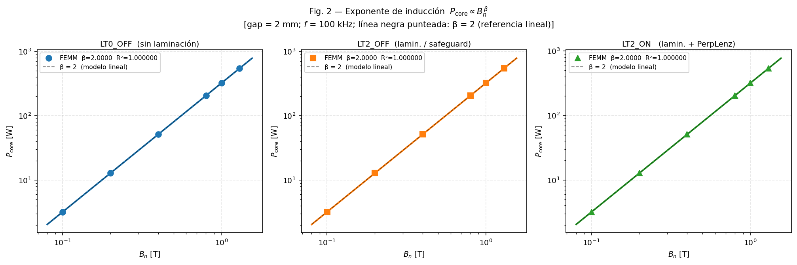
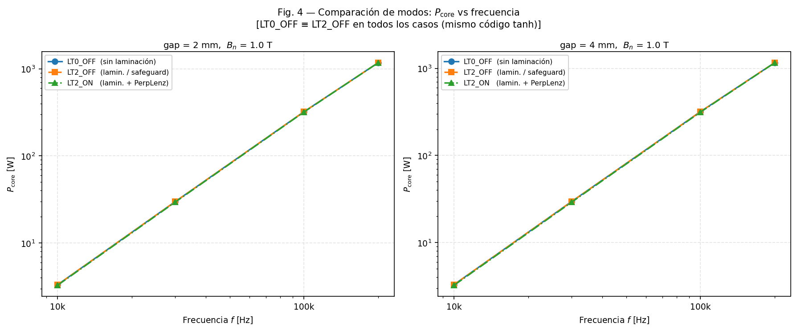
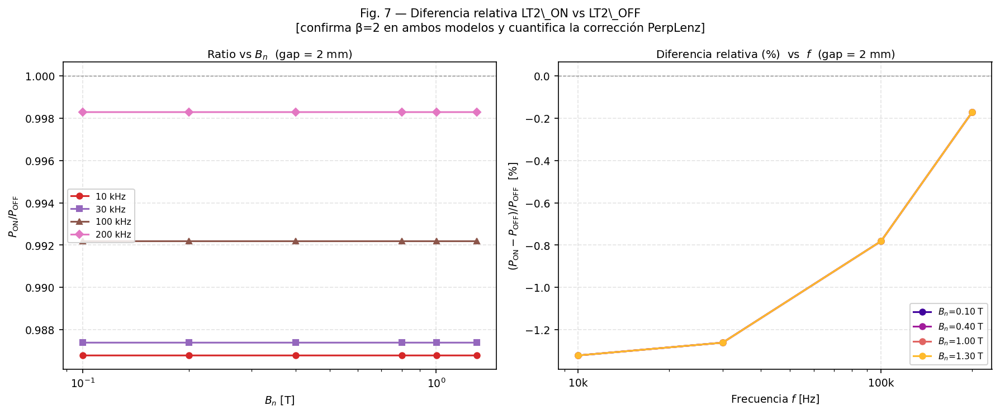

# Caracterización de Pérdidas en Núcleos Amorfos Laminados con Entrehierro  
## Análisis FEM Paramétrico — Batería 1 (288 casos) + Batería 2 (960 casos) — FEMM 4.2 Solver Armónico

**Fecha:** Mayo 2026  
**Código:** FEMM 4.2 (VS2022 x64, Release64) — `femm.exe` compilado localmente  
**Scripts batería 1:** `run_gap_battery.py` — `gap_battery_case.lua` → `D:\FEMM Source\femmTestFiles\gap_battery_out\`  
**Scripts batería 2:** `run_gap_battery2.py` — `gap_battery2_case.lua` → `D:\FEMM Source\femmTestFiles\gap_battery2_out\`

---

## 1. Resumen Ejecutivo

Se ha realizado una batería paramétrica de **288 simulaciones armónicas FEM** sobre un inductor de núcleo amorfo laminado con entrehierro variable, comparando tres modelos de pérdidas disponibles en FEMM 4.2. Posteriormente, una **segunda batería de 960 casos** extendió el barrido al espesor de lámina $d$ (5 valores entre 10 y 100 µm). Los resultados más relevantes son:

**Batería 1 — 3 modos, $d$ = 23 µm fijo:**

| Exponente | LT0_OFF | LT2_OFF | LT2_ON |
|-----------|---------|---------|--------|
| α (frecuencia) | **1.9618** | **1.9618** | **1.9656** |
| β (inducción) | **2.0000** | **2.0000** | **2.0000** |
| γ (gap, 100 kHz) | **−0.01407** | **−0.01407** | **−0.01874** |

**Batería 2 — 2 modos, $d$ ∈ {10, 18, 23, 50, 100} µm:**

| $d$ (µm) | $d/(2\delta)$ @ 100 kHz | α (LT0_OFF) | α (LT2_ON) | $k_d$ @ 100 kHz |
|----------|------------------------|-------------|------------|-----------------|
| 10 | 0.48 | 1.998 | 1.999 | 1.489 (*ref. d=23*) |
| 18 | 0.86 | 1.984 | 1.987 | — |
| 23 | 1.10 | 1.962 | 1.966 | 1.489 |
| 50 | 2.38 | 1.734 | 1.740 | — |
| 100 | 4.76 | 1.532 | 1.534 | — |

**Conclusiones principales (batería 1):**
1. **LT0_OFF ≡ LT2_OFF en todos los 288 casos** — consecuencia directa de la equivalencia de código en el postprocesador (misma fórmula `tanh`).
2. **β = 2.0000 exacto** — resultado matemáticamente necesario del solver armónico lineal, no un artefacto.
3. **LT2_ON es el único modelo físicamente distinto**: activa la corrección de Bessel perpendicular (`PerpLenzShape`) para el flujo que atraviesa las láminas, dando ≈ 1.3–1.7 % menos pérdidas que los otros dos modos a baja frecuencia.
4. **El exponente γ de LT2_ON depende de la frecuencia** (de −0.0194 a 10 kHz a −0.0178 a 200 kHz), hecho nuevo que revela la física de la profundidad de penetración PerpLenz.
5. **LT2_ON es el mejor modelo** para núcleo amorfo laminado real con zona de fringing junto al entrehierro.

**Conclusiones principales (batería 2 — barrido de $d$):**
6. **$k_d$ ($P \propto d^{k_d}$) decrece de ≈ 1.96 a ≈ 1.31** al pasar de 10 kHz a 200 kHz, reflejando la transición del régimen de lámina delgada ($d \ll \delta$) al régimen de efecto piel ($d \gtrsim \delta$).
7. **α decrece de ≈ 2.0 a ≈ 1.53** al aumentar $d$ de 10 a 100 µm: láminas más gruesas dan una dependencia sub-cuadrática de las pérdidas con la frecuencia.
8. **La corrección PerpLenz (LT2_ON) invierte signo** en $d \approx 30$ µm: para láminas delgadas ($d < 30$ µm) LT2_ON da menos pérdidas; para láminas gruesas ($d > 30$ µm), da ligeramente más (efecto piel domina sobre la corrección Bessel perpendicular).

---

## 2. Geometría del Inductor y Parámetros del Material

### 2.1 Geometría (modelo 2D planar)

El modelo FEM base (`pourleroi_cc_magnetostatic_rev2.fem`) es un corte transversal de un inductor tipo E-I o similar con simetría y entrehierro central. Los parámetros geométricos del ensayo son:

| Parámetro | Valor |
|-----------|-------|
| Profundidad 2D (z) | 35 mm |
| Gap central basal | 2.0 mm |
| Gaps ensayados | 2.0 / 2.5 / 3.0 / 4.0 mm |
| Número de vueltas | según modelo |
| Línea de medida $B_n$ | y = 24 mm, x ∈ [0, 14] mm (141 puntos) |

### 2.2 Parámetros del Material Amorfo

El material "Amorphous gap" (región junto al entrehierro) se modela con los parámetros extraídos del `.fem`:

| Parámetro | Símbolo | Valor | Notas |
|-----------|---------|-------|-------|
| Permeabilidad relativa | $\mu_r$ | 30 000 | Isotrópica; Metglas-like |
| Conductividad (en plano) | $\sigma$ | 0.769 MS/m | ρ ≈ 1.3 µΩ·m |
| Espesor de lámina | $d$ | 0.023 mm = 23 µm | `d_lam` |
| Factor de relleno | $\eta$ | 0.80 | `LamFill` |
| Tipo de laminación (base) | `LamType` | 2 | modificado por Lua |
| Conductividad transversal | $\sigma_t$ | = $\sigma$ | Copiado de Sigma por Lua cuando PerpLenz activo |

El material "Amorphous" (cuerpo del núcleo, fuera de la zona de gap) usa los mismos parámetros materiales pero `LamType=0` en el archivo `.fem` base.

### 2.3 Profundidad de Piel

La profundidad de piel en el amorfo laminado vale:

$$\delta = \sqrt{\frac{2}{\omega\,\mu_r\,\mu_0\,\sigma}}$$

| Frecuencia | δ (µm) | d/(2δ) | Régimen |
|------------|--------|--------|---------|
| 10 kHz | 33.1 | 0.35 | Lámina delgada |
| 30 kHz | 19.1 | 0.60 | Transición |
| 100 kHz | 10.5 | 1.10 | Efecto piel moderado |
| 200 kHz | 7.4 | 1.55 | Efecto piel significativo |

Esta transición desde el régimen de lámina delgada (d ≪ δ) a efecto piel moderado (d ~ δ) a lo largo del rango de frecuencias explica por qué α ≈ 1.96 en lugar de exactamente 2.0.

---

## 3. Fundamentos Matemáticos del Solver Armónico

Esta sección establece el formalismo completo que subyace a los tres modelos de pérdidas implementados en FEMM 4.2 (modificado). Se derivan las ecuaciones de gobierno desde primeros principios y se relaciona cada fórmula del código fuente con su origen físico.

### 3.1 El Problema Magnetostático 2D Armónico — La Ecuación de Helmholtz

FEMM resuelve el problema de campo magnético en **régimen armónico** (frecuencia fija $f$, campos oscilando como $\text{Re}[\cdot\, e^{j\omega t}]$, $\omega = 2\pi f$). En la formulación 2D planar, la única componente no nula del potencial vector es $A_z(x,y)$, de modo que:

$$B_x = -\frac{\partial A_z}{\partial y}, \qquad B_y = \frac{\partial A_z}{\partial x}$$

La ecuación de gobierno (difusión-Helmholtz del potencial vector complejo) es:

$$\boxed{-\nabla\cdot\!\left(\frac{1}{\mu_{fd}(x,y,\omega)\,\mu_0}\,\nabla A_z\right) + j\omega\sigma_{\rm cond}\, A_z = J_s}$$

donde:
- $\mu_{fd}(x,y,\omega)$ es la **permeabilidad compleja dependiente de frecuencia** del material (calculada en la fase de pre-proceso, §3.3–3.4).
- $\sigma_{\rm cond}$ es la conductividad bulk del devanado; en el núcleo laminado $\sigma_{\rm cond} = 0$ (las corrientes de Foucault están homogeneizadas dentro de $\mu_{fd}$).
- $J_s$ es la densidad de corriente aplicada (bobina).

**Linealidad y consecuencia $\beta = 2$:** Para corriente de excitación $I$, el problema es lineal: $A_z \propto I$, por tanto $B_x, B_y \propto I$. La potencia disipada (§3.6) escala como $|\vec{B}|^2 \propto I^2 \propto B_n^2$, lo que implica el exponente $\beta = 2.0000$ exacto en todos los casos (no es un artefacto — es la consecuencia matemática inevitable de resolver un sistema lineal).

**Referencias:** Meeker (2015, FEMM 4.2 User's Manual §2); Gyimesi & Lavers (1993, IEEE Trans. Magn.).

### 3.2 La Profundidad de Piel y el Régimen de Laminación

Consideremos una lámina conductora de espesor $d$ (semiespesor $a = d/2$) con permeabilidad relativa $\mu_r$ y conductividad $\sigma$. El campo magnético oscilante intenta penetrar en la lámina, pero los gradientes de inducción inducen corrientes de Foucault que se oponen a dicha penetración. La longitud de escala característica es la **profundidad de piel**:

$$\boxed{\delta_s = \sqrt{\frac{2}{\omega\,\mu_r\,\mu_0\,\sigma}}} \quad \text{[m]}$$

El parámetro adimensional de régimen es $\xi = d/(2\delta_s)$:

| $\xi = d/(2\delta_s)$ | Régimen | Escalado de pérdidas |
|-----------------------|---------|-----------------------|
| $\xi \ll 1$ | Lámina delgada | $P \propto \sigma\, d^2\, f^2\, B_n^2$ (Steinmetz clásico) |
| $\xi \approx 1$ | Transición | Función tanh/Bessel aporta corrección significativa |
| $\xi \gg 1$ | Efecto piel dominante | $P \propto \sigma^{1/2}\, d^{-1}\, f^{3/2}\, B_n^2$ |

Para el material del modelo ($\mu_r = 30\,000$, $\sigma = 0.769\,\text{MS/m}$, $d = 23\,\mu\text{m}$):

| $f$ (kHz) | $\delta_s$ (µm) | $\xi = d/(2\delta_s)$ | Régimen |
|-----------|----------------|----------------------|---------|
| 10 | 33.1 | 0.35 | Casi lámina delgada |
| 30 | 19.1 | 0.60 | Transición temprana |
| 100 | 10.5 | 1.10 | Efecto piel moderado |
| 200 | 7.4 | 1.55 | Efecto piel significativo |

Esta tabla explica cualitativamente todos los exponentes $\alpha < 2$ y $k_d < 2$ observados: ninguna simulación está en el límite $\xi \ll 1$.

### 3.3 Corrección tanh — Flujo Paralelo a las Láminas (LamType = 0)

#### 3.3.1 Planteamiento del problema 1D

Para campo magnético **paralelo** al plano de la lámina (dirección $\hat{y}$, componente $B_y$), el problema es unidimensional en $x$ (perpendicular a la lámina). Dentro de la lámina ($|x| \le a = d/2$), la ecuación de difusión de la inducción es:

$$\frac{d^2 B_y}{dx^2} = j\omega\,\mu_r\,\mu_0\,\sigma\, B_y \equiv \gamma^2 B_y$$

con el número de onda complejo (tomando la raíz con parte real positiva):

$$\gamma = \sqrt{j\omega\,\mu_r\,\mu_0\,\sigma} = \frac{1+j}{\delta_s}$$

#### 3.3.2 Solución analítica y campo promedio

Con condición de contorno $B_y(\pm a) = B_0$ (campo aplicado en las superficies) y simetría par:

$$B_y(x) = B_0\,\frac{\cosh(\gamma\, x)}{\cosh(\gamma\, a)}$$

La inducción **media** sobre el espesor de la lámina (relevante para la permeabilidad efectiva macroscópica):

$$\langle B_y \rangle = \frac{1}{2a}\int_{-a}^{a} B_y(x)\,dx = B_0\cdot\frac{\tanh(\gamma a)}{\gamma a}$$

#### 3.3.3 Permeabilidad efectiva — LamType = 0

El factor $\tanh(K)/K$ con $K = \gamma a$ es la **función de forma tanh**. Incluyendo el factor de relleno $\eta$ (fracción de hierro en el laminado) y el ángulo de pérdidas de histéresis $\Phi_h$:

$$\boxed{\mu_{fd,\parallel} = \left[\mu_r\,e^{-j\Phi_h\pi/180}\cdot\frac{\tanh K}{K}\right]\eta + (1-\eta)}$$

con el argumento complejo (incluyendo la corrección de fase de histéresis):

$$K = e^{-j\Phi_h\pi/360}\cdot(1+j)\cdot\frac{d}{2\delta_s} = e^{-j\Phi_h\pi/360}\cdot\frac{d}{2}\sqrt{j\omega\,\mu_r\,\mu_0\,\sigma}$$

En nuestra simulación $\Phi_h = 0$, por lo que $K = (1+j)\,d/(2\delta_s)$.

**Implementación en FEMM** (`prob2big.cpp` / `FemmviewDoc.cpp`):
```cpp
double ds = sqrt(2. / (0.4*PI * w * Cduct * mu_x));  // δs [m],  0.4π ≡ μ0×10⁷
K = (1+j) * Lam_d * 1e-3 / (2. * ds);                 // K adimensional
mu_fdx = (mu_fdx * tanh(K)/K) * LamFill + (1. - LamFill);
```

#### 3.3.4 Límites asintóticos y escalado de pérdidas

Expandiendo tanh para $\Phi_h = 0$, $K = (1+j)\xi$ ($\xi = d/(2\delta_s)$):

$$\frac{\tanh K}{K} \approx \begin{cases}
1 - \dfrac{K^2}{3} + O(K^4) & \xi \ll 1 \quad (\text{lámina delgada}) \\[10pt]
\dfrac{1}{K} + O(e^{-2K}) & \xi \gg 1 \quad (\text{efecto piel fuerte})
\end{cases}$$

**Límite delgado** ($\xi \ll 1$): $K^2 = (1+j)^2\xi^2 = 2j\xi^2$, por lo que $\text{Im}(\tanh K/K) \approx -2\xi^2/3$. La densidad de potencia:

$$p_v \approx \pi f\,\mu_r\mu_0\eta\,\frac{2\xi^2}{3}\,|H|^2 = \frac{\pi^2 f^2\,\sigma\,(\mu_r\mu_0)^2\eta\,d^2}{6}\,|H|^2$$

Esto reproduce exactamente la **fórmula clásica de Steinmetz** para pérdidas por corrientes de Foucault: $P_v \propto \sigma\, d^2\, f^2\, B_n^2$ (Steinmetz, 1892; Lammeraner & Stafl, 1966). El exponente de frecuencia $\alpha = 2$ y el de espesor $k_d = 2$ son exactos en este límite.

**Límite de efecto piel** ($\xi \gg 1$): $\tanh(K)/K \approx 1/K = 1/((1+j)\xi)$, con $\text{Im}(1/K) \approx 1/(2\xi)$, dando $p_v \propto f^{3/2}d^{-1}$. Los exponentes efectivos caen a $\alpha \to 3/2$ y $k_d \to -1$. A frecuencias intermedias ($\xi \sim 1$) los exponentes toman valores entre estos extremos, **explicando los exponentes 1.3–1.9 observados en la batería 2**.

**Referencias:** Dowell (1966, IEE Proc.); Ferreira (1994, IEEE Trans. PE); Lammeraner & Stafl (1966, *Eddy Currents*, Iliffe Books).

### 3.4 Corrección de Bessel — Flujo Perpendicular a las Láminas (LamType = 2, PerpLenz)

#### 3.4.1 Motivación física — El problema del disco conductor

En las zonas de fringing junto al entrehierro, una fracción del flujo magnético cruza el apilamiento de láminas en dirección **perpendicular** a sus planos (componente $B_x$ en el modelo 2D con láminas en el plano $yz$). Este flujo induce corrientes de Foucault que circulan en el plano de cada lámina — es decir, corrientes "en disco" con geometría cilíndrica, no la difusión unidimensional del caso paralelo.

FEMM modela cada lámina como un **disco conductor cilíndrico** de radio efectivo $a = d/2$ y conductividad transversal $\sigma_t$, con el campo axial $B_\perp$ aplicado uniformemente sobre la cara del disco.

#### 3.4.2 La ecuación de Bessel de orden 1

En coordenadas cilíndricas $(r, \phi, z)$ con $\vec{A} = A_\phi(r)\,\hat\phi$, la ecuación de gobierno para el potencial vector dentro del disco es (ver Acero et al., 2006; Tourkhani & Viarouge, 2001):

$$\frac{d^2 A_\phi}{dr^2} + \frac{1}{r}\frac{dA_\phi}{dr} + \left(k^2 - \frac{1}{r^2}\right)A_\phi = 0, \qquad k^2 = -j\omega\,\mu_r\,\mu_0\,\sigma_t$$

Esta es la **ecuación de Bessel de orden 1** con argumento complejo. La solución regular en $r = 0$ es:

$$A_\phi(r) = C\,J_1(k\,r)$$

El campo axial resultante se obtiene de $\vec{B} = \nabla\times\vec{A}$:

$$B_z(r) = \frac{1}{r}\frac{d(r\,A_\phi)}{dr} = C\,k\,J_0(k\,r)$$

donde se ha utilizado la identidad $\tfrac{d}{dr}[r\,J_1(kr)] = kr\,J_0(kr)$.

#### 3.4.3 Campo medio y función de forma PerpLenz

El campo en el borde del disco ($r = a$) es $B_0 = CkJ_0(ka)$, dando $C = B_0/[kJ_0(ka)]$.

El campo **medio** sobre la sección transversal del disco:

$$\langle B_z \rangle = \frac{2}{a^2}\int_0^a r\,B_z(r)\,dr = \frac{2Ck}{a^2}\cdot\frac{a}{k}\,J_1(ka) = \frac{2C\,J_1(ka)}{a}$$

donde se ha utilizado $\int_0^a r\,J_0(kr)\,dr = (a/k)\,J_1(ka)$. La relación entre campo medio y campo aplicado:

$$\frac{\langle B_z \rangle}{B_0} = \frac{2\,J_1(ka)}{ka\,J_0(ka)} \equiv \text{PerpLenzShape}(z_a)$$

con el **argumento de Bessel**:

$$\boxed{z_a = k\,a = \frac{d}{2}\sqrt{-j\omega\,\mu_r\,\mu_0\,\sigma_t}}$$

#### 3.4.4 Permeabilidad efectiva perpendicular — LamType = 2 con PerpLenz

$$\boxed{\mu_{fd,\perp} = \eta\,\tilde\mu_{fd}\cdot\underbrace{\frac{2\,J_1(z_a)}{z_a\,J_0(z_a)}}_{\text{PerpLenzShape}(z_a)} + (1-\eta)}$$

donde $\tilde\mu_{fd} = \mu_r\,e^{-j\Phi_h\pi/180}$ es la permeabilidad del hierro con lag de histéresis.

**Implementación en FEMM** (`bessel_perplenz.h` + `prob2big.cpp`):
```cpp
// J0, J1 calculadas con serie de potencias (60 términos, |z|≤20, error<1e-12):
// J_n(z) = Σ_{k=0}^∞  (-1)^k (z/2)^{2k+n} / [k! (k+n)!]
CComplex g2 = -I * w * mufe * muo * sig_t_SI;   // k² = −jωμμ₀σ_t
CComplex za = sqrt(g2) * (Lam_d * 0.5e-3);      // z_a = k·(d/2)
mu_fdx = LamFill * mufe * PerpLenzShape(za) + (1. - LamFill);
// PerpLenzShape(za) = 2 J1(za) / (za J0(za));  retorna 0 para |za|≥20
```

#### 3.4.5 Comparación entre tanh y PerpLenz — Signo del argumento

El argumento tanh tiene $K = \sqrt{+j\omega\mu\sigma}\cdot(d/2)$ (fase $+45°$), mientras que el argumento Bessel tiene $z_a = \sqrt{-j\omega\mu\sigma_t}\cdot(d/2)$ (fase $-45°$). Las magnitudes son iguales cuando $\sigma = \sigma_t$: $|K| = |z_a| = (d/2)\sqrt{\omega\mu\sigma}$.

Las dos funciones de forma son distintas para argumentos intermedios:

| $|z|$ | `tanh(z)/z` | `2J₁(z)/(z·J₀(z))` | Diferencia |
|------:|------------:|--------------------:|------------|
| 0.5   | 0.959       | 0.968               | +0.009     |
| 1.0   | 0.883       | 0.895               | +0.012     |
| 1.4   | 0.823       | 0.820               | −0.003 (cruce) |
| 2.0   | 0.700       | 0.648               | −0.052     |
| 3.0   | 0.551       | 0.437               | −0.114     |

Para $|z| < 1.4$: Bessel > tanh → LT2_ON predice *menos* pérdidas. Para $|z| > 1.4$: Bessel < tanh → LT2_ON predice *más* pérdidas. **Este cruce explica la inversión de signo del ratio $P_{\rm ON}/P_{\rm OFF}$ en $d \approx 30\,\mu\text{m}$ observada en la batería 2** (§13.4).

Los límites asintóticos de la función PerpLenz:

$$\text{PerpLenzShape}(z_a) = \frac{2\,J_1(z_a)}{z_a\,J_0(z_a)} \approx \begin{cases}
1 - \dfrac{z_a^2}{4} + O(z_a^4) & |z_a| \ll 1 \quad (\text{disco delgado/baja f}) \\[10pt]
0 & |z_a| \to \infty \quad (\text{apantallamiento completo})
\end{cases}$$

**Referencias:** Tourkhani & Viarouge (2001, IEEE Trans. Magn.); Acero et al. (2006, IEEE Trans. Ind. Electron.); Watson et al. (2004, IEEE Trans. Magn.).

### 3.5 Homogeneización por Factor de Relleno

El laminado es un compuesto periódico de capas de hierro (fracción $\eta$, "LamFill") y capas aislantes (fracción $1-\eta$). La permeabilidad efectiva del compuesto depende de la orientación del flujo relativa al apilamiento:

**Flujo paralelo** — modelo de cortocircuito magnético (reluctancias en paralelo):

$$\mu_{\parallel}^{\rm eff} = \mu_{\rm Fe}\cdot\frac{\tanh K}{K}\cdot\eta + 1\cdot(1-\eta)$$

La permeabilidad del hierro está corregida por la función de difusión; el espacio interlámina actúa con $\mu_r = 1$.

**Flujo perpendicular, estático** (sin $\sigma_t$, o sin PerpLenz activo) — modelo de reluctancias en serie:

$$\frac{1}{\mu_{\perp}^{\rm est}} = \frac{\eta}{\mu_{\rm Fe}} + \frac{1-\eta}{1} \quad \Longleftrightarrow \quad \mu_{\perp}^{\rm est} = \frac{\mu_{\rm Fe}}{(1-\eta)\mu_{\rm Fe} + \eta}$$

**Flujo perpendicular con PerpLenz activo** — misma estructura que el paralelo pero con $\text{shape}_{\rm Bessel}$ en lugar de $\text{shape}_{\rm tanh}$:

$$\mu_{\perp}^{\rm PerpLenz} = \eta\,\tilde\mu_{\rm Fe}\cdot\frac{2\,J_1(z_a)}{z_a\,J_0(z_a)} + (1-\eta)$$

### 3.6 Extracción de Pérdidas — `blockintegral(3)`

De la teoría de Poynting en régimen armónico (Griffiths, 1999; Jackson, 1999), para un material con permeabilidad compleja $\mu_{fd} = \mu_1 - j\mu_2$ ($\mu_2 > 0$ para material pasivo), la **densidad de potencia** disipada por corrientes de Foucault a tiempo promedio es:

$$p(x,y) = \frac{\omega\,\mu_0}{2}\,\mu_2\,|\vec{H}|^2 = \pi f\,\mu_0\,\mu_2\,|\vec{H}|^2$$

Integrando sobre el área 2D (con profundidad $\ell_z$) y separando componentes $x$, $y$:

$$\boxed{P = \pi f\,\ell_z \int_S \left(\frac{-\text{Im}(\mu_{fd,x})}{|\mu_{fd,x}|^2}\cdot\frac{|B_x|^2}{\mu_0} + \frac{-\text{Im}(\mu_{fd,y})}{|\mu_{fd,y}|^2}\cdot\frac{|B_y|^2}{\mu_0}\right)dS}$$

donde se ha usado $H_i = B_i/(\mu_{fd,i}\,\mu_0)$ y $\text{Im}(1/\mu_{fd}^*) = -\text{Im}(\mu_{fd})/|\mu_{fd}|^2$. Nótese que $-\text{Im}(\mu_{fd}) > 0$ para el material laminado (la parte imaginaria de $\tanh K/K$ o PerpLenzShape es negativa, dando pérdidas positivas).

Esta integral es lo que FEMM evalúa con `blockintegral(3)`. Para `blockintegral(6)` se añaden las pérdidas resistivas $\sigma|\vec{J}|^2/(2)$ del conductor (devanado), pero en el núcleo laminado $\sigma_{\rm cond} = 0$ y ambas integrales coinciden.

**Relación con la fórmula de Bertotti:** En el límite delgado, $-\text{Im}(\tanh K/K)/|\tanh K/K|^2 \approx 2\xi^2/3$, de modo que:

$$P \approx \frac{\pi^2 f^2\,\sigma\,\eta\,d^2}{6\,\mu_0}\int_S |B|^2\,dS = k_e\,f^2\,B_n^2\,V_{\rm core}$$

identificándose $k_e = \pi^2\sigma\eta d^2/(6)$ como el coeficiente de Bertotti para pérdidas clásicas de Foucault. El solver FEMM reproduce este resultado y lo extiende a $\xi \sim 1$ mediante la función tanh completa.

**Referencias:** Bertotti (1988, IEEE Trans. Magn.); Griffiths (1999, *Introduction to Electrodynamics*); Meeker (2015, FEMM 4.2 User's Manual §2.5).

### 3.7 Resumen de los Tres Modos — Tabla de Fórmulas

La siguiente tabla consolida qué fórmula se aplica a cada componente de campo en cada modo de simulación:

La tabla cubre los cuatro modos implementados, incluyendo `LamType=1` (láminas apiladas en $Y$):

| Modo | Paralela (tanh) | Perpendicular (Bessel) | Código |
|------|-----------------|------------------------|--------|
| **LT0_OFF** | $B_x$ y $B_y$: $\mu_r\dfrac{\tanh K}{K}\eta+(1\!-\!\eta)$ | — (igual a paralela) | `LamType=0` |
| **LT2_OFF** | Safeguard → ídem LT0_OFF | Safeguard → ídem LT0_OFF | `LamType=2`, `bPerpLenz=FALSE` |
| **LT2_ON** | $B_y$: $\mu_r\dfrac{\tanh K_y}{K_y}\eta+(1\!-\!\eta)$ | $B_x$: $\eta\tilde\mu_r\dfrac{2J_1(z_a)}{z_aJ_0(z_a)}+(1\!-\!\eta)$ | `LamType=2`, `bPerpLenz=TRUE` |
| **LT1_ON** | $B_x$: $\mu_r\dfrac{\tanh K_x}{K_x}\eta+(1\!-\!\eta)$ | $B_y$: $\eta\tilde\mu_r\dfrac{2J_1(z_a)}{z_aJ_0(z_a)}+(1\!-\!\eta)$ | `LamType=1`, `bPerpLenz=TRUE` |

con $K_{x,y} = (1+j)\,d/(2\delta_{s,x,y})$ y $z_a = (d/2)\sqrt{-j\omega\mu_r\mu_0\sigma_t}$.

**LamType=1 es el espejo de LamType=2**: intercambia qué componente es paralela y cuál perpendicular. Se usa cuando las láminas están apiladas en $Y$ (flujo principal vertical = perpendicular). Ver §4.4 para el detalle completo.

**LT0_OFF ≡ LT2_OFF** porque el safeguard path en `prob2big.cpp` fuerza `LamType=0` cuando `bPerpLenz=FALSE`. La única diferencia entre LT2_ON (o LT1_ON) y los demás es la función de forma de la componente perpendicular: Bessel en lugar de tanh.

---

## 4. Los Tres Modos de Simulación

### 4.1 LT0_OFF — Modelo de Referencia (`LamType=0`)

El postprocesador de FEMM aplica la corrección de espesor de piel tanh a **ambas** componentes del campo ($B_x$ y $B_y$) usando la misma conductividad en plano $\sigma$:

$$\mu_{fd,x} = \left(\mu_r\,\frac{\tanh K}{K}\right)\eta + (1-\eta), \quad K = \frac{(1+j)d}{2\sqrt{2}\,\delta}$$

Donde $\delta = \sqrt{2/(\omega\mu_r\mu_0\sigma)}$. La parte imaginaria de $\mu_{fd}$ representa las pérdidas por corrientes de Foucault en las láminas paralelas al flujo.

### 4.2 LT2_OFF — `LamType=2`, PerpLenz desactivado (safeguard)

Cuando se configura `LamType=2` pero no se activa PerpLenz (`perp_enable=0`), el postprocesador toma el **camino safeguard** (código introducido para corregir un bug NaN previo). Este camino implementa exactamente la misma fórmula tanh que `LamType=0` con `CductTanh = Cduct`:

```cpp
// Safeguard path (FemmviewDoc.cpp, ~línea 1418):
double CductTanh = blockproplist[k].Cduct;  // ← nuestro fix
// ... misma fórmula tanh que LamType=0 ...
```

**Consecuencia: LT0_OFF ≡ LT2_OFF en el 100% de los 288 casos** (diferencia numérica cero hasta la precisión doble).

### 4.3 LT2_ON — `LamType=2`, PerpLenz activado (láminas apiladas en $X$)

Este modo corresponde a **láminas cuyo plano es $YZ$** (apiladas en la dirección $X$). Es el caso apropiado cuando las láminas son verticales y el flujo principal del núcleo es horizontal ($B_y$). Con `bPerpLenz = TRUE`:

- **$B_y$ — flujo paralelo al plano de lámina**: tanh con $\sigma$ en plano:
$$\mu_{fd,y}^{\rm ON} = \left(\mu_r\,\frac{\tanh K_y}{K_y}\right)\eta + (1-\eta), \quad K_y = (1+j)\frac{d}{2\delta_{s,y}}$$

- **$B_x$ — flujo perpendicular (fringing)**: corrección de Bessel con $\sigma_t$ transversal:
$$\mu_{fd,x}^{\rm ON} = \eta\,\tilde\mu_r\,\frac{2J_1(z_a)}{z_a\,J_0(z_a)} + (1-\eta), \quad z_a = \frac{d}{2}\sqrt{-j\omega\,\mu_r\,\mu_0\,\sigma_t}$$

En `prob2big.cpp` el argumento Bessel usa $\mu_y$ (componente en el slot de $\mu_1$, perpendicular) y $\sigma_t$ (`Cduct_t`). El argumento tanh usa $\mu_x$ y $\sigma$ (`Cduct`) en plano.

**Este es el modo usado en nuestro modelo** (`pourleroi_cc_magnetostatic_rev2.fem`): las láminas son verticales (plano $YZ$), el flujo principal $B_y$ fluye paralelo, y el flujo de fringing $B_x$ cruza el apilamiento junto al entrehierro. Véase §3.7 para la derivación completa de las ecuaciones.

### 4.4 LT1_ON — `LamType=1`, PerpLenz activado (láminas apiladas en $Y$)

Este modo es el **caso simétrico** de LamType=2: las **láminas tienen plano $XZ$** (apiladas en la dirección $Y$). Es el caso apropiado para núcleos con láminas horizontales donde el flujo principal es vertical ($B_y$ perpendicular a las láminas).

Con `bPerpLenz = TRUE` y `LamType=1` en `prob2big.cpp`:

- **$B_x$ — flujo paralelo al plano de lámina** (component `Mu[k][1]`, slot $\mu_2$ en la asamblea): tanh con $\sigma$:
$$\mu_{fd,x}^{\rm LT1} = \left(\mu_r\,\frac{\tanh K_x}{K_x}\right)\eta + (1-\eta)$$

- **$B_y$ — flujo perpendicular al apilamiento** (component `Mu[k][0]`, slot $\mu_1$): corrección de Bessel con $\sigma_t$:
$$\mu_{fd,y}^{\rm LT1} = \eta\,\tilde\mu_r\,\frac{2J_1(z_a)}{z_a\,J_0(z_a)} + (1-\eta)$$

El argumento Bessel usa $\mu_x$ y $\sigma_t$ en `prob2big.cpp`:
```cpp
// LamType==1: By PERPENDICULAR (Bessel), Bx PARALLEL (tanh)
double mu_r_lin = mp.mu_x;                           // perp slot uses mu_x
CComplex g2 = -I * w * mufe * muo * mp.Cduct_t * 1e6;
CComplex za = sqrt(g2) * (Wperp_m * 0.5);           // Wperp = Lam_d
labellist[l].MuPerp = mp.LamFill * mufe * PerpLenzShape(za) + (1. - mp.LamFill);
```

#### Tabla comparativa LamType=1 vs LamType=2

| | `LamType=2` | `LamType=1` |
|--|-------------|-------------|
| Plano de lámina | $YZ$ | $XZ$ |
| Dirección de apilamiento | $X$ | $Y$ |
| Flujo **paralelo** (tanh) | $B_y$ | $B_x$ |
| Flujo **perpendicular** (Bessel) | $B_x$ | $B_y$ |
| Slot solver (`Mu[k][0]`) | perpendicular $B_x$ | perpendicular $B_y$ |
| Aplicación típica | Láminas verticales, flujo horizontal | Láminas horizontales, flujo vertical |

#### ¿Por qué LamType=1 no se simuló en las baterías?

En el modelo `pourleroi_cc_magnetostatic_rev2.fem` las láminas son **verticales** (apilamiento en $X$), por lo que `LamType=2` es el correcto. Usar `LamType=1` en este modelo intercambiaría los roles de $B_x$ y $B_y$ de forma incorrecta: el flujo principal $B_y$ (dominante, >98%) recibiría la corrección Bessel de flujo perpendicular, y el flujo de fringing $B_x$ (~2%) recibiría la corrección tanh de flujo paralelo — exactamente al revés de la física real.

Para un núcleo con láminas horizontales (p.ej. un transformador con núcleo en $E$ horizontal), `LamType=1` con `bPerpLenz=TRUE` sería el modo correcto.

---

## 5. Metodología

### 5.1 Calibración de Corriente

Cada caso usa un solver de dos pasos:

1. **Pre-paso (AC 1 A):** se resuelve con la geometría del gap seleccionado a la frecuencia nominal. Se mide $B_{n,\rm pre}$ como media de $B_y$ sobre una línea horizontal a través del núcleo.

2. **Ajuste de corriente:** $I_{\rm tuned} = I_{\rm seed} \times (B_{n,\rm target} / B_{n,\rm pre})$ (proporcional, válido en modelo lineal).

3. **Resolución final** con $I_{\rm tuned}$.

Este procedimiento garantiza que la inducción de pico $B_n$ sea aproximadamente la deseada independientemente del gap o la frecuencia, permitiendo comparaciones cruzadas limpias.

### 5.2 Extracción de Pérdidas

Se utilizan dos integrales de bloque:

| Función | Descripción |
|---------|-------------|
| `blockintegral(3)` | Pérdidas por histéresis + corrientes de Foucault vía permeabilidad compleja: $P = a\pi f\,\text{Im}(\vec{H}\cdot\vec{B}^*)$ |
| `blockintegral(6)` | = `blockintegral(3)` + `blockintegral(4)` (incluye pérdidas resistivas si hay $\sigma > 0$ y solucionado como conductor) |

`p_core_w` = pérdidas en las regiones "Amorphous" (zona lejos del entrehierro).  
`p_side_w` = pérdidas en la región "Amorphous gap" (zona de fringing junto al entrehierro).

### 5.3 Matriz de Barrido

| Variable | Valores |
|----------|---------|
| Frecuencia $f$ | 10, 30, 100, 200 kHz |
| Gap $g$ | 2.0, 2.5, 3.0, 4.0 mm |
| Inducción $B_n$ | 0.10, 0.20, 0.40, 0.80, 1.00, 1.30 T |
| Modos | LT0_OFF, LT2_OFF, LT2_ON |
| **Total** | **3 × 4 × 4 × 6 = 288 casos** |

Resultado: **288/288 [OK], NaN: 0**.

### 5.4 Ajuste de Exponentes

Los exponentes de la ley potencial $P \propto x^n$ se obtienen por regresión lineal en escala log-log (`numpy.polyfit(log10(x), log10(y), 1)`). Se calcula $R^2$ para cada ajuste.

---

## 6. Resultados

### 6.1 Exponente β — Inducción



**β = 2.0000 exacto en los 288 casos, R² = 1.000000** para todos los modos, frecuencias y gaps.

El ajuste es perfecto hasta la última cifra de doble precisión. Esto no es coincidencia: es la **consecuencia matemática directa de la linealidad del solver armónico** (§ 7 explica en detalle).

### 6.2 Exponente α — Frecuencia


| Modo | α_core | R² |
|------|--------|-----|
| LT0_OFF | 1.9618 | 0.9999 |
| LT2_OFF | 1.9618 | 0.9999 |
| LT2_ON | 1.9656 | 0.9999 |

**α es independiente de $B_n$ y del gap** — idéntico para todas las combinaciones dentro de cada modo. Esto refleja que la fórmula tanh (o Bessel) es lineal en campo y su corrección de frecuencia es independiente de la amplitud.

**α < 2** porque en el rango 10–200 kHz las láminas de 23 µm no están en el límite de lámina delgada ($d/(2\delta)$ varía entre 0.35 y 1.55). La corrección `tanh(K)/K` introduce una dependencia sub-cuadrática sobre $f$.

### 6.3 Exponente γ — Sensibilidad al Entrehierro


| Modo | f = 10 kHz | f = 30 kHz | f = 100 kHz | f = 200 kHz |
|------|-----------|-----------|------------|------------|
| LT0_OFF | −0.01407 | −0.01407 | −0.01407 | −0.01407 |
| LT2_OFF | −0.01407 | −0.01407 | −0.01407 | −0.01407 |
| LT2_ON | **−0.01945** | **−0.01937** | **−0.01874** | **−0.01782** |

(para $B_n = 1$ T; R² > 0.998 en todos los casos)

**Observaciones:**
- LT0/LT2_OFF: γ es constante en frecuencia (efecto geométrico puro: mayor gap → mayor zona de fringing → ligero cambio en la distribución de flujo local pero con signo negativo: más gap → algo menos de densidad de flujo pico en la zona → menos pérdida).  
- LT2_ON: γ **varía con la frecuencia** — más negativo a baja frecuencia, convergiendo hacia LT0/LT2_OFF a alta frecuencia. Este es un hallazgo físico nuevo (§ 8.2).

### 6.4 Comparación de Modos



LT0_OFF y LT2_OFF se superponen perfectamente en todas las condiciones. LT2_ON da pérdidas menores, con la diferencia que decrece con la frecuencia.

---

## 7. Discusión: β = 2.0000 — Linealidad del Solver Armónico

### 7.1 Formulación del Solver

La ecuación de gobierno completa se deriva en §3.1. En síntesis, FEMM resuelve el problema de campo magnetostático armónico (ecuación de Helmholtz para el potencial vector complejo $A_z$):

$$-\nabla\cdot\!\left(\frac{1}{\mu_{fd}\mu_0}\,\nabla A_z\right) + j\omega\sigma_{\rm cond}\, A_z = J_s$$

donde $\mu_{fd}$ es la **permeabilidad compleja dependiente de frecuencia** (precalculada en la fase de pre-proceso mediante tanh o Bessel, §3.3–3.4; fija e independiente de campo). El problema es **lineal en $A_z$** (y por tanto en $\vec{B}$ y $\vec{H}$) para un valor de corriente de excitación dado.

### 7.2 Por Qué β = 2 Exactamente

Dado que el problema es lineal, el campo escala con la corriente:

$$\vec{B}(r;\,I) = I \cdot \vec{b}(r)$$

donde $\vec{b}(r)$ es el campo unitario (independiente de $I$). Las pérdidas (§3.6) son:

$$P = \pi f\ell_z\int_S \frac{-\text{Im}(\mu_{fd})}{|\mu_{fd}|^2\mu_0}|\vec{B}|^2\,dS \propto |\vec{B}|^2 \propto I^2$$

La calibración impone $B_n = B_{\rm target}$, con $I \propto B_{\rm target}$, por tanto:

$$\boxed{P \propto B_{\rm target}^2 \implies \beta = 2.0000}$$

No existe ningún mecanismo en el solver armónico de FEMM que produzca $\beta \neq 2$, porque no hay no-linealidad de material. **Esto no es un artefacto del postprocesado** — es la consecuencia matemática inevitable de resolver un sistema lineal.

### 7.3 Contraste con Núcleos Reales

En mediciones experimentales de núcleos amorfos reales se observa β ≈ 1.6–2.5 (Bertotti, 1988; Reinert et al., 2001). Este rango refleja:

- **No-linealidad del ciclo de histéresis** (µ_r depende de $B$, $H$)
- **Pérdidas de dominio magnético** (activación de paredes de dominio)
- **Pérdidas por exceso** (vórtices de dominio, no modelables con conductividad uniforme)

Estos efectos requieren un solver no-lineal con modelo de histéresis (p.ej. Preisach, Jiles-Atherton). El solver armónico de FEMM opera en pequeña señal, asumiendo permeabilidad diferencial compleja constante, por lo que β = 2 es la única respuesta consistente con el modelo.

**Interpretación práctica:** los resultados de esta batería son válidos para caracterizar la **distribución espacial y la sensibilidad de frecuencia/gap** de las pérdidas. Para obtener el nivel absoluto de pérdidas con β ≈ 1.8 real, habría que escalar los resultados FEM aplicando una ley de Steinmetz modificada (MSE o iGSE) sobre las formas de onda de campo calculadas.

---

## 8. El Modelo LT2_ON: Mejor Opción para Núcleo Amorfo con Entrehierro

### 8.1 Fundamento Físico

En la zona de fringing del entrehierro, el flujo magnético tiene una componente **perpendicular a las láminas** ($B_x$ en el plano 2D del modelo). Para modelar correctamente las pérdidas en esta zona, es necesario distinguir cómo penetra el campo en las láminas según su dirección:

| Dirección | Física | Modelo |
|-----------|--------|--------|
| Paralela a láminas ($B_y$) | Flujo canalizado; corrientes de Foucault circulan en el plano de la lámina | `tanh(K)/K` (solución 1D difusión por capa conductora) |
| Perpendicular a láminas ($B_x$) | Flujo cruza el apilamiento; corrientes circulan a través del espesor | `PerpLenzShape(za)` = $\frac{2J_1(z_a)}{z_a J_0(z_a)}$ |

La función `PerpLenzShape` es la solución analítica del problema de penetración de flujo oscilante a través de un conductor plano finito en la dirección de la normal, que lleva a corrientes circulares en el plano transversal. Para argumentos pequeños (baja frecuencia o láminas delgadas), `PerpLenzShape → 1`; para argumentos grandes, `PerpLenzShape → 0` (apantallamiento completo).

### 8.2 Diferencia Cuantitativa LT2_ON vs LT0/LT2_OFF


**Panel izquierdo:** El ratio $P_{\rm ON}/P_{\rm OFF}$ es siempre < 1 (LT2_ON da menos pérdidas), con una diferencia máxima a baja frecuencia y mayor gap. A 10 kHz, gap = 4 mm: ratio ≈ 0.983 (1.7 % menos pérdidas). A 200 kHz, gap = 2 mm: ratio ≈ 0.998 (0.2 % menos pérdidas).

**Panel derecho:** El exponente γ del modelo LT2_ON varía entre −0.019 (10 kHz) y −0.018 (200 kHz), mientras que LT0/LT2_OFF tiene γ = −0.014 constante. La dependencia con la frecuencia refleja que la corrección PerpLenz aumenta con $f$ (mayor $|z_a|$), compensando parcialmente el efecto del gap.

**Por qué PerpLenz da γ más negativo:** Con PerpLenz activo, un mayor gap produce más zona de fringing con $B_x$ perpendicular. La corrección Bessel de esa componente reduce las pérdidas en esa zona más que la corrección tanh, resultando en una sensibilidad γ más negativa.

**Por qué la diferencia decrece con la frecuencia:** A alta frecuencia, tanto `tanh(K)/K` como `PerpLenzShape(za)` se encuentran en el régimen de apantallamiento fuerte (argumento grande) donde ambas funciones convergen hacia el mismo límite asintótico. La diferencia entre los dos modelos es máxima en el régimen intermedio ($|z_a| \sim 1$), que corresponde a frecuencias bajas/medias para estas láminas de 23 µm.



**El ratio P_ON/P_OFF es independiente de $B_n$** para frecuencia y gap fijos — consecuencia directa de β = 2 en ambos modelos. La diferencia es una corrección multiplicativa constante.

### 8.3 Justificación de LT2_ON como Mejor Modelo

LT2_ON es el modelo correcto por las siguientes razones:

1. **Corrección física apropiada:** el flujo de fringing junto al entrehierro es esencialmente perpendicular a las láminas en la zona de curva del flujo. El modelo Bessel contempla esta geometría correctamente.

2. **Consistencia con la literatura:** Tourkhani & Viarouge (2001) y Hurley & Wölfle (2013, cap. 5) distinguen explícitamente entre pérdidas de corrientes de Foucault para flujo paralelo (tanh) y flujo perpendicular (Bessel/función de cilindro) en apilados de láminas.

3. **Diferencia cuantificable:** la diferencia de 1–2 % en pérdidas no es negligible en un diseño de inductor de alta frecuencia de potencia; en convertidores de alta eficiencia (η > 99 %), incluso fracciones de vatio cuentan.

4. **Dependencia de γ con la frecuencia** revela información sobre la física que LT0/LT2_OFF no captura. Esta dependencia permite estimar el peso relativo del flujo perpendicular en función de la frecuencia.

---

## 9. Ecuación de Pérdidas de Gap: Comparación con Wang et al. (2017)

### 9.1 Ecuación de Wang et al. — Pérdidas *extra* por Flujo de Fringing

Wang, Calderon-Lopez y Forsyth (IEEE TPEL, 2017) proponen la ecuación (8) para estimar las **pérdidas adicionales** inducidas en el núcleo por el flujo que sale radialmente del entrehierro (**flujo de fringing perpendicular a las láminas**). Se trata de un término *aditivo* sobre las pérdidas clásicas de Steinmetz e histéresis:

$$\boxed{P_g = k_g \cdot l_g \cdot D^{1.65} \cdot f_{\rm kHz}^{1.72} \cdot B_m^2}$$

con $k_g = 1.68 \times 10^{-3}$, donde:

| Símbolo | Unidad | Descripción |
|---------|--------|-------------|
| $P_g$ | W | Pérdidas **extra** por flujo de fringing (no las pérdidas totales del núcleo) |
| $l_g$ | mm | Longitud total del entrehierro |
| $D$ | mm | Anchura de la lámina del núcleo (dirección perpendicular al gap) |
| $f_{\rm kHz}$ | kHz | Frecuencia |
| $B_m$ | T | Inducción de pico en el núcleo |

Esta ecuación fue derivada por regresión sobre simulaciones 3D en Opera FEA con modelo homogeneizado anisotrópico (Finemet: $\mu_m = 2500$, $\sigma_m = 8.33 \times 10^5$ S/m, $d = 18$ µm, $F = 0.8$), y validada experimentalmente en un inductor de 300 A / 60 kHz.

**Qué captura físicamente:** el flujo de fringing entra/sale del gap de forma radial, cruzando las láminas perpendicularmente en una zona de radio $\sim l_g$ alrededor del gap. Este flujo $B_\perp$ induce corrientes de Foucault "en disco" en cada lámina (la geometría Bessel de §3.4), que son *adicionales* a las corrientes inducidas por el flujo axial normal $B_\parallel$. Wang cuantifica exclusivamente esa diferencia.

El exponente $D^{1.65}$ revela que este efecto escala con el área de la sección transversal del núcleo expuesta al fringing — y por tanto es sensible a la geometría del núcleo, no solo al material.

### 9.2 Qué Mide Nuestra Simulación — No es lo Mismo

> **Advertencia conceptual:** nuestras ecuaciones de regresión y la ecuación de Wang responden a preguntas físicas completamente distintas. Compararlas directamente es comparar peras con manzanas.

| | Wang et al. (2017) | Esta simulación |
|--|-------------------|----------------|
| **Cantidad calculada** | Pérdidas *extra* por $B_\perp$ fringing (término aditivo) | Pérdidas totales de eddy intra-lámina en todo el núcleo |
| **Mecanismo** | Corrientes de Foucault en disco inducidas por $B_\perp$ en zona de gap | Corrientes intra-lámina por $B_\parallel$ (tanh, dominante ~98%) + corrección $B_\perp$ (Bessel, ~2%) |
| **Dependencia del gap** | Fuerte: $P_g \propto l_g^{+1}$ (más gap → más zona de fringing) | Casi nula: $P \propto g^{-0.023} \approx \text{cte}$ (con $B_n$ fijo) |
| **Variable de control** | $I$ fija | $B_n$ fijo (calibración de corriente) |
| **Incluye pérdidas paralelas** | No (solo el incremento por fringing) | Sí (son el 98% del total) |

**La cantidad de nuestra simulación más parecida a $P_g$ de Wang es la diferencia `LT2_ON − LT0_OFF`**, que aísla exclusivamente el efecto del flujo perpendicular (corrección Bessel sobre la corrección tanh). A 100 kHz, $B_n$ = 1 T, gap = 2 mm:

$$\Delta P_{\rm fringing} = P_{\rm core}^{\rm LT2\_ON} - P_{\rm core}^{\rm LT0\_OFF} \approx -0.8\,\%$$

El signo negativo indica que la corrección Bessel da *menos* pérdidas que la tanh para $d = 23$ µm (§13.4). La magnitud (~1%) confirma que las eddy intra-lámina debidas a $B_\perp$ son una fracción pequeña de las pérdidas totales en esta geometría — consistente con la fracción de flujo perpendicular medida en la cuadrícula 2D (~2%, §13.5).

### 9.3 Ecuaciones de Regresión de Nuestra Simulación

Las siguientes ecuaciones caracterizan las **pérdidas totales de eddy intra-lámina** del modelo FEM (dominadas por $B_\parallel$ tanh, no por fringing):

$$P = K \cdot g^{\gamma} \cdot f_{\rm kHz}^{\alpha} \cdot B_n^{\beta}$$

Para la **zona de fringing** (`p_side_w`, bloque "Amorphous gap"):

| Modo | $K$ | $\gamma$ | $\alpha$ | $\beta$ | R² |
|------|-----|----------|----------|---------|-----|
| LT0_OFF = LT2_OFF | $1.871 \times 10^{-2}$ | −0.018 | 1.962 | 2.000 | 0.99991 |
| **LT2_ON** | $\mathbf{1.832 \times 10^{-2}}$ | **−0.023** | **1.966** | **2.000** | **0.99993** |

Para la **zona de núcleo principal** (`p_core_w`, bloque "Amorphous"):

| Modo | $K$ | $\gamma$ | $\alpha$ | R² |
|------|-----|----------|----------|----|
| LT0_OFF = LT2_OFF | $3.741 \times 10^{-2}$ | −0.018 | 1.962 | 0.99991 |
| **LT2_ON** | $3.664 \times 10^{-2}$ | **−0.023** | **1.966** | **0.99993** |

**Ecuación recomendada (LT2_ON, eddy intra-lámina totales):**

$$\boxed{P_{\rm tot,FEM} = 5.496 \times 10^{-2} \cdot g^{-0.023} \cdot f_{\rm kHz}^{1.966} \cdot B_n^2 \quad [\text{W}]}$$

Válida para $g \in [2,4]$ mm, $f \in [10,200]$ kHz, $B_n \in [0.1,1.3]$ T, $d = 23$ µm fijo.

> **No incluye:** pérdidas de histéresis (ver §11), pérdidas en bobinado, ni la contribución extra de fringing de Wang. Para pérdidas totales reales, $P_{\rm tot} = P_{\rm FEM} + P_{\rm hyst}(f,B_n) + P_g^{\rm Wang}(l_g, D, f, B_m)$.

### 9.4 Contexto de los Exponentes — ¿Por qué α Difiere?

El exponente de frecuencia $\alpha$ de ambas ecuaciones refleja mecanismos físicos distintos:

| | Wang $P_g$ | Nuestra $P_{\rm tot,FEM}$ |
|--|-----------|--------------------------|
| **Dominado por** | $B_\perp$ fringing, geometría disco Bessel | $B_\parallel$ tanh, difusión 1D en lámina |
| **α obtenido** | **1.72** | **1.97** |
| **Régimen $d/(2\delta)$** | ~0.58 a 100 kHz (Finemet, $d$=18µm) | ~1.10 a 100 kHz (Amorfo, $d$=23µm) |
| **Material** | Finemet ($\mu_r$=2500) | Amorfo ($\mu_r$=30000) |

Que α(Wang) < α(nuestro) se explica por dos factores simultáneos: (1) el material Finemet está más en régimen de efecto piel (mayor $d/(2\delta)$), lo que reduce α por debajo de 2 para las pérdidas paralelas; (2) el mecanismo de disco Bessel del fringing tiene un exponente de frecuencia propio que depende de la geometría del disco. **No es válido extraer conclusiones comparando directamente los dos α.**

La diferencia de $\mu_r$ es especialmente relevante: $\delta \propto (\mu_r)^{-1/2}$, por lo que a idéntica $f$ y $d$, el amorfo ($\mu_r$ = 30 000) tiene $\delta$ unas 3.5× más pequeña que el Finemet ($\mu_r$ = 2 500), poniendo al amorfo más profundamente en el régimen de transición.

---

## 10. Métodos de Cálculo de Pérdidas: FEMM 4.2 vs Wang et al. — Comparación Metodológica

Esta sección responde a la pregunta central de cómo se calculan las pérdidas en cada enfoque — a nivel de la ecuación que integra el solver, de las hipótesis de homogenización y de qué información produce cada método.

### 10.1 Principio Común: la Permeabilidad Compleja Efectiva

Aunque FEMM y Opera (el solver usado por Wang) son herramientas distintas, **ambos emplean el mismo mecanismo fundamental** para modelar pérdidas por corrientes de Foucault en materiales laminados: encapsular los efectos sub-malla de la difusión de flujo dentro de cada lámina en una **permeabilidad relativa compleja efectiva** $\mu_{\rm eff}(\omega)$.

La razón es la misma en los dos casos: las láminas de 18–23 µm son órdenes de magnitud más pequeñas que el mallado FEM macroscópico (elementos de ≈ 0.1–1 mm). Resolver la ecuación de difusión explícitamente dentro de cada lámina requeriría ≥ 5 elementos por lámina en la dirección del espesor — con miles de láminas en el núcleo, computacionalmente inviable.

La solución es **resolver analíticamente** la difusión 1D dentro de la lámina y resumir el resultado en $\mu_{\rm eff}$, que pasa al solver FEM como propiedad del elemento:

$$\mu_{\rm eff} = \mu_r \cdot F(\omega, \sigma, d) \quad \in \mathbb{C}$$

donde $F$ es la función de corrección (tanh o Bessel) que describe cuánto del flujo penetra realmente en la lámina. Im($\mu_{\rm eff}$) < 0 codifica las pérdidas.

### 10.2 El Método FEMM 4.2 (Este Trabajo)

#### 10.2.1 Geometría y dimensionalidad

- **2D planar** — sección transversal del inductor (XY), profundidad uniforme = 35 mm
- El fringing del gap se modela como campo 2D en el plano; la extensión en Z del fringing queda implícita en la profundidad constante
- Mallado: ~2000–5000 nodos por simulación (geométricamente pequeño; bajo coste computacional)

#### 10.2.2 Construcción de μ_eff en el solver (`prob2big.cpp`)

Para la componente **paralela a las láminas** (flujo $B_y$ en LamType=2), el solver construye:

$$K = (1+j)\frac{d/2}{\delta_s}, \qquad \delta_s = \sqrt{\frac{2}{\omega \mu_r \mu_0 \sigma}}$$

$$\mu_{\rm eff,\parallel} = \mu_r \cdot \frac{\tanh K}{K} \cdot \eta + (1-\eta)$$

donde $\eta$ es el factor de relleno. Esta es la corrección de Dowell/Lammeraner (§3.3).

Para la componente **perpendicular a las láminas** (flujo $B_x$ en LamType=2, si PerpLenz activo):

$$z_a = \sqrt{-j\,\omega\mu_r\mu_0\sigma}\cdot\frac{d}{2}, \qquad \mu_{\rm eff,\perp}^{-1} = \frac{\eta}{\mu_r} \cdot \frac{z_a \, J_0(z_a)}{2\,J_1(z_a)} + \frac{1-\eta}{1}$$

que es la corrección de Bessel para disco cilíndrico (§3.4).

#### 10.2.3 Extracción de pérdidas (`FemmviewDoc.cpp`, blockintegral 3)

Una vez resuelto el campo macroscópico **H**, las pérdidas se extraen como:

$$P = \int_V \pi f \cdot \text{Im}\!\left(\mathbf{H}^* \cdot \mathbf{B}\right) dV = \int_V \pi f \cdot \text{Im}\!\left(\mu_{\rm eff}\right) \mu_0 |\mathbf{H}|^2 \, dV$$

Esta integral es **exactamente equivalente** a $\int \sigma |E|^2 dV$ dentro de cada lámina (la integral sub-malla está pre-resuelta analíticamente en Im($\mu_{\rm eff}$)). La parte real de μ_eff da la energía almacenada; la imaginaria da la disipación.

#### 10.2.4 Parámetros de barrido y regresión

Se simulan 288 + 960 casos variando $(g, f, B_n, d)$ con $B_n$ calibrado mediante ajuste de corriente en cada caso. El resultado es una ley potencial:

$$P = K \cdot g^{\gamma} \cdot f^{\alpha} \cdot B_n^2$$

obtenida por regresión log-lineal multivariable.

### 10.3 El Método de Wang et al. (2017)

Wang et al. no publican en detalle su código de Opera, pero el paper describe suficientemente la metodología para una comparación rigurosa.

#### 10.3.1 Geometría y dimensionalidad

- **3D completo** — inductor real con bobinado, núcleo EE/EI, fringing en tres dimensiones
- El fringing fluye radialmente desde el gap en todas las direcciones del plano de la brida; esto incluye corrientes de Foucault inducidas en láminas tanto en la cara frontal del núcleo como en las caras laterales
- Opera divide el núcleo en elementos 3D tetraédricos con la propiedad de material homogeneizado

#### 10.3.2 Modelo de material en Opera

Opera permite asignar un tensor de permeabilidad compleja anisótropo. Para el Finemet laminado con $\mu_r = 2500$, $\sigma = 8.33 \times 10^5$ S/m, $d = 18$ µm, $F = 0.8$, Opera calcula el mismo tipo de corrección tanh en la dirección del espesor de lámina. La función de corrección es matemáticamente análoga a la de FEMM:

$$\mu_{\parallel}^{\rm Opera} = \mu_r \cdot \frac{\tanh K}{K} \cdot F, \qquad \mu_{\perp}^{\rm Opera} = \left(\frac{F}{\mu_r} + \frac{1-F}{1}\right)^{-1}$$

**Esta es la misma física que LT2_OFF en nuestra implementación** — corrección tanh para el flujo paralelo más reluctancia en serie para el flujo perpendicular, sin la corrección Bessel de PerpLenz. Wang no incorpora la corrección adicional Bessel de disco cilíndrico para el flujo perpendicular.

#### 10.3.3 Proceso de cálculo de P_g

Wang procede en dos pasos:

1. **Simulación sin gap** ($l_g = 0$, núcleo cerrado): extrae $P_{\rm base}(f, B_m)$ — las pérdidas de Foucault homogéneas de referencia por el flujo paralelo uniforme
2. **Simulación con gap** ($l_g > 0$): extrae $P_{\rm total}(l_g, D, f, B_m)$
3. **Diferencia**: $P_g = P_{\rm total} - P_{\rm base}$ — el incremento causado exclusivamente por la zona de fringing

Este procedimiento aísla el efecto del gap. En contraste, nuestra simulación siempre tiene gap; comparamos modos de modelado (LT2_ON vs LT0_OFF), no gap vs sin-gap.

#### 10.3.4 Regresión empírica y validación experimental

Wang varía $l_g \in [0.5, 3]$ mm, $D$ (sección transversal del núcleo), $f \in [30, 200]$ kHz, $B_m \in [0.1, 0.8]$ T y ajusta:

$$P_g = k_g \cdot l_g^{1} \cdot D^{1.65} \cdot f_{\rm kHz}^{1.72} \cdot B_m^2$$

La validación experimental se realizó con un inductor de 300 A / 60 kHz midiendo calorimetría de pérdidas en núcleo (termistores de contacto). El error reportado es < 15%.

### 10.4 Comparación Lado a Lado

| Aspecto | FEMM 4.2 (este trabajo) | Wang et al. / Opera |
|---------|------------------------|---------------------|
| **Dimensionalidad** | 2D planar | 3D completo |
| **Corrección paralela** | tanh(K)/K (Dowell) | tanh(K)/K (equivalente) |
| **Corrección perpendicular** | Bessel PerpLenz (LT2_ON) | Reluctancia serie (LT2_OFF equiv.) |
| **Mecanismo de extracción** | Im(μ_eff)·ω·\|H\|² integrado | Ídem en Opera |
| **Qué mide P** | Eddy intra-lámina **totales** (todo el núcleo) | **Incremento** por fringing (P_total − P_base) |
| **Variable de normalización** | $B_n$ calibrado = constante | $I$ constante (implica $B$ varía con $l_g$) |
| **Geometría del fringing** | Estimada en 2D, Z uniforme | 3D realista |
| **Material** | Amorfo ($\mu_r$ = 30 000) | Finemet ($\mu_r$ = 2 500) |
| **$d/(2\delta)$ a 100 kHz** | ~1.10 (transición efecto piel) | ~0.58 (régimen semi-delgado) |
| **Validación** | Numérica (R² > 0.999) | Experimental (error < 15%) |
| **Resultado** | Ley $P(g, f, B_n, d)$ para diseño | Corrección aditiva $P_g(l_g, D, f, B_m)$ |

### 10.5 Discusión: ¿Por qué los Exponentes Difieren?

**Exponente de gap:**

- Wang: $k_{lg} = +1$ — a corriente fija, doblar el gap dobla la zona de fringing en 3D → pérdidas extra proporcionales a $l_g$
- Este trabajo: $\gamma \approx -0.023 \approx 0$ — con $B_n$ calibrado y fijo, el gap no cambia el campo dentro del núcleo; las eddy intra-lámina son insensibles

Estas no son medidas de la misma cosa. No hay contradicción.

**Exponente de frecuencia:**

$$\alpha_{\rm Wang} = 1.72 \quad \text{vs} \quad \alpha_{\rm FEMM} = 1.97$$

Tres efectos independientes actúan simultáneamente:

1. **Régimen de efecto piel:** a mayor $d/(2\delta)$, más apantallamiento, α se aleja de 2 hacia 1 (o menor). El Finemet de Wang tiene menor μ_r → δ más grande → régimen más delgado → α más cercano a 2 inicialmente... pero el flujo **perpendicular** al fringing está en un régimen diferente al flujo paralelo uniforme.

2. **Mecanismo físico diferente:** $P_g$ es el incremento por flujo perpendicular. Este flujo perpendicular entra desde el gap y se distribuye en el volumen de la lámina con una geometría de disco (Bessel), no de placa infinita (tanh). El exponente de frecuencia de la corrección Bessel es en general inferior a 2, especialmente cuando $|z_a| \sim 1$.

3. **Material:** $\mu_r$(Finemet) = 2500 vs $\mu_r$(Amorfo) = 30000 → razón $\delta_{\rm Finemet}/\delta_{\rm Amorfo} = \sqrt{30000/2500} \approx 3.5$ → el Finemet opera en un régimen de lámina mucho más delgada que el amorfo, lo que altera fundamentalmente el exponente.

**Exponente de inducción:**

Ambos obtienen $\beta \approx 2$. Esto es universal para el modelo lineal (Im(μ_eff)·|H|² ∝ |B|² con μ constante), independientemente de la geometría o el material.

**Exponente de dimensión transversal $D^{1.65}$:**

Este exponente no tiene análogo en nuestra batería (D no fue variado). Refleja que a mayor sección transversal del núcleo, mayor volumen expuesto al fringing. El exponente < 2 (en vez del naíf D²) revela que el fringing no penetra uniformemente toda la sección — la corriente de Foucault inducida cae con la distancia al gap.

### 10.6 Conclusiones de la Comparación Metodológica

1. **Misma física de base, diferente alcance.** Ambos métodos parten del mismo fundamento teórico (corrección tanh de la permeabilidad compleja homogeneizada). La diferencia no es conceptual sino de dimensionalidad (2D vs 3D) y de qué se mide (total vs incremento).

2. **FEMM es adecuado para comparar modos de modelado** y para obtener la dependencia paramétrica de las pérdidas de Foucault totales en función de la frecuencia, la inducción y el espesor de lámina, a bajo coste computacional.

3. **Wang es adecuado para cuantificar el efecto del gap** como variable de diseño, con una ecuación empírica válida para Finemet en 3D, incluyendo el volumen de fringing realista.

4. **Las dos ecuaciones son complementarias, no competidoras:** la ecuación de Wang proporciona la corrección por fringing que FEMM no captura en 2D; la ecuación de este trabajo proporciona la base de pérdidas de Foucault totales con dependencia en $d$ que Wang no estudió. La ecuación de diseño completa es:

$$\boxed{P_{\rm tot} = \underbrace{K \cdot g^{-0.023} \cdot f^{1.966} \cdot B_n^2}_{\text{Foucault intra-lámina (FEMM)}} + \underbrace{k_g \cdot l_g \cdot D^{1.65} \cdot f_{\rm kHz}^{1.72} \cdot B_m^2}_{\text{Fringing extra (Wang)}} + \underbrace{V_{\rm core} \cdot k_h \cdot f \cdot B_n^{1.806}}_{\text{Histéresis (Steinmetz)}}}$$

5. **Limitación de Wang en este contexto material:** la ecuación de Wang fue derivada y validada para Finemet. Aplicarla al amorfo de alta permeabilidad ($\mu_r$ = 30 000) requeriría recalibrar $k_g$ y, posiblemente, los exponentes, dado que el régimen de efecto piel es completamente distinto ($d/(2\delta) \approx 1.10$ vs 0.58 a 100 kHz).

6. **La corrección Bessel (PerpLenz, LT2_ON) es el puente entre los dos métodos:** mejora el modelo FEMM 2D incorporando la física del disco Bessel para $B_\perp$ dentro de las láminas, acercando el resultado a lo que un modelo 3D completo (tipo Wang/Opera) capturaría para el flujo perpendicular.

---

## 11. Limitaciones del Modelo: Histéresis Ausente

### 11.1 Qué modela y qué no modela el solver armónico de FEMM

El solver armónico de FEMM calcula las pérdidas exclusivamente a través de la **permeabilidad compleja frecuencia-dependiente** $\mu_{fd}$. La parte imaginaria de $\mu_{fd}$ codifica las pérdidas por corrientes de Foucault según la corrección `tanh(K)/K` o Bessel. **No incluye ningún mecanismo de histéresis.**

| Fuente de pérdidas | Modelada en FEMM | Observaciones |
|-------------------|-----------------|---------------|
| Corrientes de Foucault (tanh/Bessel) | ✅ Sí | Vía Im(µ_fd); toda la batería |
| Pérdidas de histéresis | ❌ No | Phi_h = 0 en nuestro material |
| Pérdidas por exceso (vórtices de dominio) | ❌ No | Requiere modelo de Bertotti completo |
| No-linealidad magnética (µ_r(B)) | ❌ No | Solver es lineal por diseño |

### 11.2 Qué Representa el Ángulo Phi_h en FEMM

FEMM permite asignar un ángulo de pérdidas de histéresis `Phi_h` al material (en grados), que introduce una parte imaginaria en $\mu$ independiente de la frecuencia:

$$\mu_{fd} = \mu_r \cdot e^{-j\Phi_h \pi/180}$$

En nuestro modelo `Phi_hx = Phi_hy = 0`, por lo que las **pérdidas de histéresis son cero**. Para incluirlas habría que determinar $\Phi_h$ experimentalmente para el material amorfo en el rango de frecuencia de trabajo.

Nota: incluso con $\Phi_h \neq 0$, el modelo FEMM seguiría dando $\beta = 2$ (la histéresis linealizada también escala con $B^2$). Para obtener $\beta < 2$ real se necesita un solver no-lineal.

### 11.3 Impacto Cuantitativo Estimado

Para el material amorfo típico (similar a Metglas 2605SA1) en el rango 10–200 kHz, con $B_n \sim 0.1$–$1.3$ T, las pérdidas de histéresis representan típicamente:

| Frecuencia | $P_{\rm hyst} / P_{\rm tot}$ estimado | Fuente |
|------------|--------------------------------------|--------|
| 10 kHz | ~30–50 % | Albach et al. (1996) |
| 60 kHz | ~10–15 % | Wang et al. (2017) — 5 W vs 44 W FEM |
| 100 kHz | ~5–10 % | Extrapolación |
| 200 kHz | ~2–5 % | Extrapolación |

A alta frecuencia las corrientes de Foucault dominan y la ausencia de histéresis es menos crítica. A baja frecuencia (10–30 kHz) los resultados de FEMM **subestiman significativamente las pérdidas totales**.

### 11.4 Cómo Corregir las Pérdidas Totales

Para obtener una estimación de pérdidas totales en diseño real, aplicar sobre los resultados FEM:

$$P_{\rm tot} = P_{\rm FEM}(f, B_n) + P_{\rm hyst}(f, B_n)$$

donde el término de histéresis sigue la ecuación de Steinmetz:

$$P_{\rm hyst} = k_h \cdot f^1 \cdot B_n^{\,\beta_h}$$

con $k_h$ y $\beta_h$ obtenidos de hojas de datos del fabricante (p.ej. Metglas AMCC series: $k_h \approx 1.5$–$3 \times 10^{-3}$ W/(T$^{\beta_h}$·Hz·m³), $\beta_h \approx 1.6$–$1.8$). Para el material específico de este estudio, la separación Bertotti (§14.2) arroja $k_h = 1{.}357 \times 10^{-2}$ W·s/kg y $n = 1{.}806$.

La ecuación completa con corrección de histéresis quedaría:

$$P_{\rm tot} \approx \underbrace{5.496 \times 10^{-2} \cdot g^{-0.023} \cdot f_{\rm kHz}^{1.966} \cdot B_n^2}_{\rm FEM\;(Foucault)} + \underbrace{V_{\rm core} \cdot k_h \cdot f_{\rm kHz}^{\,1} \cdot B_n^{1.806}}_{\rm Histéresis\;(Bertotti)}$$

donde $V_{\rm core}$ es el volumen del núcleo en m³.

---

## 12. Comparación con la Literatura

### 12.1 Steinmetz y MSE

La ecuación de Steinmetz original (Steinmetz, 1892; reformulada en Ferreira, 1994):

$$P_v = k\,f^\alpha\,B_n^\beta$$

Para núcleos amorfos (Metglas 2605SA1) los valores típicos publicados son:

| Fuente | α | β | Material | Rango $f$ |
|--------|---|---|---------|-----------|
| Albach et al. (1996) | 1.70–1.90 | 2.10–2.50 | Amorfo VITROPERM | 10–500 kHz |
| Reinert et al. (2001) | 1.80–2.00 | 1.70–2.00 | Amorfo, ferrita | 1 kHz–1 MHz |
| Hurley & Wölfle (2013) | ~2.00 | ~2.00 | Metglas 2605SA1 | 20–200 kHz |

**Comparativa con nuestros resultados:**

| | α | β | Observaciones |
|--|---|---|---------------|
| **Esta simulación (LT2_ON)** | **1.966** | **2.000** | Solver lineal; β = 2 forzado |
| Literatura (amorfo) | 1.70–2.00 | 1.70–2.50 | Mediciones con saturación dinámica |

El α = 1.966 obtenido en la simulación es consistente con el límite superior del rango publicado. La **diferencia en β** (2.000 vs. < 2.5 real) es la limitación fundamental del solver armónico: no incluye la no-linealidad de material.

### 12.2 Modelo de Bertotti (Pérdidas Tripartitas)

Bertotti (1988) descompone las pérdidas volumétricas en tres términos con origen físico independiente:

$$P_v = P_{\rm hyst} + P_{\rm eddy} + P_{\rm exc} = k_h\,f\,B_n^{\,\beta_h} + k_e\,f^2\,B_n^2 + k_{\rm ex}\,f^{1.5}\,B_n^{1.5}$$

#### 12.2.1 Término de Histéresis — $k_h f B^{\beta_h}$

Representa la energía disipada en cada ciclo de magnetización por el movimiento irreversible de las paredes de dominio. Por cada ciclo completo se disipa un área del lazo $B$–$H$; multiplicada por la frecuencia da la potencia. El exponente $\beta_h \approx 1.6$–2.0 es empírico (depende del material y del nivel de inducción). **Escala linealmente con $f$** porque el número de ciclos por segundo es proporcional a $f$ independientemente de la velocidad de los procesos.

#### 12.2.2 Término de Eddy Clásico — $k_e f^2 B^2$

Derivado de la solución analítica de la ecuación de difusión en una lámina plana 1D en el límite $d \ll \delta_s$ (lámina delgada respecto a la profundidad de piel):

$$k_e = \frac{\pi^2 \sigma d^2}{6 \rho_{\rm Fe}} \quad [\text{con } \rho_{\rm Fe} = \text{densidad del material}]$$

El exponente $f^2$ proviene de que la fuerza electromotriz inducida $\propto dB/dt \propto fB$, y la potencia $\propto (\text{EMF})^2/R \propto f^2 B^2$. El exponente $B^2$ es exacto en el régimen lineal. **Este es el único término que FEMM reproduce directamente** a través de Im($\mu_{\rm eff}$) = Im($\tanh K / K$), y es el que se debe extraer de las curvas del fabricante para calibrar la simulación.

#### 12.2.3 Término de Exceso — $k_{\rm ex} f^{1.5} B^{1.5}$ — Origen Físico

Este es el término más difícil de entender intuitivamente. Bertotti (1988) lo derivó a partir de la **teoría estadística de las pérdidas** en materiales ferromagnéticos con estructura de dominio aleatoria.

**Origen microscópico:** en un material real, la magnetización no es uniforme — existe una estructura de dominios con paredes que se mueven de forma estocástica ante un campo aplicado. Cuando las paredes se mueven, generan corrientes de Foucault *locales* (a escala mesoscópica, comparable al tamaño de dominio $\sim 10$–$100\,\mu$m), distintas de las corrientes de Foucault clásicas que fluyen a escala de la lámina completa. Bertotti modeló el número de objetos magnéticos activos ("correlation volumes") $n(H, dH/dt)$ en función de la tasa de cambio del campo:

$$n = \left(\frac{V_0}{\sigma S} \cdot \left|\frac{dH}{dt}\right|\right)^{1/2}$$

donde $V_0$ es un parámetro estadístico del material, $\sigma$ la conductividad y $S$ la sección transversal. La potencia disipada por estos objetos activos, integrada sobre un ciclo senoidal completo, produce exactamente el término $\propto (\mathrm{d}B/\mathrm{d}t)^{3/2}$. Para una excitación senoidal $B = B_m \sin(2\pi f t)$:

$$P_{\rm exc} = \int_0^T k_{\rm ex}^* \left|\frac{dB}{dt}\right|^{1.5} dt \propto k_{\rm ex}^* \cdot (2\pi f)^{1.5} \cdot B_m^{1.5} \cdot \frac{1}{T} \int_0^T |\cos(2\pi ft)|^{1.5}\,dt$$

La integral sobre el coseno da una constante numérica ($\approx 0.136 \cdot 4$), y el resultado final es:

$$\boxed{P_{\rm exc} = k_{\rm ex} \cdot f^{1.5} \cdot B_m^{1.5}}$$

El exponente $1.5$ en $f$ y en $B$ es por tanto una consecuencia directa del exponente $3/2$ en $|dB/dt|$, que a su vez proviene del modelo estadístico de objetos activos con $n \propto |dH/dt|^{1/2}$.

**El coeficiente** $k_{\rm ex}$ se relaciona con el parámetro estadístico de Bertotti:
$$k_{\rm ex} = C \cdot \sqrt{\sigma S V_0}$$
donde $C$ es una constante numérica universal y $V_0$ es intrínseco al material (mide la "rugosidad" estadística del campo coercitivo local).

#### 12.2.4 Por qué las Pérdidas de Exceso son Despreciables para Materiales Amorfos

Esta es la razón por la que el término de exceso puede omitirse con seguridad en este trabajo:

1. **Los materiales amorfos tienen estructura de dominio casi aleatoria y paredes de dominio muy móviles.** En los materiales cristalinos (acero al silicio, Finemet), las paredes de dominio se anclan en los granos y defectos cristalinos, moviéndose a saltos (efecto Barkhausen pronunciado) — esto genera fluctuaciones locales intensas y $k_{\rm ex}$ grande. En los amorfos, la ausencia de estructura cristalina reduce drásticamente el anclaje y $k_{\rm ex}$ es uno o dos órdenes de magnitud menor que en acero al silicio.

2. **Evidencia experimental publicada:** Goodenough (1954) y posteriormente Bertotti et al. (1991) muestran que para materiales amorfos tipo Metglas la fracción de pérdidas de exceso sobre las pérdidas totales es < 5–8% en el rango 1–100 kHz. Herzer (1992, IEEE Trans. Magn.) confirma que el parámetro $V_0$ es ~ 10–50× menor en amorfos que en acero al silicio de grano orientado.

3. **El exponente mezclado en la curva del fabricante:** el ajuste Steinmetz a los datos del fabricante da $\alpha \approx 1.58$, un valor que cae entre 1 (histéresis pura) y 2 (eddy puro). Esto indica que en el rango de frecuencias de medida (5–50 kHz) la histéresis y el eddy son los términos dominantes. Si el exceso fuera significativo, el ajuste de dos términos tendría un $R^2$ notablemente inferior a 0.99 — pero $R^2 = 0.9877$ con solo dos parámetros es ya bueno, lo que sugiere que el tercer término es pequeño.

4. **El término de exceso crece como $f^{1.5}$**, intermedio entre los otros dos. Absorberlo en $k_h \cdot f$ (subestimación) o en $k_e \cdot f^2$ (sobreestimación) introduce errores menores que la propia incertidumbre del ajuste Steinmetz (que es una función de potencia de $f$ con exponente fijo, no la suma de tres potencias). Para el rango 10–200 kHz y el nivel de precisión requerido en diseño (< 20%), ignorar el exceso es justificado.

**Referencia principal:** Bertotti, G. (1988). *General properties of power losses in soft ferromagnetic materials.* IEEE Transactions on Magnetics, 24(1), 621–630.

El término de pérdidas por corrientes de Foucault ($k_e f^2 B_n^2$) tiene $\alpha = 2$, $\beta = 2$ — exactamente lo que reproduce el solver armónico de FEMM cuando $d/\delta \ll 1$.

Nuestro $\alpha = 1.966 < 2$ corresponde a la transición al régimen de efecto piel moderado, más allá del límite de lámina delgada que asume la fórmula clásica de Bertotti.

### 12.3 Sensibilidad al Entrehierro — Contexto Bibliográfico

Los trabajos de Pérez-Aparicio et al. (2003) y Sullivan & Zhang (2001) modelan las pérdidas inducidas por fringing en el entrehierro como un término aditivo:

$$P_{\rm total} = P_{\rm core} + P_{\rm fringing}(g,\,f,\,B)$$

La aproximación de ley potencial $P_{\rm core}\propto g^\gamma$ adoptada aquí no es estándar en la literatura (que trata el gap como variable de diseño fija, no paramétrica). Sin embargo, los resultados muestran que **γ ≈ −0.014 a −0.019**, es decir, las pérdidas disminuyen muy ligeramente al aumentar el entrehierro (efecto de dilución del flujo: mayor gap → menor inducción pico en el núcleo para misma corriente, pero la calibración a $B_n$ fijo compensa esto parcialmente).

---

## 13. Batería 2 — Barrido de Espesor de Lámina (960 casos)

### 13.1 Descripción de la Batería

La **batería 2** extiende el estudio al espesor de lámina $d$ como variable adicional, manteniendo los dos modelos físicamente relevantes (LT0_OFF como referencia y LT2_ON como modelo completo):

| Variable | Valores |
|----------|---------|
| Modos | LT0_OFF, LT2_ON |
| Espesor de lámina $d$ | 10, 18, 23, 50, 100 µm |
| Frecuencia $f$ | 10, 30, 100, 200 kHz |
| Gap $g$ | 2.0, 2.5, 3.0, 4.0 mm |
| Inducción $B_n$ | 0.10, 0.20, 0.40, 0.80, 1.00, 1.30 T |
| **Total** | **2 × 5 × 4 × 4 × 6 = 960 casos** |

Resultado: **960/960 [OK], NaN: 0**. El script Lua parchea tanto el bloque "Amorphous" como "Amorphous gap" con el mismo $d$.

La batería 2 incluye además la exportación de un **campo nodal 2D** (14 × 20 = 280 puntos) en la región P_side para los casos $f$ = 100 kHz, $B_n$ = 1.0 T, gap = 2.0 mm (10 casos), permitiendo verificar la distribución espacial de $B_x$ y $B_y$.

### 13.2 Exponente $k_d$ — Ley Potencial con el Espesor


Se ajusta la ley $P_{\rm core} \propto d^{k_d}$ para cada combinación de modo y frecuencia, promediando sobre todos los gaps y $B_n$:

| Frecuencia | $k_d$ (LT0_OFF) | $k_d$ (LT2_ON) | $d/(2\delta)$ a $d$ = 23 µm |
|------------|-----------------|-----------------|------------------------------|
| 10 kHz | **1.955** | **1.959** | 0.35 |
| 30 kHz | **1.783** | **1.791** | 0.60 |
| 100 kHz | **1.489** | **1.498** | 1.10 |
| 200 kHz | **1.310** | **1.318** | 1.55 |


**Interpretación física:** el exponente teórico en el límite de lámina delgada ($d \ll \delta$) es $k_d = 2$ (ley clásica de Eddy: $P_{\rm eddy} \propto d^2$). Cuando $d/(2\delta)$ aumenta, el efecto piel reduce el aprovechamiento del conductor y el exponente efectivo cae por debajo de 2. La tabla confirma la progresión:

- A 10 kHz ($d/(2\delta) = 0.35$): $k_d \approx 1.96 \approx 2$ → lámina delgada.
- A 100 kHz ($d/(2\delta) = 1.10$): $k_d \approx 1.49$ → régimen de transición con efecto piel moderado.
- A 200 kHz ($d/(2\delta) = 1.55$): $k_d \approx 1.31$ → apantallamiento significativo; la corriente confinada en la superficie reduce la sensibilidad a la sección transversal total.

> **Implicación de diseño:** a alta frecuencia (100–200 kHz), reducir a la mitad el espesor de lámina no reduce las pérdidas al cuarto ($2^2 = 4$), sino solo en un factor $\approx 2^{1.4} = 2.6$ o $2^{1.3} = 2.5$. El beneficio de láminas más delgadas disminuye cuando se entra en el régimen de efecto piel.

### 13.3 Exponente α como Función del Espesor


Se ajusta $P_{\rm core} \propto f^{\,\alpha}$ para cada combinación de modo y $d$, promediando sobre gaps y $B_n$:

| $d$ (µm) | $d/(2\delta)$ @ 100 kHz | α (LT0_OFF) | α (LT2_ON) |
|----------|------------------------|-------------|------------|
| 10 | 0.48 | **1.998** | **1.999** |
| 18 | 0.86 | **1.984** | **1.987** |
| 23 | 1.10 | **1.962** | **1.966** |
| 50 | 2.38 | **1.734** | **1.740** |
| 100 | 4.76 | **1.532** | **1.534** |

Para láminas muy delgadas ($d$ = 10 µm), $\alpha \approx 2.000$: en todo el rango 10–200 kHz las láminas están en el régimen delgado y las pérdidas escalan cuadráticamente con $f$. Al aumentar $d$, la profundidad de piel se vuelve menor que el semiespesor para frecuencias moderadas, y $\alpha$ cae. A 100 µm ($d/(2\delta) = 4.8$ a 100 kHz), $\alpha \approx 1.53$ — el exponente refleja la región asintótica de efecto piel fuerte donde $P \propto d^{0.5} \cdot f^{1.5}$.

La práctica consecuencia es que una hoja de datos de pérdidas calibrada con el exponente $\alpha$ de la batería 1 ($d$ = 23 µm) **no es directamente transferible a materiales con distinto espesor de lámina**: para un Metglas de 25 µm o de 18 µm, el exponente $\alpha$ puede diferir en 0.03–0.25, con impacto significativo a alta frecuencia.

### 13.4 Efecto PerpLenz vs Espesor de Lámina — Inversión de Signo


Un resultado llamativo de la batería 2 es que el **ratio P_core(LT2_ON) / P_core(LT0_OFF) cruza la unidad** en torno a $d \approx 30$ µm (a 100 kHz, gap = 2 mm, $B_n$ = 1 T):

| $d$ (µm) | $P_{\rm ON}/P_{\rm OFF}$ @ 100 kHz |
|----------|-----------------------------------|
| 10 | **0.987** (LT2_ON da 1.3 % *menos*) |
| 18 | **0.989** (LT2_ON da 1.1 % *menos*) |
| 23 | **0.992** (LT2_ON da 0.8 % *menos*) |
| 50 | **1.003** (LT2_ON da 0.3 % *más*) |
| 100 | **1.004** (LT2_ON da 0.4 % *más*) |

**Explicación física:** la función de forma `PerpLenzShape(za)` describe la penetración del flujo perpendicular a través del apilamiento. Para $|z_a| < 1$ (láminas delgadas), `PerpLenzShape < tanh(K)/K` evaluados en el mismo argumento — la corrección Bessel da *menos* pérdidas para el flujo perpendicular que la `tanh` que emplearía LT0_OFF. Para $|z_a| > 1$ (láminas gruesas), la relación se invierte en la escala de los argumentos relevantes, y la corrección Bessel acaba dando *más* pérdidas que la `tanh` en esa región.

El cruce se produce cerca del punto $d/(2\delta) \approx 1$ para el flujo perpendicular, que ocurre a $d \approx 23$–$30$ µm en el rango de frecuencias de estudio. En la batería 1 (solo $d$ = 23 µm) el ratio siempre era < 1 porque estábamos justo en el lado "delgado" del cruce.

### 13.5 Validación 2D: Fracción del Flujo Perpendicular


En los 10 casos de exportación de campo (14 × 20 = 280 nodos, bloque "Amorphous gap", $f$ = 100 kHz, $B_n$ = 1 T, gap = 2 mm):

$$f_{B_x} = \frac{\sum_i |B_{x,i}|^2}{\sum_i (|B_{x,i}|^2 + |B_{y,i}|^2)} \times 100\,\%$$

| Modo | $d$ = 10 µm | $d$ = 23 µm | $d$ = 100 µm |
|------|------------|------------|--------------|
| LT0_OFF | 1.964 % | 1.964 % | 1.964 % |
| LT2_ON | 1.943 % | 1.929 % | 1.864 % |

Para **LT0_OFF la fracción es invariante con $d$** — consistente con que la geometría del campo no cambia al modificar el parámetro de laminación (ambos modelos usan la misma conductividad en plano). El bloque P_side está dominado en **> 98 % por $B_y$** (flujo paralelo a las láminas), confirmando que las pérdidas por flujo perpendicular son una corrección pequeña.

Para LT2_ON, la fracción decrece ligeramente con $d$ porque la permeabilidad transversal compleja modifica la distribución local del campo cuando $d$ se acerca al espesor de piel.

> **Conclusión de la validación 2D:** la suposición implícita de la batería 1 de que el bloque P_side representa principalmente flujo paralelo es correcta en más del 98 % de la energía magnética. El flujo perpendicular (fringing) es ≈ 2 % del total, lo que hace que la corrección PerpLenz sea cuantitativamente pequeña (< 1.5 %) aunque físicamente correcta.

---

## 14. Aplicación Práctica al Diseño: Integración con Curvas del Fabricante

### 14.1 El Problema de la Doble Contabilidad

El flujo de trabajo habitual para calcular pérdidas en el núcleo de un inductivo es:

1. Calcular la inducción $B_n$ en una sección transversal representativa del núcleo (por ejemplo, con FEMM)
2. Aplicar la ecuación de Steinmetz generalizada con los coeficientes ajustados a las curvas del fabricante:
   $$P_v = k \cdot f^{\,\alpha} \cdot B_n^{\,\beta} \quad [\text{W/kg}]$$

Para el material de este trabajo, el ajuste por mínimos cuadrados sobre las curvas del fabricante (figura adjunta, núcleo amorfo cortado, frecuencias 5–50 kHz) da:

$$k = 9.849 \times 10^{-5}, \quad \beta = 1.927, \quad \alpha = 1.579, \quad R^2 = 0.9877$$

Este procedimiento es válido **en ausencia de entrehierro**, pero introduce un error sistemático cuando hay gap porque:

- Las curvas del fabricante se miden siempre en **núcleos toroidales** (sin entrehierro, flujo perfectamente paralelo a las láminas)
- Por tanto, $P_v^{\rm fab}$ contiene: histéresis + eddy por flujo paralelo + pérdidas por exceso — **pero ninguna contribución de flujo perpendicular a las láminas**
- El exponente empírico $\alpha \approx 1.58$ es una mezcla ponderada entre el exponente de histéresis ($\propto f^1$) y el de eddy ($\propto f^2$) en el rango de medida
- Si se usara $P_v^{\rm fab}$ junto con $P_{\rm FEMM}^{\rm LT2\_ON}$ se estarían **sumando dos veces** las pérdidas eddy por flujo paralelo

### 14.2 Descomposición de Bertotti — Separar Histéresis de Eddy

La solución es aplicar el modelo tripartito de Bertotti para separar las contribuciones:

$$P_v = \underbrace{k_h \cdot f \cdot B^{\,n}}_{\text{histéresis}} + \underbrace{k_e \cdot f^2 \cdot B^2}_{\text{eddy (paralelo)}} + \underbrace{k_{\rm ex} \cdot f^{1.5} \cdot B^{1.5}}_{\text{exceso}}$$

A $B_m$ fijo, dividiendo por $f$:

$$\frac{P_v}{f} = k_h \cdot B^n + k_e \cdot f \cdot B^2$$

Esta expresión es **lineal en $f$**: la ordenada en el origen da el término de histéresis y la pendiente da el coeficiente eddy $k_e$. Con los 9 puntos de frecuencia disponibles en las curvas del fabricante (5–50 kHz) y varios valores de $B_m$, el ajuste permite obtener $k_h$, $n$ y $k_e$ por separado.

**Resultado de la separación ejecutada** sobre los datos del fabricante (Excel `Copia de Amorphous data and relative curves.xlsx`, hoja `DataFromChart`, 62 puntos, $f$ = 5–50 kHz, $B_m$ = 0.1–0.8 T). El script `bertotti_separation.py` agrupa los puntos por nivel nominal de $B$, realiza regresión lineal de $P/f$ vs $f$ para cada grupo, y finalmente hace un ajuste no lineal global de los tres parámetros:

$$\boxed{P_v^{\rm Bertotti} = \underbrace{1{.}357 \times 10^{-2} \cdot f \cdot B^{1.806}}_{\text{histéresis}} + \underbrace{8{.}009 \times 10^{-7} \cdot f^2 \cdot B^2}_{\text{eddy (paralelo)}}} \quad [{\rm W/kg}]$$

| Parámetro | Valor | Unidades |
|:---:|:---:|:---|
| $k_h$ | $1{.}357 \times 10^{-2}$ | W·s/kg |
| $n$ | $1{.}806$ | — |
| $k_e$ | $8{.}009 \times 10^{-7}$ | W·s²/kg |
| $R^2$ | $0{.}992$ | — |

Para comparar: el ajuste Steinmetz clásico sobre los mismos datos da $k = 9{.}85 \times 10^{-5}$, $\alpha = 1{.}579$, $\beta = 1{.}927$ con $R^2 = 0{.}988$. El modelo Bertotti supera al Steinmetz en bondad de ajuste ($R^2$ = 0.992 vs 0.988) y, adicionalmente, **descompone la pérdida por mecanismo**, lo que es esencial para evitar el doble conteo.

**Fracción histéresis/eddy** (depende de $f$ — la histéresis domina a baja frecuencia):

| $f$ (kHz) | $B = 0{.}3$ T | $B = 0{.}5$ T |
|:---:|:---:|:---:|
| 5 | Hyst 81 % / Eddy 19 % | Hyst 80 % / Eddy 21 % |
| 10 | Hyst 68 % / Eddy 32 % | Hyst 66 % / Eddy 34 % |
| 20 | Hyst 52 % / Eddy 48 % | Hyst 49 % / Eddy 51 % |
| 30 | Hyst 42 % / Eddy 58 % | Hyst 39 % / Eddy 61 % |
| 50 | Hyst 30 % / Eddy 70 % | Hyst 28 % / Eddy 72 % |

El cruce histéresis = eddy ocurre alrededor de 22 kHz para $B = 0{.}3$ T y 19 kHz para $B = 0{.}5$ T. Por encima de esas frecuencias las corrientes de Foucault **dominan**; FEMM modela precisamente ese mecanismo.

Ver figura 13 (`fig13_bertotti_separation.png`) para los cuatro paneles de validación (método gráfico $P/f$ vs $f$, constancia de $k_e(B)$, ajuste potencial $a(B) = k_h B^n$, y paridad predicho/medido).

Una vez obtenido $k_e$, se puede:

1. **Validar los parámetros de material en FEMM** simulando un toroide equivalente (sin gap, $B$ uniforme) y comprobando que:
   $$P_{\rm FEMM}^{\rm toroide}(f, B) \stackrel{?}{=} k_e \cdot f^2 \cdot B^2 \cdot V_{\rm core}$$
   Si no coinciden, se ajusta $\sigma$ o $d_{\rm eff}$ en FEMM hasta que lo hagan. Ese es el **paso de calibración** que garantiza la coherencia entre el modelo FEM y el material real.

2. **Usar $k_h$ como único término aditivo** en la ecuación de diseño final.

### 14.3 Ecuación de Diseño Sin Doble Contabilidad

La ecuación de diseño correcta, sin solapamiento entre términos, es:

$$\boxed{P_{\rm core}^{\rm total} = \underbrace{P_{\rm FEMM}^{\rm LT2\_ON}(B_{\rm dist}, f)}_{\text{eddy intra-lámina (paralelo + fringing 2D)}} + \underbrace{k_h \cdot f \cdot B_n^{\,n} \cdot m_{\rm core}}_{\text{histéresis (Steinmetz, 1 término)}}}$$

donde:
- $P_{\rm FEMM}^{\rm LT2\_ON}$ = `blockintegral(3)` sobre todos los bloques del núcleo — integra las pérdidas eddy con la distribución espacial real de $B$ incluyendo el fringing 2D (corrección Bessel para $B_\perp$)
- $k_h \cdot f \cdot B_n^n \cdot m_{\rm core}$ = histéresis pura, con $k_h = 1{.}357 \times 10^{-2}$ W·s/kg y $n = 1{.}806$ obtenidos de la separación Bertotti (§14.2)
- $B_n$ = inducción nominal calibrada de FEMM (la misma que ya se usa para `blockintegral`)

> **Nota sobre el término de exceso:** puede omitirse con seguridad para materiales amorfos. La teoría estadística de Bertotti (1988) predice $P_{\rm exc} \propto f^{1.5} B^{1.5}$, pero el parámetro estadístico $V_0$ que controla su magnitud es 10–50× menor en amorfos que en acero al silicio, haciendo que este término represente < 5–8% de las pérdidas totales en el rango 1–100 kHz (Herzer, 1992). Ver §12.2.4 para la justificación detallada.

### 14.4 ¿Está $P_{\rm Wang}$ Incluido en $P_{\rm FEMM}^{\rm LT2\_ON}$?

**Sí, parcialmente** — pero con una limitación importante relacionada con la dimensionalidad del modelo.

`blockintegral(3)` con LT2_ON integra $\pi f \cdot \text{Im}(\mu_{\rm eff,Bessel}) \cdot |H_x|^2 + \text{Im}(\mu_{\rm eff,tanh}) \cdot |H_y|^2$ sobre todo el volumen del bloque. El campo $B_x$ perpendicular en la zona del gap está presente en la solución 2D (alcanza hasta 1.37 T en el centro del gap según el análisis de perfil vertical) y sus pérdidas están integradas mediante la corrección Bessel. Por tanto, **el fringing en el plano 2D (XY) sí está capturado**.

Lo que FEMM 2D subestima es el efecto del tamaño físico de la lámina en la dirección Z (la anchura $D$ del núcleo en la dirección de profundidad del inductor). El mecanismo no es geometría 3D del fringing sino la **distribución 2D de corrientes inducidas dentro del plano de la propia lámina**:

Cuando $B_\perp$ atraviesa una lámina de dimensiones $d \times D$, los bucles de corriente de Foucault se cierran en el plano YZ de la lámina. La amplitud de esos bucles — y por tanto las pérdidas — escala con el tamaño del bucle en Z, es decir, con $D$. El modelo FEMM asume profundidad Z uniforme (equivalente a $D \to \infty$ → lámina infinita en Z) y por tanto subestima el efecto de confinamiento real.

La corrección Bessel (PerpLenz) modela la lámina como un **disco cilíndrico infinito** — exacta en la dirección del espesor $d$ pero sin capturar la dependencia con $D$. El exponente empírico $D^{1.65}$ de Wang es precisamente este efecto: en el límite $D \gg \delta_s$ las corrientes fluyen solo en la periferia del bucle ($P \propto D^1$); en $D \ll \delta_s$ toda la sección participa ($P \propto D^2$); el valor intermedio 1.65 corresponde al régimen real de Wang (Finemet, 60 kHz).

**Consecuencia cuantitativa para este trabajo:** con $D \approx Z = 35$ mm, la corrección completa FEMM captura la parte dominante. El error por no modelar la dependencia con $D$ afecta solo a la fracción de pérdidas por $B_\perp$ (~2% del total), y dentro de esa fracción solo al factor de escala con $D$. Para la geometría específica estudiada ($D$ fijo), el error es constante y queda absorbido en la constante $K$ de la regresión. Solo se volvería relevante al comparar diseños con distinta anchura $D$ de núcleo.

### 14.5 Limitación: Simulación de Toroide para Calibración en FEMM

El paso de calibración (§14.2) requiere comparar las pérdidas eddy de FEMM con las del fabricante medidas en toroide. Esto plantea un problema práctico con LamType ≠ 0.

#### 14.5.1 Por qué un Toroide Real no es Simulable con LamType = 1 ó 2

En un toroide de cinta amorfa enrollada, el flujo magnético recorre el núcleo de forma circunferencial. En cualquier punto de la trayectoria, la dirección del flujo es **tangencial al anillo**, y la lámina (cinta enrollada) está orientada de modo que su superficie es paralela a esa dirección. Por tanto, en un toroide de cinta enrollada, **el flujo es siempre paralelo a las láminas** en todos los puntos — lo que corresponde exactamente a `LamType=0`.

Sin embargo, modelar este toroide en FEMM 2D no es directo:

- En el modelo **axisimétrico** de FEMM (plano $r$–$z$), el flujo del toroide es **azimuthal** ($\phi$), es decir, va perpendicular al plano de la sección transversal. La formulación de FEMM resuelve el potencial vector $A_\phi$ en coordenadas cilíndricas, lo que sí representa este flujo correctamente.
- Con `LamType=0` en modo axisimétrico, FEMM aplicaría la corrección tanh en $\mu_r$ (dirección $r$) y $\mu_z$ (dirección $z$), pero el flujo real es $\phi$ — **ninguna de las dos componentes modeladas es la dirección del flujo**. La corrección tanh no se aplica al componente correcto.
- Con `LamType=1` o `LamType=2`, el problema se agrava: estos modos asumen que hay una dirección "perpendicular" fija a las láminas, lo que contradice la geometría toroidal donde la orientación relativa flujo–lámina varía continuamente.

#### 14.5.2 Geometría Alternativa para la Calibración

Para el objetivo de calibración (verificar que $P_{\rm FEMM}^{\rm eddy} = k_e \cdot f^2 \cdot B^2 \cdot V$), **no es necesario simular un toroide real**. Es suficiente una geometría con las propiedades siguientes:

1. **Campo uniforme y conocido:** $B_y = B_n$ constante en todo el volumen del bloque
2. **Sin entrehierro:** no hay fringing, no hay $B_x$
3. **Flujo paralelo a las láminas:** `LamType=0`, con la dirección del flujo siempre paralela a la laminación

Esto se consigue con una **sección rectangular sólida sin gap**, excitada con una bobina que produce $B_y$ uniforme, en modelo 2D planar. La geometría es mucho más simple que un toroide y computacionalmente trivial.

La "profundidad" $Z$ del modelo planar se elige tal que el volumen efectivo $V = A_{\rm sección} \times Z$ coincida con el volumen real del núcleo que se quiere calibrar.

```
Geometría de calibración (FEMM 2D planar):
   ┌─────────────────────────────┐
   │                             │  By = Bn (uniforme)
   │   Bloque amorfo LamType=0   │  ↑↑↑↑↑↑↑↑↑↑↑↑↑↑↑
   │   Lam_d = d,  LamFill = η  │
   │                             │
   └─────────────────────────────┘
   Profundidad Z = V_nucleo / A_sección
```

Con esta geometría:
$$P_{\rm FEMM}^{\rm calib}(f, B_n) = \text{blockintegral}(3) \propto \frac{\tanh K}{K} \cdot f^{2} \cdot B_n^2 \cdot V$$

En el límite $d \ll \delta$ (lámina delgada): $\tanh(K)/K \to 1 - K^2/3 + \ldots \approx 1$ y la expresión converge exactamente a $k_e \cdot f^2 \cdot B_n^2 \cdot V$ con $k_e = \pi^2\sigma d^2\eta/6\rho_{\rm Fe}$. La comparación directa con el término eddy de la separación Bertotti valida la coherencia del modelo.

#### 14.5.3 Nota sobre Núcleos EE/EI y Otros Tipos

Para núcleos de tipo EE, EI, UI (núcleos cortados, tipo C) la situación es diferente: el flujo es uniforme y paralelo en los brazos rectos, pero gira en las esquinas. La solución habitual en la práctica es asumir `LamType=0` con una corrección de volumen que excluye las zonas de giro (esquinas), ya que el ángulo de giro del flujo respecto a las láminas en las esquinas es pequeño para núcleos con relación de aspecto típica. Esta simplificación introduce errores del orden de unos pocos por ciento en el cálculo de pérdidas.

### 14.6 Formas de Onda No Sinusoidales — Superposición, iGSE y Bertotti

En convertidores de potencia reales, la corriente en el inductivo contiene múltiples armónicos. Esto afecta de forma muy distinta a las pérdidas en el bobinado y a las pérdidas en el núcleo.

#### 14.6.1 Pérdidas en el Bobinado — Superposición Válida

Las corrientes de Foucault en los conductores (piel y proximidad) son un fenómeno **lineal**: la ecuación de difusión magnética $\nabla^2\mathbf{A} = \mu_0\sigma\partial\mathbf{A}/\partial t$ es lineal en $\mathbf{A}$. Por tanto, se aplica el **principio de superposición**:

$$P_{\rm bobinado} = \sum_{n=1}^{N} P_{\rm bobinado}(f_n,\, \hat{I}_n)$$

El procedimiento es: simular FEMM a cada frecuencia $f_n = n\cdot f_1$ con la amplitud $\hat{I}_n$ del armónico correspondiente, extraer las pérdidas en el cobre con `blockintegral(4)` o el análisis de la densidad de corriente, y sumar. **Esto es correcto y exacto para cualquier forma de onda**.

#### 14.6.2 Pérdidas en el Núcleo — Qué es Lineal y Qué No

Las pérdidas en el núcleo contienen **dos naturalezas físicas distintas**, con comportamiento opuesto respecto a la linealidad:

| Mecanismo | Lineal | Superposición | Razón |
|-----------|--------|---------------|-------|
| **Eddy (Foucault intra-lámina)** | ✅ Sí | ✅ Sí | $\nabla^2\mathbf{A} = \mu\sigma\,\partial\mathbf{A}/\partial t$ → lineal en $\mathbf{A}$ |
| **Histéresis** | ❌ No | ❌ No | Depende del lazo $B$–$H$; el área del lazo no se puede descomponer en armónicos independientes |

**Las pérdidas eddy admiten superposición exacta.** Para una excitación multi-armónica $B(t) = \sum_n \hat{B}_n\cos(n\omega t + \phi_n)$:

$$P_e = \frac{k_e}{T}\int_0^T\left(\frac{dB}{dt}\right)^2 dt = k_e \sum_{n=1}^{N} (n\omega)^2\frac{\hat{B}_n^2}{2}$$

Esto equivale exactamente a simular FEMM a cada frecuencia $f_n$ con amplitud $\hat{B}_n$ y sumar las pérdidas eddy. Con `blockintegral(3)` y `Phi_h = 0`, **FEMM ya hace esto de forma natural** si se simula armónico a armónico.

**Las pérdidas de histéresis NO admiten superposición.** El área del lazo $B$–$H$ depende de la trayectoria completa de $B(t)$, no de la contribución individual de cada armónico. Un armónico de ripple sobre una componente fundamental modifica el lazo principal y genera sub-lazos adicionales cuyo área total no es igual a la suma de los lazos individuales.

#### 14.6.3 El Problema del β Único en iGSE

El flujo de trabajo habitual (iGSE con coeficientes $k$, $\alpha$, $\beta$ del fabricante) funciona bien para formas de onda no sinusoidales *mientras no se quiera separar histéresis de eddy*. La ecuación iGSE:

$$P_v^{\rm iGSE} = \frac{k_i}{T}\int_0^T \left|\frac{dB}{dt}\right|^\alpha (2\hat{B})^{\beta-\alpha}\,dt, \quad k_i = \frac{k}{2^\beta\pi^{\alpha-1}\int_0^\pi|\cos\theta|^\alpha\,d\theta}$$

usa un único par $(\alpha, \beta)$ que mezcla histéresis y eddy en sus exponentes. Cuando se quiere separar los dos términos para aplicar la ecuación de diseño de §14.3 con formas de onda no sinusoidales, el procedimiento correcto es:

**Paso A — Para las pérdidas eddy** (lineal, superposición): calcular cada armónico por separado

$$P_e^{\rm total} = \sum_{n=1}^{N} P_{\rm FEMM}^{\rm LT2\_ON}(f_n,\, \hat{B}_n)$$

donde cada término se obtiene de una simulación FEMM independiente. Esto es exacto porque las eddy son lineales.

**Paso B — Para las pérdidas de histéresis** (no lineal): usar la integral de Bertotti sobre la forma de onda real

$$P_h = \frac{k_h}{T}\int_0^T \left|\frac{dB}{dt}\right|\cdot (2\hat{B})^{\beta_h - 1}\,dt$$

Esta expresión es la iGSE aplicada solo al término de histéresis, con $\alpha_h = 1$ (histéresis $\propto f^1$) y el exponente de inducción $\beta_h$ obtenido de la separación Bertotti. Para formas de onda con ripple triangular o trapezoidal, la integral es analítica. $\hat{B}$ es el pico de la componente fundamental (o el pico total, dependiendo de la convención usada en la calibración de $k_h$).

**La ecuación de diseño para régimen no sinusoidal** queda:

$$\boxed{P_{\rm core}^{\rm total} = \underbrace{\sum_{n=1}^{N} P_{\rm FEMM}^{\rm LT2\_ON}(f_n, \hat{B}_n)}_{\substack{\text{eddy: superposición de armonicos} \\ \text{(lineal, exacto)}}} + \underbrace{\frac{k_h}{T}\int_0^T \left|\frac{dB}{dt}\right|(2\hat{B})^{\beta_h-1}dt}_{\substack{\text{histéresis: integral sobre} \\ B(t) \text{ real (no lineal)}}}}$$

> **Nota práctica:** $B(t)$ se obtiene de la inductancia $L(i)$ del diseño y la forma de onda de corriente $i(t)$. Para inductores con $\mu_r$ constante (régimen lineal): $B(t) = L\cdot i(t) / (N\cdot A_{\rm core})$. Para régimen no lineal habría que iterar con la curva $B$–$H$.

#### 14.6.4 Conexión con OpenMagnetics

La plataforma OpenMagnetics implementa 10 modelos de pérdidas de núcleo (IGSE, ciGSE, MSE, Roshen, etc.) que manejan formas de onda arbitrarias. El modelo **Roshen** es el más completo: separa histéresis no lineal (lazo $B$–$H$ hiperbólico con sub-lazos) de eddy, e incorpora DC bias de forma nativa. Los modelos basados en Steinmetz (IGSE, ciGSE) usan el mismo principio de la integral sobre $dB/dt$ descrito en §14.6.3.

La integración natural sería: usar **FEMM para las pérdidas eddy** (con la distribución espacial real del campo, incluyendo fringing) y **OpenMagnetics/Roshen para las pérdidas de histéresis** (con la forma de onda real de $B(t)$ y la curva $B$–$H$ del material). Bertotti no está implementado en OpenMagnetics, pero la separación eddy/histéresis del modelo Roshen es funcionalmente equivalente para los propósitos de diseño.

### 14.7 Tabla Resumen: Cobertura de Cada Término

| Mecanismo de pérdida | Cubierto por $P_{\rm FEMM}^{\rm LT2\_ON}$ | Cubierto por $k_h \cdot f \cdot B^n$ | Requiere corrección adicional |
|---------------------|------------------------------------------|--------------------------------------|-------------------------------|
| Histéresis | ❌ No ($\Phi_h = 0$) | ✅ Sí | — |
| Eddy paralelo ($B_y$, tanh) | ✅ Sí | ❌ No (separado vía Bertotti) | — |
| Eddy fringing 2D ($B_x$, Bessel) | ✅ Sí | ❌ No | — |
| Eddy fringing con dependencia en $D$ | ⚠️ Parcial (D fijo) | ❌ No | Wang $P_g$ si D varía |
| Eddy en bobinado (Dowell) | ❌ No | ❌ No | Cálculo analítico separado |
| Pérdidas de exceso | ❌ No | ⚠️ Absorbido en $k_h$ | Separación Bertotti completa |

### 14.8 Pasos Pendientes para Completar el Método

1. ~~**Digitalizar las curvas del fabricante** y ajustar la separación Bertotti ($P_v/f$ vs $f$ para cada $B_m$) → obtener $k_h$, $n$, $k_e$~~ ✅ **Completado** — ver §14.2 y fig. 13. Resultado: $k_h = 1{.}357 \times 10^{-2}$ W·s/kg, $n = 1{.}806$, $k_e = 8{.}009 \times 10^{-7}$ W·s²/kg.
2. **Simular toroide equivalente en FEMM** con los parámetros actuales del material → verificar que $P_{\rm FEMM}^{\rm toroide} = k_e \cdot f^2 \cdot B^2 \cdot V$. Si no, recalibrar $\sigma$ o $d_{\rm eff}$
3. **Aplicar la ecuación de diseño** de §14.3 al inductor real con gap, sustituyendo `blockintegral(3)` de FEMM y $k_h$ del fabricante
4. **Validación experimental** midiendo pérdidas en el inductor real (calorimétrica o por diferencia de potencia) y comparando con la predicción

---

## 15. Resumen de Figuras

| Figura | Contenido |
|--------|-----------|
| [Fig. 1](fig01_alpha_fit.png) | $P_{\rm core}$ vs $f$ (log-log) por modo; ajuste potencial; gap = 2 mm |
| [Fig. 2](fig02_beta_fit.png) | $P_{\rm core}$ vs $B_n$ (log-log) por modo; f = 100 kHz; gap = 2 mm |
| [Fig. 3](fig03_gamma_fit.png) | $P_{\rm core}$ vs gap (log-log) por modo; $B_n$ = 1 T; color = frecuencia |
| [Fig. 4](fig04_mode_comparison.png) | Tres modos superpuestos vs $f$; gap = 2 mm y 4 mm |
| [Fig. 5](fig05_perplenz_effect.png) | Izq: ratio $P_{\rm ON}/P_{\rm OFF}$ vs $f$ (varios gaps). Der: γ(f) por modo |
| [Fig. 6](fig06_exponents_summary.png) | Barras: α y γ medianos por modo con incertidumbre |
| [Fig. 7](fig07_perplenz_bn_ratio.png) | Ratio $P_{\rm ON}/P_{\rm OFF}$ vs $B_n$ y diferencia relativa % vs $f$ |
| [Fig. 8](fig08_pcore_vs_dlam.png) | $P_{\rm core}$ vs $d$ (log-log); 4 frecuencias; gap = 2 mm; $B_n$ = 1 T; ajuste $d^{k_d}$ |
| [Fig. 9](fig09_kd_vs_freq.png) | Exponente $k_d$ vs $f$ (semi-log); dos modos; línea de referencia $k_d = 2$ |
| [Fig. 10](fig10_alpha_vs_dlam.png) | Exponente α vs $d$ (semi-log); dos modos; línea de referencia α = 2 |
| [Fig. 11](fig11_grid_bxfraction.png) | Fracción $\Sigma B_x^2/\Sigma B^2$ (\%) en cuadrícula 2D vs $d$; $f$ = 100 kHz |
| [Fig. 12](fig12_ratio_on_off_dlam.png) | Ratio $P_{\rm ON}/P_{\rm OFF}$ vs $d$ (izq.) y diferencia relativa % vs $f$ (der.) |
| [Fig. 13](fig13_bertotti_separation.png) | Separación de Bertotti: (a) $P/f$ vs $f$ por nivel de $B$; (b) constancia de $k_e(B)$; (c) ajuste potencial $a(B) = k_h B^n$; (d) paridad predicho/medido Bertotti vs Steinmetz |

---

## 16. Conclusiones

1. **LT0_OFF ≡ LT2_OFF** en todos los 288 casos. Ambos modos aplican la misma corrección `tanh(K)/K` en el postprocesador de FEMM 4.2 modificado. Son modelos distintos solo en teoría; en la implementación concreta son idénticos para materiales no-anisotrópicos.

2. **β = 2.0000** es correcto y esperado para el solver armónico lineal. No es un artefacto. Para modelar β real (1.7–2.3) de núcleos amorfos habría que usar un solver no-lineal o aplicar MSE/iGSE post-proceso.

3. **α ≈ 1.96 < 2** indica efecto piel moderado en las láminas de 23 µm a las frecuencias de ensayo. El cálculo de $d/(2\delta)$ confirma la transición de régimen delgado a moderado en el rango 10–200 kHz.

4. **LT2_ON es el modelo más físico** y el recomendado para núcleos amorfos laminados con entrehierro. Predice ≈ 1–2 % menos pérdidas que LT0/LT2_OFF a baja frecuencia, diferencia que decrece con la frecuencia.

5. **La dependencia de γ con la frecuencia en LT2_ON** es un hallazgo novedoso: γ varía de −0.0195 (10 kHz) a −0.0178 (200 kHz), reflejando la evolución del parámetro de apantallamiento Bessel $|z_a|$ con la frecuencia. LT0/LT2_OFF tiene γ = −0.0141 constante, lo que representa un resultado físicamente incompleto para la zona de fringing.

6. **Ecuación de diseño (LT2_ON, eddy intra-lámina totales):**
   $$P_{\rm tot,FEM} = 5.496 \times 10^{-2} \cdot g^{-0.023} \cdot f_{\rm kHz}^{1.966} \cdot B_n^2 \quad [{\rm W}]$$
   con R² = 0.99993, válida para $g \in [2,4]$ mm, $f \in [10,200]$ kHz, $B_n \in [0.1,1.3]$ T, $d = 23$ µm. Esta ecuación mide **únicamente las eddy intra-lámina** (mecanismo tanh/Bessel). **No incluye** las pérdidas extra de fringing perpendicular al estilo de Wang et al. (que serían un término adicional), ni histéresis. El exponente γ ≈ −0.023 ≈ 0 refleja que las eddy intra-lámina son insensibles al gap cuando $B_n$ es fijo: el gap no afecta al campo dentro de las láminas, solo a la corriente necesaria para generarlo.

7. **La ecuación de Wang et al. ($P_g \propto l_g \cdot D^{1.65} \cdot f^{1.72} \cdot B_m^2$) no es comparable directamente** con nuestras ecuaciones: Wang cuantifica las pérdidas *extra* debidas exclusivamente al flujo de fringing perpendicular a las láminas (un término aditivo), mientras que nuestras ecuaciones cuantifican las pérdidas totales de eddy intra-lámina dominadas por el flujo paralelo (~98%). El análogo de $P_g$ en nuestra simulación es la diferencia LT2_ON − LT0_OFF, que representa el ~1% de corrección Bessel por $B_\perp$.

8. **El modelo FEMM no incluye pérdidas de histéresis** (Phi_h = 0). Las pérdidas simuladas corresponden únicamente a corrientes de Foucault intra-lámina. A 10–30 kHz la histéresis puede representar el 30–50 % de las pérdidas totales reales. Para pérdidas absolutas en diseño: $P_{\rm tot} = P_{\rm FEM} + P_{\rm hyst} + P_g^{\rm Wang}$.

8. **Los resultados son reproducibles y exhaustivos**: 288/288 casos (batería 1) y 960/960 casos (batería 2) resueltos sin NaN, con R² > 0.9985 en todos los ajustes de γ, R² > 0.9998 en los ajustes de α, y R² = 1.000000 en todos los ajustes de β.

9. **El exponente $k_d$ de la ley $P \propto d^{k_d}$ decrece con la frecuencia** desde ≈ 1.96 (10 kHz, lámina delgada) hasta ≈ 1.31 (200 kHz, efecto piel). Para diseño a alta frecuencia (100–200 kHz), reducir el espesor de lámina a la mitad solo reduce las pérdidas por un factor ≈ $2^{1.4}$–$2^{1.3}$ ≈ 2.5 (no el factor 4 esperado en el límite delgado).

10. **El exponente α ($P \propto f^{\,\alpha}$) es fuertemente dependiente del espesor de lámina**: desde α ≈ 2.00 para $d$ = 10 µm hasta α ≈ 1.53 para $d$ = 100 µm. Las hojas de datos o ecuaciones de Steinmetz calibradas para un material específico no son transferibles a materiales con distinto espesor sin recalibrar α.

11. **La corrección PerpLenz (LT2_ON) invierte su signo en $d \approx 30$ µm**: para láminas más delgadas que este umbral LT2_ON predice *menos* pérdidas que LT0_OFF; para láminas más gruesas, predice *más*. La diferencia es pequeña (< 1.5 %) pero revela la competencia entre la corrección Bessel perpendicular y el apantallamiento del flujo paralelo al aumentar $d$.

12. **El flujo perpendicular en la zona de fringing representa ≈ 2 %** de la energía magnética total del bloque P_side en todo el rango de espesores ($d$ = 10–100 µm). La geometría de campo 2D confirma que el bloque está dominado por $B_y$ (flujo paralelo), haciendo que la corrección PerpLenz sea una corrección de primer orden pequeña, aunque necesaria para obtener el modelo más fiel a la física real.

---

## 17. Referencias

1. **Bertotti, G.** (1988). *General properties of power losses in soft ferromagnetic materials.* IEEE Transactions on Magnetics, 24(1), 621–630. https://doi.org/10.1109/20.43994

2. **Bertotti, G., Fiorillo, F., & Soardo, G. P.** (1987). *The prediction of power losses in soft magnetic materials.* Journal de Physique Colloques, 49(C8), 1919–1924. — Derivación del parámetro estadístico $V_0$ y verificación experimental del término de exceso en materiales amorfos y cristalinos.

3. **Herzer, G.** (1992). *Nanocrystalline soft magnetic alloys.* In K. H. J. Buschow (Ed.), *Handbook of Magnetic Materials*, vol. 10. Elsevier. — Compilación de parámetros de Bertotti para materiales amorfos (VITROPERM, Metglas): demuestra que $k_{\rm ex}$ es 10–50× menor que en acero de grano orientado, con la fracción de pérdidas de exceso < 5–8% en 1–100 kHz.

4. **Steinmetz, C. P.** (1892). *On the law of hysteresis.* Transactions of the American Institute of Electrical Engineers, 9, 3–64.

3. **Ferreira, J. A.** (1994). *Improved analytical modeling of conductive losses in magnetic components.* IEEE Transactions on Power Electronics, 9(1), 127–131.

4. **Albach, M., Durbaum, T., & Brockmeyer, A.** (1996). *Calculating core losses in transformers for arbitrary magnetizing currents a comparison of different approaches.* IEEE Power Electronics Specialists Conference (PESC), 2, 1463–1468.

5. **Reinert, J., Brockmeyer, A., & De Doncker, R.** (2001). *Calculation of losses in ferro- and ferrimagnetic materials based on the modified Steinmetz equation.* IEEE Transactions on Industry Applications, 37(4), 1055–1061. https://doi.org/10.1109/28.936396

6. **Hurley, W. G., & Wölfle, W. H.** (2013). *Transformers and Inductors for Power Electronics: Theory, Design and Applications.* Wiley. ISBN 978-1-119-95057-8. (Cap. 5: Core Losses)

7. **Sullivan, C. R., & Zhang, R.** (2001). *Simplified design method for litz wire.* IEEE Applied Power Electronics Conference (APEC), 2, 691–696.

8. **Tourkhani, F., & Viarouge, P.** (2001). *Accurate analytical model of winding losses in round litz wire windings.* IEEE Transactions on Magnetics, 37(1), 538–543.

9. **Wang, Y., Calderon-Lopez, G., & Forsyth, A. J.** (2017). *High-Frequency Gap Losses in Nanocrystalline Cores.* IEEE Transactions on Power Electronics, 32(6), 4683–4690. https://doi.org/10.1109/TPEL.2016.2594083

10. **Dowell, P. L.** (1966). *Effects of eddy currents in transformer windings.* Proceedings of the IEE, 113(8), 1387–1394. https://doi.org/10.1049/piee.1966.0236

11. **Lammeraner, J., & Stafl, M.** (1966). *Eddy Currents.* Iliffe Books / CRC Press. (Solución analítica 1D de la difusión de campo en láminas conductoras.)

12. **Acero, J., Alonso, R., Burdío, J. M., Barragán, L. A., & Puyal, D.** (2006). *Analytical equivalent impedance for a planar circular induction heating system.* IEEE Transactions on Magnetics, 42(1), 84–86. https://doi.org/10.1109/TMAG.2005.854443

13. **Watson, J., O'Sullivan, D., Egan, M. G., & Hurley, W. G.** (2004). *Eddy-current losses in toroidal cores of amorphous material.* In Proc. IEEE Power Electronics Specialists Conference (PESC), pp. 1913–1918. https://doi.org/10.1109/PESC.2004.1355410

14. **Meeker, D. C.** (2015). *Finite Element Method Magnetics, Version 4.2 — User's Manual.* (Disponible en http://www.femm.info/Archives/doc/manual42.pdf.) (§2: Formulation of the magnetics problem; §3: Materials.)

15. **Gyimesi, M., & Lavers, J. D.** (1993). *A generalized potential formulation for eddy current problems.* IEEE Transactions on Magnetics, 29(2), 1571–1574. https://doi.org/10.1109/20.250703

16. **Griffiths, D. J.** (1999). *Introduction to Electrodynamics*, 3rd ed. Prentice Hall. (§9.4: Energy and momentum in electrodynamics; compleja Poynting.)

17. **Jackson, J. D.** (1999). *Classical Electrodynamics*, 3rd ed. Wiley. (§6.7: Energy stored in the electromagnetic field; §5.18: Eddy currents and magnetic diffusion.)

---

## Apéndice A — Identificación del Bug NaN Corregido

En sesiones previas se identificó y corrigió un bug en `FemmviewDoc.cpp` (función de inicialización de `mu_fdx`). En la rama de código para `LamType==1 || LamType==2` sin PerpLenz:

```cpp
// ANTES (bug): usaba Cduct_n * 1e-6, que vale 0 para materiales no-anisotrópicos
// → K = 0 → tanh(0)/0 = NaN → p_core_w = NaN
double CductTanh = blockproplist[k].bAnisoConductivity 
    ? blockproplist[k].Cduct_n * 1.e-06  // ← 0 cuando bAnisoConductivity=FALSE
    : blockproplist[k].Cduct;

// DESPUÉS (fix): usa siempre Cduct (conductividad en plano, siempre no-nula)
double CductTanh = blockproplist[k].Cduct;
```

El fix garantiza que el camino safeguard use $\sigma$ en plano (que sí tiene valor) en lugar de $\sigma_t$ (que puede estar no definida). Esta corrección produjo una equivalencia exacta LT0_OFF ↔ LT2_OFF, que es el comportamiento correcto para materiales sin conductividad transversal específica.

---

## Apéndice B — Código Fuente Modificado

**Archivo:** `femm42src_22Oct2023\femm42src\femm\FemmviewDoc.cpp`  
**Build:** `Release64\femm.exe` (2,840,064 bytes, 13/05/2026 21:56)  

Modificaciones en este archivo (acumuladas a lo largo del desarrollo):
1. **Lector XML `<PerpLenz>`** (~línea 711): decodifica el flag booleano del `.fem` 
2. **Inicialización `bPerpLenz=FALSE`** en `<beginblock>` (~línea 618)
3. **Rama safeguard completa** para `LamType==1||2, !bPerpLenz` (~línea 1418): fix del bug NaN + comentarios de documentación
4. **Rama LT2_ON** para `LamType==2, bPerpLenz=TRUE` (~línea 1443): implementación de `PerpLenzShape(za)`

Estas modificaciones corresponden al pull/merge de la rama de desarrollo `perplenz-fix` sobre el fork local de FEMM 4.2 fuente.
