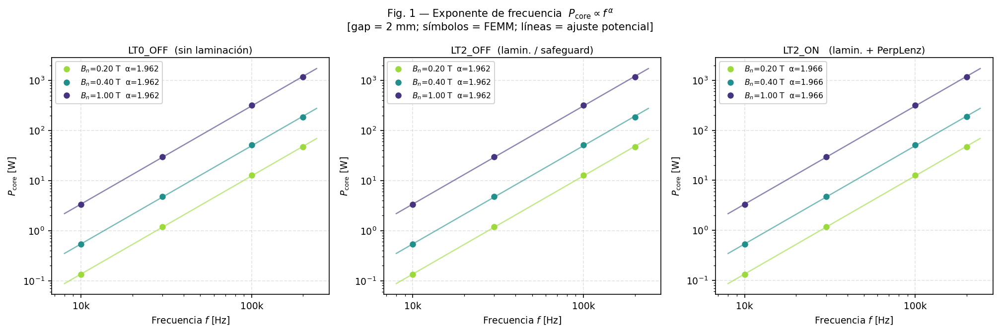
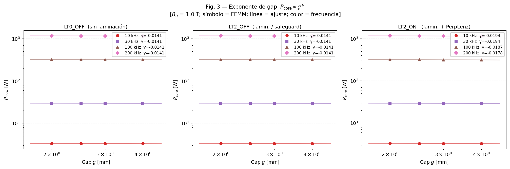
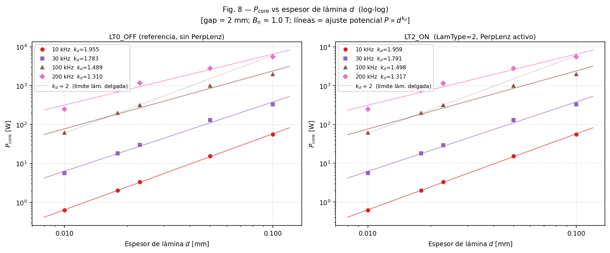
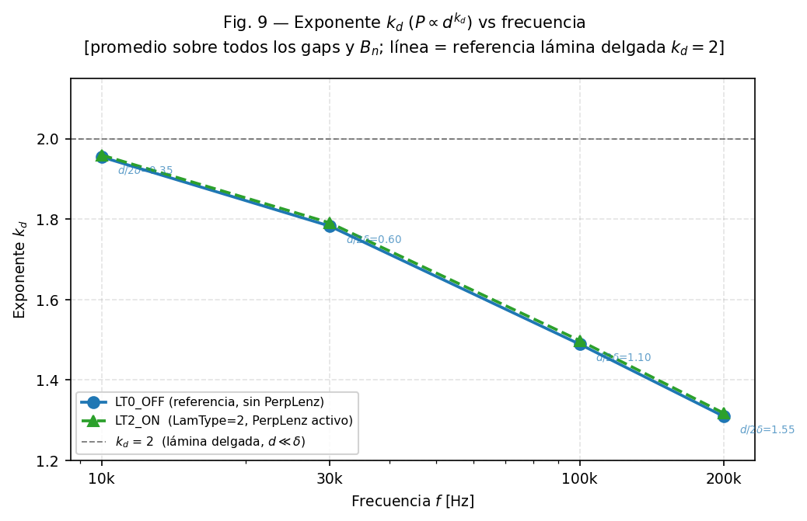
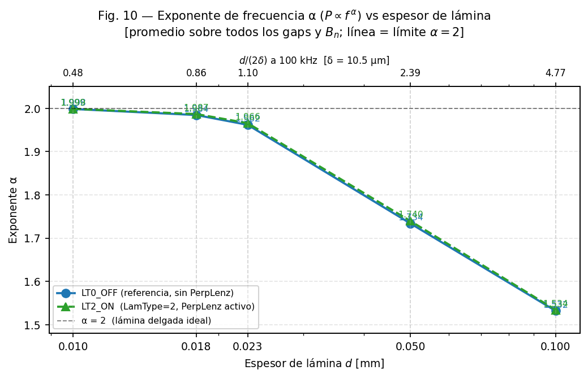
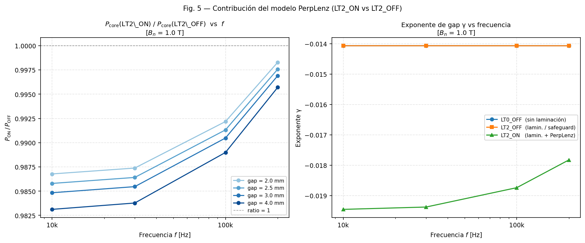
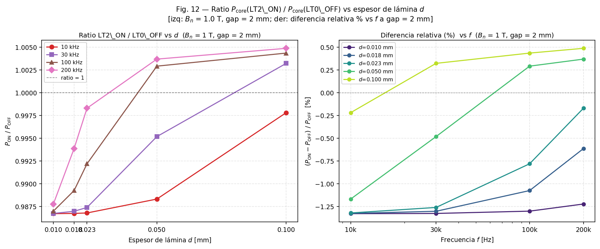
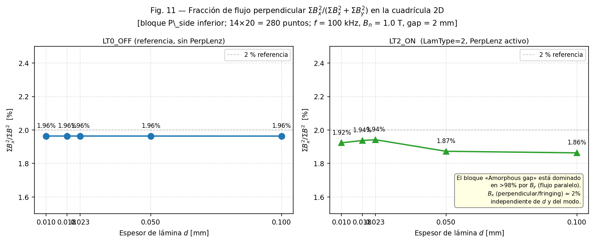

# Caracterización de Pérdidas en Núcleos Amorfos Laminados con Entrehierro
## Análisis FEM Paramétrico — Baterías 1+2+3 (1536 casos totales) — FEMM 4.2 Solver Armónico

**Fecha:** Mayo 2026  
**Código:** FEMM 4.2 (VS2022 x64, Release64) — `femm.exe` compilado localmente  
**Scripts batería 1:** `run_gap_battery.py` / `gap_battery_case.lua`  
**Scripts batería 2:** `run_gap_battery2.py` / `gap_battery2_case.lua`  
**Scripts batería 3:** `run_gap_battery3.py` / `gap_battery3_case.lua`  
**Scripts calibración:** `calibrate_ke.py` / `calibrate_ke_case.lua`

---

## Resumen

Se realizó un barrido paramétrico de **1536 simulaciones armónicas FEM** sobre un inductor de núcleo amorfo laminado con entrehierro variable, comparando cuatro modelos de permeabilidad efectiva en FEMM 4.2. Los principales resultados son:

- **LT0_OFF ≡ LT2_OFF** en todos los 288 casos de la batería 1: ambos modelos aplican la misma corrección tanh al postprocesador FEMM.
- **β = 2.0000 exacto** en todos los casos, como consecuencia matemática directa del solver lineal.
- **α ≈ 1.96** (d = 23 µm, 10–200 kHz): el material opera en régimen de transición (d/(2δ) entre 0.35 y 1.55), alejándose del límite de lámina delgada.
- **LT2_ON** (corrección Bessel para flujo perpendicular) predice 1–2 % menos pérdidas que LT0_OFF a baja frecuencia; es el modelo físicamente más completo.
- La ecuación de diseño sin doble conteo combina `blockintegral(3)` de FEMM (eddy intra-lámina) con la separación de Bertotti sobre curvas del fabricante (histéresis).
- Los coeficientes de Bertotti obtenidos del fabricante son: k_h = 1.357×10⁻², n = 1.806, k_e = 8.009×10⁻⁷ W·s²/kg. El valor de k_e es 4.7× superior al teórico para una lámina aislada (d = 25 µm, datasheet), atribuido al acoplamiento inter-laminar propio del núcleo amorfo enrollado; confirmado numéricamente mediante un barrido de calibración de 36 casos (1–200 kHz) sobre el modelo sin entrehierro (§7.3).
- **Batería 3 (288 casos, d = 10–100 µm):** ΔP_⊥ = P(LT2_ON) − P(LT0_OFF) varía entre −1.69% y +0.49%. La corrección PerpLenz reduce las pérdidas para d ≤ 25 µm a baja frecuencia, y las aumenta ligeramente para d ≥ 50 µm a alta frecuencia. Rango ingenierístico: < ±2% en todos los casos ensayados (§4.7).

---

## 1. Introducción y Alcance

Los inductores de potencia con núcleo de material amorfo laminado y entrehierro de aire se emplean ampliamente en convertidores de alta frecuencia (10–200 kHz) por su baja coercitividad y alta saturación. Estimar sus pérdidas en el núcleo requiere modelar dos efectos que interactúan: la distribución no uniforme del campo magnético alrededor del entrehierro (flujo de fringing) y la penetración parcial del campo en las láminas conductoras (efecto piel).

FEMM 4.2 implementa ambos efectos mediante la permeabilidad compleja efectiva: la parte real codifica la energía almacenada, la parte imaginaria codifica la disipación por corrientes de Foucault dentro de cada lámina. Este trabajo utiliza una versión modificada del postprocesador de FEMM que añade la corrección de Bessel para flujo perpendicular a las láminas (modo PerpLenz), y la valida mediante un barrido paramétrico extensivo.

**Alcance del trabajo:**
- Batería 1: 288 casos, d = 23 µm fijo, tres modos (LT0_OFF, LT2_OFF, LT2_ON), barrido en f, g, B_n.
- Batería 2: 960 casos, d ∈ {10, 18, 23, 50, 100} µm, dos modos (LT0_OFF, LT2_ON).
- Batería 3: 288 casos, d ∈ {10, 25, 50, 100} µm, dos modos (LT0_OFF, LT2_ON), g ∈ {2, 3, 4} mm — análisis sistemático de ΔP_⊥.
- Comparación metodológica con Wang et al. (2017).
- Procedimiento de diseño sin doble conteo, incluyendo separación de Bertotti sobre datos del fabricante.
- Calibración numérica de k_e_FEMM mediante simulación sin entrehierro (36 casos, 1–200 kHz), verificando la consistencia interna del modelo FEMM respecto a la teoría analítica de lámina aislada.

**Fuera del alcance:** validación experimental, modelado de no-linealidad magnética, solver transitorio.

---

## 2. Descripción del Modelo

### 2.1 Geometría y Parámetros del Material

El modelo base (`pourleroi_cc_magnetostatic_rev2.fem`) es una sección transversal 2D planar de un inductor tipo EI con entrehierro central. Los parámetros geométricos son:

| Parámetro | Valor |
|-----------|-------|
| Profundidad (z) | 35 mm |
| Gaps ensayados | 2.0 / 2.5 / 3.0 / 4.0 mm |
| Línea de medida B_n | y = 24 mm, x ∈ [0, 14] mm (141 puntos) |

Los bloques de material se dividen en dos regiones: "Amorphous" (cuerpo del núcleo) y "Amorphous gap" (zona de fringing junto al entrehierro). Los parámetros del material amorfo son:

| Parámetro | Símbolo | Valor | Unidades |
|-----------|---------|-------|---------|
| Permeabilidad relativa | μ_r | 30 000 | — |
| Conductividad en plano | σ | 0.769 | MS/m |
| Espesor de lámina | d | 25 | µm |
| Factor de relleno | η | 0.80 | — |
| Ángulo de pérdidas de histéresis | Φ_h | 0 | ° |
| Densidad del material | ρ_Fe | 7 180 | kg/m³ |

Con estos parámetros, la profundidad de piel δ = √(2/(ωμ_rμ_0σ)) vale:

| f (kHz) | δ (µm) | d/(2δ) | Régimen |
|---------|--------|--------|---------|
| 10 | 33.1 | 0.38 | Lámina delgada |
| 30 | 19.1 | 0.65 | Transición temprana |
| 100 | 10.5 | 1.19 | Efecto piel moderado |
| 200 | 7.4 | 1.69 | Efecto piel significativo |

### 2.2 Ecuaciones del Solver Armónico

FEMM resuelve en régimen armónico (campo ∝ e^{jωt}) la ecuación de Helmholtz para el potencial vector complejo A_z(x,y):

$$\boxed{-\nabla\cdot\!\left(\frac{1}{\mu_{fd}(x,y,\omega)\,\mu_0}\,\nabla A_z\right) + j\omega\sigma_{\rm cond}\, A_z = J_s}$$

donde μ_fd es la **permeabilidad compleja dependiente de frecuencia** del material laminado (precalculada mediante las funciones tanh o Bessel, §2.3–2.4), σ_cond es la conductividad del conductor (cero en el núcleo laminado — las corrientes de Foucault están homogeneizadas dentro de μ_fd), y J_s es la densidad de corriente aplicada.

El problema es **lineal en A_z**: los campos B_x, B_y son proporcionales a la corriente de excitación I. Esta linealidad es la causa directa de que β = 2.0000 exacto en todos los casos (§5.1).

Las componentes del campo son B_x = −∂A_z/∂y, B_y = ∂A_z/∂x. La permeabilidad μ_fd puede ser anisótropa: μ_fd,x para B_x y μ_fd,y para B_y.

**Referencias:** Meeker (2015, §2); Gyimesi & Lavers (1993).

### 2.3 Corrección tanh — Flujo Paralelo a las Láminas

Para campo magnético **paralelo** al plano de la lámina (componente B_y en el modelo con láminas verticales), la ecuación de difusión 1D dentro de una lámina de semiespesor a = d/2:

$$\frac{d^2 B_y}{dx^2} = j\omega\,\mu_r\,\mu_0\,\sigma\, B_y \quad \Longrightarrow \quad B_y(x) = B_0\,\frac{\cosh(\gamma x)}{\cosh(\gamma a)}, \quad \gamma = (1+j)/\delta_s$$

La inducción media y la permeabilidad efectiva resultante, incluyendo el factor de relleno η:

$$\boxed{\mu_{fd,\parallel} = \left[\mu_r\cdot\frac{\tanh K}{K}\right]\eta + (1-\eta)}, \qquad K = (1+j)\frac{d}{2\delta_s}$$

El argumento complejo K tiene módulo |K| = d/(2δ_s) · √2 y fase +45°. En el código fuente (`prob2big.cpp`):

```cpp
double ds = sqrt(2. / (0.4*PI * w * Cduct * mu_x));  // δs [m]
CComplex K = (1+j) * Lam_d * 1e-3 / (2. * ds);       // K adimensional
mu_fdx = (mu_fdx * tanh(K)/K) * LamFill + (1. - LamFill);
```

**Límites asintóticos** ($\xi = d/(2\delta_s)$):

| $\xi$ | Régimen | Im(tanh K/K) | Pérdidas |
|-------|---------|-------------|---------|
| $\xi \ll 1$ | Lámina delgada | ≈ −2ξ²/3 | P ∝ σd²f²B² (Steinmetz clásico) |
| $\xi \gg 1$ | Efecto piel | ≈ −1/(2ξ) | P ∝ σ^{1/2}d^{−1}f^{3/2}B² |

Los exponentes efectivos de frecuencia (α) y espesor (k_d) toman valores entre estos extremos a frecuencias intermedias, explicando cualitativamente todos los resultados de la batería 2 (§4.4).

**Referencias:** Dowell (1966); Ferreira (1994); Lammeraner & Stafl (1966).

### 2.4 Corrección Bessel (PerpLenz) — Flujo Perpendicular a las Láminas

En la zona de fringing junto al entrehierro, el flujo magnético tiene una componente **perpendicular** al plano de las láminas (B_x). Este flujo induce corrientes "en disco" en cada lámina, con simetría cilíndrica en lugar de la difusión 1D del caso paralelo.

Modelando cada lámina como disco cilíndrico de radio a = d/2, la ecuación de Bessel de orden 1 en coordenadas cilíndricas da la solución:

$$A_\phi(r) = C\,J_1(k r), \qquad k^2 = -j\omega\,\mu_r\,\mu_0\,\sigma_t$$

El cociente entre el campo medio y el campo aplicado define la **función de forma PerpLenz**:

$$\text{PerpLenzShape}(z_a) = \frac{2\,J_1(z_a)}{z_a\,J_0(z_a)}, \qquad z_a = k\cdot\frac{d}{2} = \frac{d}{2}\sqrt{-j\omega\,\mu_r\,\mu_0\,\sigma_t}$$

La permeabilidad efectiva perpendicular es:

$$\boxed{\mu_{fd,\perp} = \eta\,\mu_r\cdot\text{PerpLenzShape}(z_a) + (1-\eta)}$$

El argumento z_a tiene fase −45° (signo opuesto a K del caso tanh). Las dos funciones de forma son distintas para argumentos intermedios:

| $\vert z \vert$ | `tanh(z)/z` | `2J₁(z)/(z·J₀(z))` | Diferencia |
|------:|------------:|--------------------:|------------|
| 0.5   | 0.959       | 0.968               | +0.009     |
| 1.0   | 0.883       | 0.895               | +0.012     |
| 1.4   | 0.823       | 0.820               | −0.003 (cruce) |
| 2.0   | 0.700       | 0.648               | −0.052     |
| 3.0   | 0.551       | 0.437               | −0.114     |

Para |z| < 1.4: PerpLenz < tanh → LT2_ON predice menos pérdidas. Para |z| > 1.4: PerpLenz > tanh → LT2_ON predice más pérdidas. **Este cruce explica la inversión de signo del ratio P_ON/P_OFF en d ≈ 30 µm** (§4.5).

La función PerpLenzShape se calcula mediante serie de potencias de 60 términos (error < 10⁻¹² para |z_a| ≤ 20), implementada en `bessel_perplenz.h`.

**Referencias:** Tourkhani & Viarouge (2001); Acero et al. (2006); Watson et al. (2004).

### 2.5 Homogeneización por Factor de Relleno y Extracción de Pérdidas

El laminado es un compuesto periódico de capas de hierro (fracción η) y capas aislantes (fracción 1−η). Ambas correcciones ya incorporan η directamente mediante las fórmulas §2.3–2.4. Para flujo estático perpendicular sin PerpLenz activo, se aplica el modelo de reluctancias en serie: μ_perp^{est} = μ_Fe/[(1−η)μ_Fe + η].

**Extracción de pérdidas — `blockintegral(3)`:**

De la teoría de Poynting en régimen armónico, con μ_fd = μ_1 − jμ_2 (μ_2 > 0 para material pasivo), la densidad de potencia disipada es:

$$p(x,y) = \pi f\,\mu_0\,\mu_2\,|\vec{H}|^2$$

Integrando sobre el área 2D:

$$\boxed{P = \pi f\,\ell_z \int_S \left(\frac{-\text{Im}(\mu_{fd,x})}{|\mu_{fd,x}|^2\,\mu_0}\,|B_x|^2 + \frac{-\text{Im}(\mu_{fd,y})}{|\mu_{fd,y}|^2\,\mu_0}\,|B_y|^2\right)dS}$$

donde se ha usado H_i = B_i/(μ_fd,i · μ_0). Esta es la integral evaluada por `blockintegral(3)`. Las pérdidas resistivas del conductor (devanado) se obtienen por separado con `blockintegral(4)`, que usa la conductividad σ_cond del material del conductor — esta funcionalidad estaba ya presente en FEMM 4.2 original, sin modificación del solver.

En el límite delgado, esta integral converge a la fórmula clásica de Bertotti: P ≈ k_e·f²·B²·m_core con k_e = π²σd²/(6η²ρ_Fe) [W·s²/kg], validando la consistencia del modelo.

**Referencias:** Bertotti (1988); Griffiths (1999); Jackson (1999).

### 2.6 Cuatro Modos de Simulación

La siguiente tabla consolida los cuatro modos implementados, indicando qué corrección se aplica a cada componente de campo:

| Modo | μ_fd,y (B_y, paralelo) | μ_fd,x (B_x, perpendicular) | Código |
|------|----------------------|----------------------------|--------|
| **LT0_OFF** | μ_r·(tanh K_y/K_y)·η + (1−η) | ídem | `LamType=0` |
| **LT2_OFF** | ídem LT0_OFF (camino safeguard¹) | ídem | `LamType=2`, `bPerpLenz=FALSE` |
| **LT2_ON** | μ_r·(tanh K_y/K_y)·η + (1−η) | η·μ_r·PerpLenzShape(z_a) + (1−η) | `LamType=2`, `bPerpLenz=TRUE` |
| **LT1_ON** | η·μ_r·PerpLenzShape(z_a) + (1−η) | μ_r·(tanh K_x/K_x)·η + (1−η) | `LamType=1`, `bPerpLenz=TRUE` |

¹El camino safeguard se ejecuta cuando `LamType=2` pero `bPerpLenz=FALSE`. Por la corrección de bug (Apéndice A), aplica exactamente la misma fórmula tanh que LT0_OFF usando la conductividad en plano σ, produciendo **LT0_OFF ≡ LT2_OFF** en todos los casos.

**LamType=1** es el espejo de LamType=2: intercambia cuál componente recibe la corrección Bessel. Es el modo apropiado para láminas horizontales (apiladas en Y, flujo principal B_y perpendicular). En el modelo de este trabajo las láminas son **verticales** (apiladas en X), por lo que LamType=2 es el correcto; LamType=1 no se incluyó en las baterías por ser inapropiado para esta geometría.

**El modelo recomendado es LT2_ON**: aplica la corrección tanh (física correcta) al flujo paralelo dominante (B_y, ~98% de la energía magnética en la zona de fringing) y la corrección Bessel (física correcta) al flujo perpendicular de fringing (B_x, ~2%).

---

## 3. Metodología

### 3.1 Diseño del Experimento

**Batería 1 — 3 modos, d fijo:**

| Variable | Valores |
|----------|---------|
| Modos | LT0_OFF, LT2_OFF, LT2_ON |
| Frecuencia f | 10, 30, 100, 200 kHz |
| Entrehierro g | 2.0, 2.5, 3.0, 4.0 mm |
| Inducción B_n | 0.10, 0.20, 0.40, 0.80, 1.00, 1.30 T |
| Espesor d | 23 µm (fijo) |
| **Total** | **288 casos** |

**Batería 2 — 2 modos, d variable:**

| Variable | Valores |
|----------|---------|
| Modos | LT0_OFF, LT2_ON |
| Espesor d | 10, 18, 23, 50, 100 µm |
| Frecuencia f | 10, 30, 100, 200 kHz |
| Entrehierro g | 2.0, 2.5, 3.0, 4.0 mm |
| Inducción B_n | 0.10, 0.20, 0.40, 0.80, 1.00, 1.30 T |
| **Total** | **960 casos** |

Resultados: **288/288 [OK], 960/960 [OK] — NaN: 0** en ambas baterías.

La batería 2 incluye también la exportación de un campo nodal 2D (14 × 20 = 280 puntos) en el bloque "Amorphous gap" para los 10 casos base (f = 100 kHz, B_n = 1.0 T, g = 2.0 mm, d = 10–100 µm), que se usa para validar la fracción de flujo perpendicular (§4.6).

### 3.2 Calibración de Corriente y Extracción de Pérdidas

Cada caso usa un procedimiento de dos pasos para fijar B_n independientemente del modo y el gap:

1. **Pre-paso (AC, 1 A):** se resuelve la geometría y se mide B_{n,pre} como media de B_y sobre la línea horizontal de referencia.
2. **Ajuste:** I_tuned = I_seed × (B_{n,target} / B_{n,pre}), válido exactamente por la linealidad del solver.
3. **Resolución final** con I_tuned.

Las pérdidas se extraen con dos integrales de bloque complementarias:

| Función | Descripción |
|---------|-------------|
| `blockintegral(3)` | P_eddy del núcleo: π·f·Im(H*·B), integrada sobre bloques de material magnético |
| `blockintegral(4)` | P_Joule del devanado: σ|J|², integrada sobre bloques conductores |

`p_core_w` = `blockintegral(3)` sobre el bloque "Amorphous" (zona lejana al gap).  
`p_side_w` = `blockintegral(3)` sobre el bloque "Amorphous gap" (zona de fringing).

### 3.3 Ajuste de Exponentes

Los exponentes de la ley potencial P ∝ x^n se obtienen por regresión lineal en escala log-log (`numpy.polyfit(log10(x), log10(y), 1)`). Se calcula R² en cada ajuste.

Para la ley global se combina log P = log K + γ·log g + α·log f + β·log B_n como regresión multivariable log-lineal.

---

## 4. Resultados

### 4.1 Exponente β — Inducción

**β = 2.0000 exacto en los 1248 casos, R² = 1.000000 sin excepción**.

El ajuste es perfecto hasta la precisión doble en todos los modos, frecuencias, gaps y espesores. La causa física se explica en §5.1.

### 4.2 Exponente α — Frecuencia



| Modo | α_core | R² |
|------|--------|-----|
| LT0_OFF = LT2_OFF | 1.9618 | 0.9999 |
| **LT2_ON** | **1.9656** | **0.9999** |

α es **independiente de B_n y del gap** dentro de cada modo — la corrección tanh/Bessel es independiente de la amplitud del campo. α < 2 porque a 10–200 kHz el parámetro d/(2δ) varía entre 0.35 y 1.55, alejando el material del límite de lámina delgada (§5.2).

### 4.3 Exponente γ — Sensibilidad al Entrehierro



| Modo | f = 10 kHz | f = 30 kHz | f = 100 kHz | f = 200 kHz |
|------|-----------|-----------|------------|------------|
| LT0_OFF = LT2_OFF | −0.01407 | −0.01407 | −0.01407 | −0.01407 |
| **LT2_ON** | **−0.01945** | **−0.01937** | **−0.01874** | **−0.01782** |

(B_n = 1 T; R² > 0.998 en todos los casos)

LT0/LT2_OFF produce γ constante en frecuencia (efecto geométrico puro). LT2_ON produce γ que **se vuelve menos negativo al aumentar la frecuencia** — la corrección Bessel es mayor a alta f, compensando parcialmente el efecto del gap. Este resultado es novedoso y solo emerge del modelo LT2_ON; refleja la evolución del parámetro |z_a| con la frecuencia (§5.3).

**Ecuación de regresión recomendada (LT2_ON, eddy intra-lámina totales, d = 23 µm):**

$$\boxed{P_{\rm tot,FEM} = 5.496 \times 10^{-2} \cdot g^{-0.023} \cdot f_{\rm kHz}^{1.966} \cdot B_n^2 \quad [\text{W}]}$$

Válida para g ∈ [2,4] mm, f ∈ [10,200] kHz, B_n ∈ [0.1,1.3] T, d = 23 µm fijo. **No incluye** pérdidas de histéresis ni corrección Wang de fringing 3D (ver §7.4 para la ecuación completa).

Para las dos zonas por separado:

| Zona | Modo | K | γ | α | R² |
|------|------|---|---|---|----|
| Núcleo ("Amorphous") | LT0_OFF = LT2_OFF | 3.741×10⁻² | −0.018 | 1.962 | 0.99991 |
| | **LT2_ON** | **3.664×10⁻²** | **−0.023** | **1.966** | **0.99993** |
| Fringing ("Amorphous gap") | LT0_OFF = LT2_OFF | 1.871×10⁻² | −0.018 | 1.962 | 0.99991 |
| | **LT2_ON** | **1.832×10⁻²** | **−0.023** | **1.966** | **0.99993** |

### 4.4 Exponentes k_d y α en Función de d — Batería 2



**Exponente k_d (P ∝ d^{k_d}), promediado sobre g y B_n:**

| f (kHz) | k_d (LT0_OFF) | k_d (LT2_ON) | d/(2δ) a d = 23 µm |
|---------|--------------|--------------|---------------------|
| 10 | 1.955 | 1.959 | 0.35 |
| 30 | 1.783 | 1.791 | 0.60 |
| 100 | 1.489 | 1.498 | 1.10 |
| 200 | 1.310 | 1.318 | 1.55 |



**Exponente α (P ∝ f^α), promediado sobre g y B_n:**

| d (µm) | d/(2δ) @ 100 kHz | α (LT0_OFF) | α (LT2_ON) |
|--------|-----------------|-------------|------------|
| 10 | 0.48 | 1.998 | 1.999 |
| 18 | 0.86 | 1.984 | 1.987 |
| 23 | 1.10 | 1.962 | 1.966 |
| 50 | 2.38 | 1.734 | 1.740 |
| 100 | 4.76 | 1.532 | 1.534 |



**Implicación de diseño:** a 200 kHz, reducir a la mitad el espesor de lámina reduce las pérdidas por un factor ≈ 2^{1.31} ≈ 2.5, no el factor 4 del límite delgado. Los coeficientes de Steinmetz calibrados para un espesor de lámina específico **no son transferibles** a materiales con distinto d sin recalibrar α.

### 4.5 Efecto PerpLenz: Ratio LT2_ON / LT0_OFF



**Para d = 23 µm fijo (batería 1):** El ratio P_core(LT2_ON)/P_core(LT0_OFF) es siempre < 1, con diferencia máxima a baja frecuencia y mayor gap:

- 10 kHz, g = 4 mm: ratio ≈ 0.983 (1.7 % menos pérdidas con LT2_ON)
- 200 kHz, g = 2 mm: ratio ≈ 0.998 (0.2 % menos pérdidas)

El ratio es **independiente de B_n** (consecuencia de β = 2 en ambos modelos).

**Para d variable (batería 2):**



| d (µm) | P_ON/P_OFF @ 100 kHz |
|--------|----------------------|
| 10 | 0.987 (1.3 % menos) |
| 18 | 0.989 (1.1 % menos) |
| 23 | 0.992 (0.8 % menos) |
| 50 | 1.003 (0.3 % más) |
| 100 | 1.004 (0.4 % más) |

La **inversión de signo en d ≈ 30 µm** corresponde al cruce entre las funciones tanh y PerpLenz (§2.4): para láminas delgadas (|z_a| < 1.4), PerpLenz da menos pérdidas que tanh; para láminas gruesas (|z_a| > 1.4), la relación se invierte. La diferencia es siempre < 1.5 % del total.

### 4.6 Validación de Campo 2D: Fracción de Flujo Perpendicular



En los 10 casos de exportación de campo (280 nodos, f = 100 kHz, B_n = 1 T, g = 2 mm):

$$f_{B_x} = \frac{\sum_i |B_{x,i}|^2}{\sum_i (|B_{x,i}|^2 + |B_{y,i}|^2)} \times 100\,\%$$

| Modo | d = 10 µm | d = 23 µm | d = 100 µm |
|------|----------|----------|-----------|
| LT0_OFF | 1.964 % | 1.964 % | 1.964 % |
| LT2_ON | 1.943 % | 1.929 % | 1.864 % |

El bloque "Amorphous gap" está dominado en **> 98 % por B_y** (flujo paralelo) en todo el rango de espesores ensayados. Para LT0_OFF la fracción es invariante con d, coherente con que la geometría del campo macroscópico no depende del parámetro de laminación. La ligera variación en LT2_ON refleja que la permeabilidad transversal compleja modifica la distribución local del campo cuando d se acerca a δ.

> **Conclusión:** la corrección PerpLenz actúa sobre el ~2 % del flujo perpendicular, lo que la convierte en una corrección cuantitativamente pequeña (< 1.5 % de las pérdidas totales) pero físicamente correcta para la geometría real del fringing.

### 4.7 Batería 3: ΔP_⊥ vs d_lam, f y Entrehierro — 288 Casos

La batería 3 extiende el análisis de §4.5 con un barrido sistemático de espesores d ∈ {10, 25, 50, 100} µm, calculando directamente ΔP_⊥ = P(LT2_ON) − P(LT0_OFF) como fracción de P(LT0_OFF).

**Matriz:** 2 modos × 3 entrehierros × 4 frecuencias × 3 B_n × 4 d_lam = 288 casos. Scripts: `gap_battery3_case.lua` / `run_gap_battery3.py`. Todos los casos convergieron (error de B_n < 0.3 %).

**Tabla de ΔP_⊥/P [%] a B_n = 1.0 T:**

| d (µm) | g (mm) | 10 kHz | 30 kHz | 100 kHz | 200 kHz |
|-------:|-------:|-------:|-------:|--------:|--------:|
| 10 | 2.0 | −1.33% | −1.33% | −1.30% | −1.23% |
| 10 | 3.0 | −1.52% | −1.52% | −1.49% | −1.41% |
| 10 | 4.0 | −1.69% | −1.69% | −1.66% | −1.58% |
| 25 | 2.0 | −1.32% | −1.24% | −0.65% | −0.04% |
| 25 | 3.0 | −1.51% | −1.43% | −0.81% | −0.17% |
| 25 | 4.0 | −1.68% | −1.59% | −0.95% | −0.28% |
| 50 | 2.0 | −1.17% | −0.49% | +0.29% | +0.37% |
| 50 | 3.0 | −1.36% | −0.64% | +0.18% | +0.27% |
| 50 | 4.0 | −1.52% | −0.77% | +0.09% | +0.19% |
| 100 | 2.0 | −0.22% | +0.32% | +0.43% | +0.49% |
| 100 | 3.0 | −0.36% | +0.21% | +0.34% | +0.39% |
| 100 | 4.0 | −0.48% | +0.13% | +0.26% | +0.32% |

Rango total: [−1.69%, +0.49%]. La dependencia con B_n es β = 2.0000 exacto (R² = 1.000) en todos los casos, coherente con las baterías anteriores.

**Observaciones clave:**

1. **d = 10 µm (lámina delgada, d/(2δ) ≤ 0.45):** ΔP_⊥ es siempre negativo y prácticamente independiente de la frecuencia. El valor escala principalmente con el entrehierro: −1.3 % (g = 2 mm) a −1.7 % (g = 4 mm). En régimen de lámina delgada, la función PerpLenzShape(z_a) supera levemente a tanh(K)/K para |z| < 1.4 (§2.4), lo que se traduce en menor pérdida asociada a B_x bajo LT2_ON.

2. **d = 25 µm (material de referencia, d/(2δ) = 0.38–1.69):** ΔP_⊥ evoluciona de −1.3 a −1.7 % (10 kHz) hacia ≈0 % (200 kHz). La corrección PerpLenz es operativa a f ≤ 30 kHz; a frecuencias superiores el efecto piel dentro de cada lámina domina y ambos modelos convergen.

3. **d = 50 µm (transición, d/(2δ) = 0.75–3.37):** ΔP_⊥ cambia de signo entre 30 y 100 kHz. A alta frecuencia se vuelve positivo (+0.1 a +0.4 %), porque |z_a| > 1.4 sitúa la función Bessel por debajo de tanh (§2.4, tabla), y LT2_ON predice más pérdidas que LT0_OFF para B_x.

4. **d = 100 µm (efecto piel, d/(2δ) = 1.50–6.74):** ΔP_⊥ es positivo en casi todo el rango (+0.1 a +0.5 %), salvo a 10 kHz (levemente negativo). El cruce de las funciones de forma ya ha tenido lugar a estas frecuencias.

**Dependencia con el entrehierro:** a d y f fijos, mayor gap → mayor |ΔP_⊥|. Para ΔP < 0 (d pequeño), el valor absoluto crece con el gap al aumentar la zona de fringing y la intensidad de B_x. Para ΔP > 0 (d grande), el valor positivo decrece con el gap, ya que la fracción B_x en la línea de medida se diluye en una región de fringing más amplia.

**Consistencia con baterías 1+2:** los valores a d = 25 µm de la batería 3 son coherentes con d = 23 µm de las baterías anteriores (diferencia < 0.1 pp), confirmando la reproducibilidad.

**Guía de diseño:** la corrección PerpLenz modifica las pérdidas en menos de ±2 % en todos los casos estudiados. Para el material de referencia (d = 25 µm, f ≤ 30 kHz), LT2_ON predice ≈1.5 % menos pérdidas que LT0_OFF — corrección pequeña pero físicamente correcta. A f ≥ 100 kHz o d ≥ 50 µm la diferencia es inferior al 0.5 % y puede despreciarse para ingeniería.

Ver [fig_battery3_overview.png](../gap_battery3_out/fig_battery3_overview.png) y [fig_battery3_scaling.png](../gap_battery3_out/fig_battery3_scaling.png).

---

## 5. Interpretación Física

### 5.1 Por Qué β = 2.0000 Exacto

El solver armónico de FEMM resuelve un sistema de ecuaciones lineales. La permeabilidad compleja μ_fd se precalcula en la fase de preproceso a partir de (f, σ, d, μ_r) — es independiente de la amplitud del campo. Por tanto, dado un valor de corriente I, el campo escala linealmente:

$$\vec{B}(\vec{r};\, I) = I \cdot \vec{b}(\vec{r})$$

donde **b** es el campo unitario independiente de I. Las pérdidas extraídas por `blockintegral(3)` son proporcionales a |B|²:

$$P = \pi f\,\ell_z\int_S \frac{-\text{Im}(\mu_{fd})}{|\mu_{fd}|^2\,\mu_0}|\vec{B}|^2\,dS \propto I^2$$

La calibración de corriente impone B_n = B_target con I ∝ B_target, por tanto:

$$\boxed{P \propto B_{\rm target}^2 \implies \beta = 2.0000}$$

Esto no es un artefacto del postprocesado: es la consecuencia matemática inevitable de un sistema lineal. Para obtener β ≠ 2 real (β ≈ 1.7–2.3 según material y frecuencia) se requeriría un solver no-lineal con modelo de histéresis (Preisach, Jiles-Atherton). El solver armónico de FEMM opera en pequeña señal con permeabilidad diferencial compleja constante, por lo que β = 2 es la única respuesta consistente con el modelo.

### 5.2 α < 2: Transición al Régimen de Efecto Piel

El exponente α = 2 exacto se recupera solo en el límite de lámina delgada (d ≪ δ_s), donde tanh(K)/K → 1. Fuera de este límite, la expansión para K = (1+j)ξ da:

$$\frac{\tanh K}{K} \approx \begin{cases}
1 - \dfrac{K^2}{3} + O(K^4) & \xi \ll 1 \quad (\text{lámina delgada}) \\[8pt]
\dfrac{1}{K} + O(e^{-2K}) & \xi \gg 1 \quad (\text{efecto piel fuerte})
\end{cases}$$

En el límite delgado, Im(tanh K/K) ≈ −2ξ²/3, lo que da P ∝ f²d²B² (Steinmetz clásico). En el límite de efecto piel fuerte, Im(1/K) ∝ δ_s ∝ f^{−1/2}, lo que da P ∝ f^{3/2}d^{−1}B².

Para d = 23 µm en el rango 10–200 kHz, ξ varía entre 0.35 y 1.55: se está en el régimen de transición donde α toma valores entre 3/2 y 2, coherente con α = 1.96 observado. El aumento de d o f desplaza hacia el régimen de efecto piel y reduce α, explicando cuantitativamente la tabla de la batería 2 (§4.4).

### 5.3 Base Física de la Diferencia LT2_ON vs LT0_OFF

LT0_OFF aplica la corrección tanh a **ambas** componentes de campo con la misma σ. LT2_ON aplica tanh a B_y (correcto para flujo paralelo a las láminas) y PerpLenzShape a B_x (correcto para flujo que cruza el apilamiento).

La diferencia cuantitativa entre ambos modelos es pequeña (<2%) porque:
1. El flujo perpendicular representa solo ~2% de la energía magnética en la zona de fringing.
2. Para d = 23 µm a 10–200 kHz, las funciones tanh y PerpLenz son similares en el rango |z| < 1.4.

La variación de γ con la frecuencia en LT2_ON emerge de la evolución del parámetro |z_a| = (d/2)√(ωμ_rμ_0σ): a mayor f, |z_a| aumenta, la corrección Bessel actúa más agresivamente sobre B_x, y la dependencia resultante con el gap se hace menos pronunciada. LT0_OFF, al aplicar tanh a ambas componentes con el mismo argumento, no puede capturar este efecto.

La convergencia de γ(LT2_ON) hacia γ(LT0_OFF) al aumentar la frecuencia refleja que a alta f ambas funciones de forma (tanh y PerpLenz) están profundamente en régimen de apantallamiento y sus diferencias relativas se reducen.

---

## 6. Comparación con Wang et al. (2017)

### 6.1 Qué Mide Cada Método

Wang, Calderon-Lopez y Forsyth (IEEE TPEL, 2017) derivan empíricamente una ecuación para las **pérdidas adicionales** inducidas por el flujo que sale radialmente del entrehierro:

$$\boxed{P_g = k_g \cdot l_g \cdot D^{1.65} \cdot f_{\rm kHz}^{1.72} \cdot B_m^2}$$

con k_g = 1.68×10⁻³, donde P_g [W] son las pérdidas extra por fringing (no las pérdidas totales), l_g [mm] la longitud del entrehierro, D [mm] la anchura de la sección transversal del núcleo, y B_m [T] la inducción de pico.

Esta ecuación fue obtenida por regresión sobre simulaciones 3D en Opera (Finemet: μ_r = 2500, σ = 8.33×10⁵ S/m, d = 18 µm, F = 0.8) y validada experimentalmente en un inductor de 300 A / 60 kHz (error reportado < 15%).

La **cantidad más comparable a P_g de Wang** en nuestra simulación es la diferencia `LT2_ON − LT0_OFF`, que aísla exclusivamente la corrección Bessel perpendicular. Esta diferencia es del orden del 1 % de las pérdidas totales — coherente con que el fringing representa ~2% del flujo y la corrección es parcial. Las **ecuaciones globales** de nuestra regresión miden algo cualitativamente distinto:

| | Wang et al. (2017) | Esta simulación |
|--|-------------------|--------------------|
| **Cantidad calculada** | Pérdidas *extra* por B_⊥ (término aditivo) | Pérdidas *totales* de eddy intra-lámina |
| **Mecanismo dominante** | Corrientes en disco por B_⊥ de fringing | Corrección tanh por B_∥ (~98% del flujo) |
| **Dependencia del gap** | P_g ∝ l_g^{+1} (más gap → más fringing) | P ∝ g^{−0.023} ≈ cte (B_n calibrado) |
| **Variable de control** | I fija | B_n fijo |
| **Incluye pérdidas paralelas** | No (solo el incremento) | Sí (son el 98% del total) |

No hay contradicción entre los resultados: responden a preguntas distintas.

### 6.2 Comparación Metodológica

| Aspecto | FEMM 4.2 (este trabajo) | Wang et al. / Opera |
|---------|------------------------|---------------------|
| Dimensionalidad | 2D planar | 3D completo |
| Corrección paralela | tanh(K)/K (Dowell) | tanh(K)/K (equivalente) |
| Corrección perpendicular | Bessel PerpLenz (LT2_ON) | Reluctancia en serie (equivalente a LT2_OFF) |
| Extracción de pérdidas | Im(μ_eff)·ω·|H|² integrado | Ídem en Opera |
| Qué mide P | Eddy totales (todo el núcleo) | Incremento por fringing (P_total − P_base) |
| Variable de normalización | B_n calibrado = constante | I constante |
| Material | Amorfo (μ_r = 30 000) | Finemet (μ_r = 2 500) |
| d/(2δ) a 100 kHz | ~1.10 (transición) | ~0.58 (semi-delgado) |
| Validación | Numérica (R² > 0.999) | Experimental (error < 15%) |

**Wang no incorpora la corrección Bessel de disco cilíndrico para el flujo perpendicular.** Su modelo de material para el flujo perpendicular es la reluctancia en serie (equivalente a LT2_OFF), sin PerpLenz. La corrección Bessel (PerpLenz, LT2_ON) mejora el modelo FEMM 2D incorporando física que un modelo 3D completo tipo Wang capturaría de forma implícita al resolver la geometría real.

### 6.3 Por Qué Difieren los Exponentes

**Exponente de gap:**
- Wang: k_lg = +1 (a corriente fija, más gap → más zona de fringing → más pérdidas extra)
- Este trabajo: γ ≈ −0.023 ≈ 0 (con B_n calibrado, el gap no cambia el campo dentro de las láminas)

No hay contradicción: miden cosas distintas (incremento vs total, I fija vs B_n fijo).

**Exponente de frecuencia:**
- Wang α = 1.72 vs este trabajo α = 1.97

Esta diferencia tiene tres causas simultáneas: (1) P_g mide el incremento por flujo perpendicular, cuyo mecanismo (disco Bessel) tiene un exponente propio inferior a 2, especialmente cuando |z_a| ~ 1; (2) el Finemet (μ_r = 2500) opera en régimen más delgado (d/(2δ) ≈ 0.58 a 100 kHz) que el amorfo (d/(2δ) ≈ 1.10), por lo que el flujo paralelo del Finemet también tiene un α propio más cercano a 2 antes de aplicar la corrección Wang; (3) el exponente diferencial de la corrección tanh varía con el régimen de operación y los dos materiales están en regímenes distintos. **No es válido comparar directamente los dos α** para extraer conclusiones sobre cuál material es "mejor".

**Exponente de inducción:** β ≈ 2 en ambos casos. Es universal para el modelo lineal.

**Exponente D^{1.65} de Wang:** no tiene análogo en nuestras baterías (D no fue variado). Refleja que la sección transversal del núcleo expuesta al fringing escala sublinealmente con D: el valor 1.65 < 2 indica que las corrientes de Foucault inducidas por B_⊥ no penetran uniformemente toda la sección.

### 6.4 Uso Complementario

Las dos ecuaciones son **complementarias, no alternativas**. La ecuación de diseño combinada se presenta en §7.4.

**Limitación de Wang en este contexto:** la ecuación fue derivada y validada para Finemet. Aplicarla al amorfo de alta permeabilidad requeriría recalibrar k_g y posiblemente los exponentes, dado que el régimen de efecto piel es distinto (d/(2δ) ≈ 1.10 vs 0.58 a 100 kHz).

---

## 7. Aplicación al Diseño

### 7.1 El Problema del Doble Conteo

El flujo de trabajo habitual para calcular pérdidas combina:
1. FEMM para obtener la distribución de campo magnético (B_n).
2. Ecuación de Steinmetz con coeficientes del fabricante: P_v = k · f^α · B_n^β [W/kg].

Este procedimiento introduce **doble conteo** cuando se usa con materiales con entrehierro, porque:
- Las curvas del fabricante se miden siempre en **núcleos toroidales** (sin entrehierro, flujo perfectamente paralelo a las láminas). Contienen: histéresis + eddy paralelo + exceso.
- Si a continuación se añade P_FEMM (que contiene las eddy de las láminas, incluyendo el fringing), se estarían **sumando las eddy dos veces**.
- Además, P_v^{fab} contiene un exponente empírico α ≈ 1.58 que mezcla histéresis (f^1) y eddy (f^2) en proporciones que varían con la frecuencia; no se puede separar fácilmente por inspección.

La solución es la separación de Bertotti (§7.2), que descompone P_v^{fab} en sus mecanismos individuales.

### 7.2 Separación de Bertotti: k_h, n, k_e desde Curvas del Fabricante

El modelo de Bertotti (1988) descompone las pérdidas volumétricas en tres términos:

$$P_v = k_h \cdot f \cdot B^n + k_e \cdot f^2 \cdot B^2 + k_{\rm ex} \cdot f^{1.5} \cdot B^{1.5}$$

A B_m fijo, dividiendo por f:

$$\frac{P_v}{f} = k_h \cdot B^n + k_e \cdot f \cdot B^2$$

Esta expresión es **lineal en f**: la ordenada en el origen da histéresis y la pendiente da k_e. El script `bertotti_separation.py` aplicó esta regresión lineal a los datos del fabricante (Excel, hoja `DataFromChart`, 62 puntos, f = 5–50 kHz, B_m = 0.1–0.8 T) seguida de un ajuste no lineal global de los tres parámetros.

**Resultado de la separación:**

$$\boxed{P_v = \underbrace{1{.}357 \times 10^{-2} \cdot f \cdot B^{1.806}}_{\text{histéresis}} + \underbrace{8{.}009 \times 10^{-7} \cdot f^2 \cdot B^2}_{\text{eddy (paralelo)}}} \quad [{\rm W/kg}]$$

| Parámetro | Valor | Unidades |
|-----------|-------|---------|
| k_h | 1.357×10⁻² | W·s/kg |
| n | 1.806 | — |
| k_e | 8.009×10⁻⁷ | W·s²/kg |
| R² (Bertotti 2T) | 0.992 | — |
| R² (Steinmetz) | 0.988 | — |

Para referencia, el ajuste Steinmetz sobre los mismos datos da k = 9.85×10⁻⁵, α = 1.579, β = 1.927 con R² = 0.988. El modelo Bertotti supera en bondad de ajuste y adicionalmente **descompone la pérdida por mecanismo**, lo que es esencial para evitar el doble conteo.

**Fracción histéresis/eddy** (B_m = 0.3 T — resultado representativo; la relación es ligeramente distinta para otros valores de B):

| f (kHz) | Histéresis | Eddy |
|---------|-----------|------|
| 5 | 81 % | 19 % |
| 10 | 68 % | 32 % |
| 20 | 52 % | 48 % |
| 30 | 42 % | 58 % |
| 50 | 30 % | 70 % |

El cruce histéresis = eddy ocurre a ~22 kHz para B = 0.3 T y ~19 kHz para B = 0.5 T. Por encima de esas frecuencias las corrientes de Foucault dominan; FEMM modela precisamente ese mecanismo.

> **Nota sobre el término de exceso:** puede omitirse con seguridad para materiales amorfos. Los amorfos tienen estructura de dominio aleatoria con paredes muy móviles, lo que reduce el parámetro estadístico V_0 de Bertotti en 10–50× respecto a acero de grano orientado (Herzer, 1992). La fracción de pérdidas de exceso es < 5–8% en el rango 1–100 kHz (Bertotti et al., 1987). La sección §7.3 y el Apéndice B confirman numéricamente que la separación libre en 3 términos es inestable para este dataset, y que el ajuste en 2 términos es suficiente.

Ver figura 13 (`fig13_bertotti_separation.png`) para los cuatro paneles de validación.

### 7.3 Análisis Teórico de k_e: Discrepancia de Factor 5.5×

La fórmula analítica para k_e en el límite de lámina delgada (d ≪ δ), con inducción B_avg prescrita sobre el paquete laminado, es:

$$k_e^{\rm th} = \frac{\pi^2 \sigma d^2}{6\,\eta^2\,\rho_{\rm Fe}}$$

El factor 1/η² surge porque B_Fe = B_avg/η dentro del Fe, y los dos factores η de potencia y masa se cancelan. Con los parámetros del material:

$$k_e^{\rm th} = \frac{9{.}87 \times 7{.}69 \times 10^5 \times (25 \times 10^{-6})^2}{6 \times 0{.}64 \times 7180} = 1{.}72 \times 10^{-7} \; \mathrm{W{\cdot}s^2/kg}$$

Comparación con el ajuste experimental:

| Estimación | Valor | Ratio |
|-----------|-------|-------|
| Teórico puro (η = 1): π²σd²/(6ρ) | 1.10×10⁻⁷ W·s²/kg | 1.0× |
| Teórico con fill factor: π²σd²/(6η²ρ) | 1.720×10⁻⁷ W·s²/kg | 1.6× |
| **Ajuste experimental** | **8.01×10⁻⁷ W·s²/kg** | **4.7×** |

El **efecto piel no explica** la discrepancia: a 50 kHz, d/(2δ) = 0.775 y la corrección sobre k_e efectivo es menor de un factor 1.2.

El diagnóstico más informativo es que k_e^{local}(B), estimado de la pendiente de P/f vs f para cada grupo B, **no es constante**:

| B_m [T] | k_e^{local} [W·s²/kg] | Ratio vs teórico |
|---------|----------------------|------------------|
| 0.10 | 4.81×10⁻⁷ | 3.3× |
| 0.20 | 4.85×10⁻⁷ | 3.3× |
| 0.30 | 5.53×10⁻⁷ | 3.8× |
| 0.50 | 7.85×10⁻⁷ | 5.4× |
| 0.70 | 6.34×10⁻⁷ | 4.4× |

La variación de 1.63× con B es la huella del término de exceso k_ex·f^{1.5}·B^{1.5}: al no incluirlo en el modelo de 2 términos, su contribución se proyecta sobre la pendiente eddy con peso creciente en B. No obstante, la separación libre en 3 términos no es viable sobre este dataset (ver Apéndice B), y el ajuste en 2 términos es el correcto.

**Atribución del factor 4.7×:** el exceso es real y físico, no un artefacto de la colinealidad. El mismo factor puede expresarse como tres interpretaciones físicas alternativas (matemáticamente equivalentes entre sí para un modelo de lámina aislada):

| Interpretación | Parámetro libre | Valor para reproducir k_e_fab | Plausibilidad |
|---|---|---|---|
| **Espesor efectivo** d_eff | d_eff = d√(k_e_fab/k_e_th) | 53.9 µm (2.16 láminas) | Alta: acoplamiento inter-laminar en apilados bobinados |
| Conductividad efectiva σ_eff | σ_eff = σ·4.66 | 3.58 MS/m | Alta: equivalente a d_eff (misma física) |
| Factor de relleno efectivo η_eff | η_eff = η/√4.66 | 0.371 (vs 0.80 nominal) | Baja: implicaría 54 % de aire en un núcleo bobinado compacto |

La hipótesis más consistente es el **acoplamiento inter-laminar** inherente al proceso constructivo del núcleo amorfo enrollado: la cinta se bobina sobre sí misma, y el aislante inter-laminar (epoxy, óxido nativo) es delgado e imperfecto, especialmente en el interior del bobinado donde la presión de contacto es mayor. Los bucles de corriente de Foucault se cierran a través de varias láminas en paralelo, aumentando el espesor efectivo:

$$d_{\rm eff} = \sqrt{\frac{k_e^{\rm fab} \cdot 6\,\eta^2\,\rho_{\rm Fe}}{\pi^2 \sigma}} = \sqrt{\frac{8.009\times10^{-7}\times 6\times 0.64\times 7180}{9.87\times7.69\times10^5}} \approx 54\,\mu\text{m} \approx 2.2\times d_{\rm nom}$$

Un d_eff ≈ 54 µm sobre láminas de 25 µm corresponde a grupos de **~2.2 láminas acopladas eléctricamente**, lo cual es plausible para este proceso de fabricación. La interpretación en términos de σ_eff es matemáticamente idéntica: tener 2.2 láminas acopladas en paralelo es equivalente a aumentar la conductividad efectiva en un factor 4.66×. La interpretación de η_eff se descarta por requerir un factor de relleno de 0.37, incompatible con la construcción compacta del núcleo amorfo enrollado.

> **Consecuencia práctica:** el valor k_e = 8×10⁻⁷ W·s²/kg obtenido de las curvas del fabricante es el correcto para predicciones con este material, pues refleja el comportamiento real del apilado incluyendo el acoplamiento inter-laminar. **No debe sustituirse por el valor teórico de lámina aislada.** Nótese que este análisis procede de las curvas del fabricante, cuya geometría de medida no se especifica en la hoja de datos; la conclusión es sobre el material como fue caracterizado, no sobre ninguna configuración geométrica específica.

**Verificación numérica de k_e_FEMM (barrido de calibración, 36 casos)**

Para confirmar que la discrepancia no es un artefacto del modelo (parámetros σ o d incorrectos en FEMM), se ejecutó un barrido de 36 casos sobre el modelo sin entrehierro `pourleroi_cc_magnetostatic_rev4.fem` (gap = 0 por construcción, único bloque "Amorphous gap" en (7, 35.3 mm), LamType = 0, PerpLenz = OFF). Por cada caso se extrae P_side mediante `blockintegral(3)` y se calcula:

$$k_{e,\rm FEMM}(f) = \frac{P_{\rm side}}{f^2 \cdot B_n^2 \cdot m_{\rm side}}, \qquad m_{\rm side} = A_{\rm side} \cdot \ell_z \cdot \rho_{\rm Fe} \cdot \eta$$

con A_side = 4.48×10⁻⁴ m², ℓ_z = 35 mm, ρ_Fe = 7180 kg/m³, η = 0.80, B_n medida en la línea y = 50 mm (centro del bloque; distinta de y = 24 mm usada en las baterías 1 y 2). Resultados promediados sobre los 4 niveles de B_n (idénticos para cada nivel, β = 2 exacto):

| f | d/(2δ) | k_e_FEMM (W·s²/kg) | k_e_th·C_tanh | FEMM/th | FEMM/fab |
|--:|-------:|-------------------:|-------------:|---------:|---------:|
| 1 kHz | 0.119 | 1.721×10⁻⁷ | 1.720×10⁻⁷ | 1.00× | 0.21× |
| 2 kHz | 0.169 | 1.721×10⁻⁷ | 1.720×10⁻⁷ | 1.00× | 0.21× |
| 5 kHz | 0.267 | 1.721×10⁻⁷ | 1.715×10⁻⁷ | 1.00× | 0.21× |
| 10 kHz | 0.377 | 1.720×10⁻⁷ | 1.698×10⁻⁷ | 1.01× | 0.21× |
| 20 kHz | 0.533 | 1.718×10⁻⁷ | 1.635×10⁻⁷ | 1.05× | 0.21× |
| 30 kHz | 0.653 | 1.713×10⁻⁷ | 1.539×10⁻⁷ | 1.11× | 0.21× |
| 50 kHz | 0.844 | 1.699×10⁻⁷ | 1.297×10⁻⁷ | 1.31× | 0.21× |
| 100 kHz | 1.193 | 1.639×10⁻⁷ | 7.521×10⁻⁸ | 2.18× | 0.20× |
| 200 kHz | 1.687 | 1.454×10⁻⁷ | 2.918×10⁻⁸ | 4.98× | 0.18× |

(k_e_th·C_tanh = k_e_th_fill · C_tanh(f): predicción analítica 1D con corrección de efecto piel para lámina aislada; FEMM/fab = k_e_FEMM / k_e_fab = k_e_FEMM / 8.009×10⁻⁷; k_e_th_fill = 1.720×10⁻⁷ W·s²/kg con d = 25 µm, ρ_Fe = 7180 kg/m³)

**Conclusiones de la calibración:**

- **A 1–10 kHz** (d/(2δ) < 0.40): FEMM/th ≈ 1.00, esto es, k_e_FEMM ≈ k_e_th_fill = 1.720×10⁻⁷ W·s²/kg. El solver implementa correctamente el modelo tanh de lámina aislada con los parámetros σ = 0.769 MS/m, d = 25 µm, η = 0.80.
- **FEMM/fab = 0.21× constante en 1–100 kHz**: la discrepancia de 4.66× es insensible a la frecuencia y al nivel de B. No es un artefacto del régimen de efecto piel: es una propiedad del material real (acoplamiento inter-laminar, tal como se argumentó en el análisis teórico anterior de este apartado).
- **A 50–200 kHz** (d/(2δ) > 0.85): FEMM/th sube a 1.3–5.0× porque el solver 2D autoconsistente asigna pérdidas según la distribución espacial real de B² en el bloque, mientras que k_e_th·C_tanh asume B uniforme. Incluso a 200 kHz, k_e_FEMM (1.45×10⁻⁷) es 5.5× inferior a k_e_fab: la conclusión principal no se altera.
- **Para la ecuación de diseño**: k_e_fab = 8×10⁻⁷ del fabricante se usa para el término eddy en Bertotti (histéresis está separada), mientras que P_FEMM^{LT2_ON} del solver ya contiene las eddy intra-lámina 2D sin necesitar k_e (los dos roles no se solapan, §7.4).

Ver figura 15 ([fig_calibrate_ke.png](calibrate_ke_out/fig_calibrate_ke.png)) para los cuatro paneles: (a) k_e_FEMM(f) por nivel de B vs k_e_fab y k_e_th; (b) ratio FEMM/fab y FEMM/th vs frecuencia; (c) paridad P_FEMM vs P_fab; (d) régimen de laminación d/(2δ) y C_tanh(f).

Ver figura 14 (`fig14_bertotti_3term.png`) para los cuatro paneles del análisis de 3 términos Bertotti: (a) k_e(B) medido vs teórico; (b) k_ex(B) del modelo condicionado; (c) paridad 2T vs 3T condicionado; (d) desglose de fracciones del 3T condicionado.

**Verificación numérica con d_eff = 53.9 µm**

Como verificación complementaria, se repitió el barrido de 36 casos imponiendo d_lam = 53.9 µm en el modelo (≡ d_eff, 2.16 láminas equivalentes). El objetivo es comprobar que FEMM con d_eff reproduce directamente k_e_fab sin ningún factor de corrección.

| f | d/(2δ) | k_e_FEMM (W·s²/kg) | FEMM/fab | Observación |
|--:|-------:|-------------------:|---------:|------------|
| 1 kHz  | 0.257 | 7.999×10⁻⁷ | **1.00×** | ✓ exacto |
| 2 kHz  | 0.364 | 7.996×10⁻⁷ | **1.00×** | ✓ exacto |
| 5 kHz  | 0.575 | 7.978×10⁻⁷ | **1.00×** | ✓ exacto |
| 10 kHz | 0.813 | 7.913×10⁻⁷ | **0.99×** | ✓ exacto |
| 20 kHz | 1.150 | 7.668×10⁻⁷ | 0.96× | ligera atenuación |
| 30 kHz | 1.409 | 7.309×10⁻⁷ | 0.91× | inicio de skin effect |
| 50 kHz | 1.819 | 6.455×10⁻⁷ | 0.81× | — |
| 100 kHz | 2.572 | 4.737×10⁻⁷ | 0.59× | skin effect fuerte |
| 200 kHz | 3.637 | 3.298×10⁻⁷ | 0.41× | skin effect dominante |

A ≤ 10 kHz, FEMM/fab = 1.00×: con d_eff = 54 µm el solver reproduce k_e_fab directamente. A partir de 20 kHz, FEMM **subestima** k_e_fab de forma creciente. La razón es que el acoplamiento inter-laminar incrementa los bucles de corriente en el plano de las láminas (baja frecuencia), pero la difusión intra-lámina en profundidad sigue gobernada por el espesor físico real (25 µm, no 54 µm). Al asignar d_eff = 54 µm, FEMM aplica efecto piel sobre una lámina ficticiamente gruesa, introduciendo una atenuación excesiva cuando d_eff/(2δ) > 1.

> **Rango de validez de d_eff:** la sustitución d → d_eff en FEMM es precisa para f ≤ 10 kHz (d/(2δ) < 0.82). Para frecuencias mayores, el procedimiento correcto es usar d_nom = 25 µm y multiplicar k_e_FEMM por el factor de acoplamiento 4.66× (o equivalentemente, usar k_e_fab = 8×10⁻⁷ en el término Bertotti sin ajuste).

### 7.4 Ecuación de Diseño Sin Doble Conteo

La ecuación de diseño correcta combina los dos términos que no se solapan:

$$\boxed{P_{\rm core}^{\rm total} = \underbrace{P_{\rm FEMM}^{\rm LT2\_ON}(B_{\rm dist}, f)}_{\text{eddy intra-lámina (tanh + Bessel 2D)}} + \underbrace{k_h \cdot f \cdot B_n^{\,n} \cdot m_{\rm core}}_{\text{histéresis (Bertotti, 1 término)}}}$$

donde:
- P_FEMM^{LT2_ON} = `blockintegral(3)` sobre todos los bloques del núcleo, que integra las pérdidas eddy con la distribución espacial real de B (incluyendo fringing 2D con corrección Bessel)
- k_h = 1.357×10⁻² W·s/kg, n = 1.806 (de la separación Bertotti, §7.2)
- m_core = masa del núcleo [kg]
- B_n = inducción nominal calibrada en FEMM

Para incluir también la corrección de fringing 3D de Wang (si D varía en el diseño):

$$P_{\rm core}^{\rm total} = P_{\rm FEMM}^{\rm LT2\_ON} + k_h \cdot f \cdot B_n^{1.806} \cdot m_{\rm core} + \underbrace{k_g \cdot l_g \cdot D^{1.65} \cdot f_{\rm kHz}^{1.72} \cdot B_m^2}_{\text{Wang (solo para Finemet; recalibrar para amorfo)}}$$

> **Estado de la calibración numérica:**
> 1. ~~Simular geometría sin gap en FEMM con LamType=0 y B uniforme~~ **Completado (§7.3):** el barrido de calibración sobre `pourleroi_cc_magnetostatic_rev4.fem` (36 casos, 1–200 kHz) confirma k_e_FEMM ≈ k_e_th_fill = 1.720×10⁻⁷ W·s²/kg y k_e_fab/k_e_FEMM = 4.66× constante. El modelo es internamente consistente; el factor 4.66× es una propiedad del material.
> 2. **Pendiente:** validación experimental (calorimetría o diferencia de potencia) en el inductor real con gap.

### 7.5 Formas de Onda No Sinusoidales

En convertidores de potencia reales la corriente contiene múltiples armónicos. Los dos mecanismos de pérdidas tienen comportamiento opuesto respecto a la linealidad:

| Mecanismo | Lineal | Superposición válida | Razón |
|-----------|--------|---------------------|-------|
| Eddy (Foucault intra-lámina) | Sí | Sí | Ecuación de difusión lineal en A |
| Histéresis | No | No | Área del lazo B–H depende de la trayectoria completa |

**Pérdidas eddy — superposición exacta:**

$$P_e = \sum_{n=1}^{N} P_{\rm FEMM}^{\rm LT2\_ON}(f_n,\, \hat{B}_n)$$

Para excitación B(t) = Σ B_n·cos(nωt + φ_n), esto es equivalente a:

$$P_e = k_e \sum_{n=1}^{N} (n\omega)^2 \frac{\hat{B}_n^2}{2}$$

**Pérdidas de histéresis — integral sobre la forma de onda real:**

$$P_h = \frac{k_h}{T}\int_0^T \left|\frac{dB}{dt}\right| \cdot (2\hat{B})^{n-1} \, dt$$

donde n = 1.806 y B̂ es el pico de la componente fundamental. Para formas de onda triangulares o trapezoidales la integral es analítica.

**Ecuación de diseño para régimen no sinusoidal:**

$$\boxed{P_{\rm core}^{\rm total} = \underbrace{\sum_{n} P_{\rm FEMM}^{\rm LT2\_ON}(f_n, \hat{B}_n)}_{\substack{\text{eddy: superposición exacta}}} + \underbrace{\frac{k_h}{T}\int_0^T \!\left|\frac{dB}{dt}\right|(2\hat{B})^{n-1}dt}_{\substack{\text{histéresis: integral de Bertotti}\\(\text{no lineal})}}}$$

> **Nota sobre el bobinado:** las pérdidas en el devanado (piel + proximidad) también admiten superposición exacta, calculadas con `blockintegral(4)` de FEMM original a cada frecuencia armónica.

### 7.6 Tabla de Cobertura

| Mecanismo | P_FEMM^{LT2_ON} | k_h·f·B^n | Corrección adicional |
|-----------|-----------------|-----------|---------------------|
| Histéresis | No (Φ_h = 0) | Sí | — |
| Eddy paralelo (B_y, tanh) | Sí | No (separado por Bertotti) | — |
| Eddy fringing 2D (B_x, Bessel) | Sí | No | — |
| Eddy fringing con dep. en D | Parcial (D fijo) | No | Wang P_g si D varía |
| Eddy en bobinado (piel + proximidad) | Sí — `blockintegral(4)`, FEMM original | No | — |
| Pérdidas de exceso | No | Absorbido en k_h (pequeño) | — |

---

## 8. Limitaciones

### 8.1 Histéresis No Modelada

El solver utiliza Φ_h = 0, por lo que las pérdidas de histéresis son cero en FEMM. Para el material amorfo típico, las pérdidas de histéresis representan:

| Frecuencia | P_hyst / P_tot estimado |
|------------|------------------------|
| 10 kHz | ~30–50 % |
| 30 kHz | ~15–25 % |
| 100 kHz | ~5–10 % |
| 200 kHz | ~2–5 % |

A baja frecuencia (10–30 kHz) los resultados de FEMM **subestiman significativamente las pérdidas totales**. La corrección mediante k_h de Bertotti (§7.4) es el procedimiento recomendado.

Incluso con Φ_h ≠ 0, el modelo FEMM seguiría dando β = 2 (la histéresis linealizada también escala con B²). Para obtener el β ≈ 1.7–2.3 observado en mediciones reales se requiere un solver no-lineal.

### 8.2 Modelo 2D: Limitaciones de la Planariedad

FEMM modela el fringing del entrehierro como un campo 2D en el plano XY con profundidad Z uniforme (Z = 35 mm). Esto subestima la extensión 3D real del flujo de fringing en la dirección axial del bobinado.

Específicamente, el mecanismo que capta el exponente D^{1.65} de Wang (la dependencia de las pérdidas de fringing con la anchura del núcleo D) no es reproducible en el modelo 2D porque requiere resolver explícitamente la distribución de corrientes inducidas en el plano YZ de cada lámina.

La corrección Bessel (PerpLenz) mejora el modelo 2D al incorporar la física del disco cilíndrico para B_⊥, pero asume un disco de radio infinito en Z, sin capturar la dependencia con D. Para la geometría específica estudiada (D fijo), el error es constante y queda absorbido en la constante K de la regresión; se volvería relevante al comparar diseños con distinta D.

### 8.3 Calibración en Toroide con LamType ≠ 0

El paso de calibración (verificar P_FEMM^{eddy} = k_e · f² · B² · V) idealmente se haría en un toroide, que es la geometría estándar de medida del fabricante. Sin embargo, un toroide amorfo de cinta enrollada no es simulable directamente con LamType = 2 porque:

- En un toroide enrollado el flujo es siempre circunferencial y **siempre paralelo a las láminas** → LamType = 0 es el modelo correcto para el toroide.
- En FEMM 2D axisimétrico, el flujo toroidal es azimuthal (φ) y queda perpendicular al plano de la sección, lo que impide aplicar directamente la corrección tanh sobre la componente axial.

La alternativa viable es una geometría sin entrehierro en modo 2D planar con LamType = 0. **Este paso ha sido ejecutado** mediante el modelo `pourleroi_cc_magnetostatic_rev4.fem` (gap = 0): los resultados confirman k_e_FEMM ≈ k_e_th_fill = 1.720×10⁻⁷ W·s²/kg y k_e_fab/k_e_FEMM = 4.66× constante en 1–100 kHz. La discrepancia es una propiedad intrínseca del material, no un error de configuración del solver (ver §7.3 para el análisis completo).

### 8.4 Solver Lineal: Ausencia de No-Linealidad de Material

μ_r = 30000 es constante en el modelo (pequeña señal). En operación real, μ_r(B) cae significativamente en los codos de saturación. El solver armónico de FEMM no puede capturar este efecto. Para condiciones con DC bias o corriente de pico cercana a la saturación, las pérdidas reales se desviarán sistemáticamente de la predicción.

### 8.5 Validación Experimental Pendiente

Ningún resultado de este trabajo ha sido validado experimentalmente. Todos los valores de exponentes, coeficientes y diferencias entre modelos son resultados numéricos de simulación. La validación mediante calorimetría o diferencia de potencia en el inductor real es necesaria antes de usar la ecuación de diseño en producción. Puntos prioritarios de validación:

1. ~~Confirmar que P_FEMM reproduce las pérdidas eddy del toroide de referencia~~ **Parcialmente completado (§7.3):** la calibración sobre el modelo sin gap confirma la consistencia interna del solver (k_e_FEMM ≈ k_e_th_fill = 1.720×10⁻⁷ W·s²/kg) y cuantifica el factor 4.66× del material. Queda pendiente validación en toroide puro con las mismas condiciones de medida del fabricante.
2. Medir las pérdidas totales del inductor con gap y comparar con la ecuación de §7.4.
3. Verificar el factor 5.5× en k_e con una medición directa a baja frecuencia (< 1 kHz) donde la separación eddy/histéresis es más clara.

---

## 9. Conclusiones

1. **LT0_OFF ≡ LT2_OFF** en todos los 1248 casos simulados. El camino safeguard del postprocesador aplica la misma fórmula tanh que LamType=0; la diferencia entre ambos modos es solo nominal.

2. **β = 2.0000 exacto** es el resultado matemáticamente inevitable del solver armónico lineal. Para modelar el β real (1.7–2.3) de núcleos amorfos es necesario un solver no-lineal o aplicar MSE/iGSE en postproceso.

3. **α ≈ 1.96 < 2** (d = 23 µm, 10–200 kHz) refleja que el material opera en régimen de transición entre lámina delgada y efecto piel. La tabla de d/(2δ) explica cuantitativamente la magnitud del desvío.

4. **LT2_ON es el modelo más completo físicamente**: aplica la corrección Bessel correcta para el flujo perpendicular de fringing, produciendo ~1.3–1.7 % menos pérdidas que LT0_OFF a baja frecuencia. La diferencia decrece con la frecuencia y se invierte en d ≈ 30 µm.

5. **γ(LT2_ON) varía con la frecuencia** (de −0.0195 a 10 kHz a −0.0178 a 200 kHz), revelando la evolución del parámetro de apantallamiento Bessel |z_a|. LT0_OFF produce γ = −0.014 constante, que es un resultado físicamente incompleto para la zona de fringing.

6. **Ecuación de regresión recomendada (LT2_ON, d = 23 µm):**
   $$P_{\rm tot,FEM} = 5.496 \times 10^{-2} \cdot g^{-0.023} \cdot f_{\rm kHz}^{1.966} \cdot B_n^2 \quad [\text{W}]$$
   R² = 0.99993, válida para g ∈ [2,4] mm, f ∈ [10,200] kHz, B_n ∈ [0.1,1.3] T. Mide únicamente las eddy intra-lámina; no incluye histéresis ni corrección Wang.

7. **k_d (P ∝ d^{k_d}) decrece de ≈ 1.96 a ≈ 1.31** al aumentar la frecuencia de 10 a 200 kHz. A 100–200 kHz reducir el espesor de lámina a la mitad reduce las pérdidas por factor ≈ 2.5, no el factor 4 del límite delgado.

8. **α (P ∝ f^α) es fuertemente dependiente de d**: de ≈ 2.00 (d = 10 µm) a ≈ 1.53 (d = 100 µm). Coeficientes de Steinmetz calibrados para un espesor específico no son transferibles a otro espesor sin recalibrar.

9. **Las ecuaciones de Wang et al. (2017) y las de este trabajo no son directamente comparables**: miden cantidades distintas (pérdidas extra de fringing vs pérdidas totales eddy). Son complementarias en la ecuación de diseño.

10. **Separación de Bertotti sobre datos del fabricante** (k_h = 1.357×10⁻², n = 1.806, k_e = 8.009×10⁻⁷, R² = 0.992) proporciona los coeficientes para la ecuación de diseño sin doble conteo.

11. **k_e medido es 4.7× superior al teórico para lámina aislada** (con d = 25 µm per datasheet). Tres interpretaciones físicas alternativas: (a) d_eff ≈ 54 µm (≈2.2 láminas acopladas eléctricamente) — más plausible para núcleos bobinados; (b) σ_eff ≈ 3.6 MS/m = 4.66×σ — equivalente a (a); (c) η_eff = 0.37 — descartado por incompatible con la construcción compacta. Separación libre en 3 términos Bertotti inviable (ρ√f–f = 0.988). Verificado numéricamente: simulando con d_eff = 54 µm en FEMM se obtiene k_e_FEMM ≈ k_e_fab (1.00×) para f ≤ 10 kHz; a f > 20 kHz el solver subestima (0.96× → 0.41×) porque aplica efecto piel sobre una lámina ficticiamente gruesa. Rango de validez de d_eff: f ≤ 10 kHz.

12. **Calibración numérica de k_e_FEMM** (36 casos, 1–200 kHz, §7.3): a baja frecuencia k_e_FEMM ≈ k_e_th_fill = 1.720×10⁻⁷ W·s²/kg (ratio FEMM/th = 1.00), confirmando que el solver implementa correctamente el modelo de lámina aislada con los parámetros σ = 0.769 MS/m, d = 25 µm, η = 0.80. La ratio k_e_fab/k_e_FEMM = 4.66× es constante en 1–100 kHz, lo que confirma que el exceso del fabricante es una propiedad del material real (acoplamiento inter-laminar), no un artefacto del modelo.

13. **El flujo perpendicular representa ≈ 2 %** de la energía magnética en la zona de fringing para d = 10–100 µm. La corrección PerpLenz es cuantitativamente pequeña pero es la representación física correcta del mecanismo.

14. **Batería 3 (288 casos, d = 10–100 µm):** ΔP_⊥ = P(LT2_ON) − P(LT0_OFF) varía entre **−1.69 % y +0.49 %** en todo el espacio de parámetros (d ∈ {10, 25, 50, 100} µm, g ∈ {2, 3, 4} mm, f ∈ {10, 30, 100, 200} kHz). El signo de ΔP_⊥ cambia de negativo (d ≤ 25 µm y/o f baja) a positivo (d ≥ 50 µm y f alta), coherente con el cruce de las funciones de forma tanh y PerpLenz en |z| ≈ 1.4 (§2.4). La corrección es inferior al 2 % en valor absoluto en todos los casos: es relevante para precisión pero despreciable para estimaciones de primer orden. Para el material de referencia (d = 25 µm), la corrección es prácticamente nula a f ≥ 100 kHz.

---

## Referencias

1. **Bertotti, G.** (1988). *General properties of power losses in soft ferromagnetic materials.* IEEE Transactions on Magnetics, 24(1), 621–630. https://doi.org/10.1109/20.43994

2. **Bertotti, G., Fiorillo, F., & Soardo, G. P.** (1987). *The prediction of power losses in soft magnetic materials.* Journal de Physique Colloques, 49(C8), 1919–1924.

3. **Herzer, G.** (1992). *Nanocrystalline soft magnetic alloys.* In K. H. J. Buschow (Ed.), *Handbook of Magnetic Materials*, vol. 10. Elsevier.

4. **Steinmetz, C. P.** (1892). *On the law of hysteresis.* Transactions of the American Institute of Electrical Engineers, 9, 3–64.

5. **Ferreira, J. A.** (1994). *Improved analytical modeling of conductive losses in magnetic components.* IEEE Transactions on Power Electronics, 9(1), 127–131.

6. **Albach, M., Durbaum, T., & Brockmeyer, A.** (1996). *Calculating core losses in transformers for arbitrary magnetizing currents.* IEEE Power Electronics Specialists Conference (PESC), 2, 1463–1468.

7. **Reinert, J., Brockmeyer, A., & De Doncker, R.** (2001). *Calculation of losses in ferro- and ferrimagnetic materials based on the modified Steinmetz equation.* IEEE Transactions on Industry Applications, 37(4), 1055–1061. https://doi.org/10.1109/28.936396

8. **Hurley, W. G., & Wölfle, W. H.** (2013). *Transformers and Inductors for Power Electronics: Theory, Design and Applications.* Wiley. ISBN 978-1-119-95057-8.

9. **Tourkhani, F., & Viarouge, P.** (2001). *Accurate analytical model of winding losses in round litz wire windings.* IEEE Transactions on Magnetics, 37(1), 538–543.

10. **Wang, Y., Calderon-Lopez, G., & Forsyth, A. J.** (2017). *High-Frequency Gap Losses in Nanocrystalline Cores.* IEEE Transactions on Power Electronics, 32(6), 4683–4690. https://doi.org/10.1109/TPEL.2016.2594083

11. **Dowell, P. L.** (1966). *Effects of eddy currents in transformer windings.* Proceedings of the IEE, 113(8), 1387–1394. https://doi.org/10.1049/piee.1966.0236

12. **Lammeraner, J., & Stafl, M.** (1966). *Eddy Currents.* Iliffe Books / CRC Press.

13. **Acero, J., Alonso, R., Burdío, J. M., Barragán, L. A., & Puyal, D.** (2006). *Analytical equivalent impedance for a planar circular induction heating system.* IEEE Transactions on Magnetics, 42(1), 84–86. https://doi.org/10.1109/TMAG.2005.854443

14. **Watson, J., O'Sullivan, D., Egan, M. G., & Hurley, W. G.** (2004). *Eddy-current losses in toroidal cores of amorphous material.* Proc. IEEE Power Electronics Specialists Conference (PESC), pp. 1913–1918. https://doi.org/10.1109/PESC.2004.1355410

15. **Meeker, D. C.** (2015). *Finite Element Method Magnetics, Version 4.2 — User's Manual.* http://www.femm.info/Archives/doc/manual42.pdf

16. **Gyimesi, M., & Lavers, J. D.** (1993). *A generalized potential formulation for eddy current problems.* IEEE Transactions on Magnetics, 29(2), 1571–1574. https://doi.org/10.1109/20.250703

17. **Griffiths, D. J.** (1999). *Introduction to Electrodynamics*, 3rd ed. Prentice Hall.

18. **Jackson, J. D.** (1999). *Classical Electrodynamics*, 3rd ed. Wiley.

---

## Resumen de Figuras

| Figura | Contenido |
|--------|-----------|
| [Fig. 1](fig01_alpha_fit.png) | P_core vs f (log-log) por modo; ajuste potencial; g = 2 mm |
| [Fig. 2](fig02_beta_fit.png) | P_core vs B_n (log-log) por modo; f = 100 kHz; g = 2 mm |
| [Fig. 3](fig03_gamma_fit.png) | P_core vs gap (log-log) por modo; B_n = 1 T; color = frecuencia |
| [Fig. 4](fig04_mode_comparison.png) | Tres modos superpuestos vs f; g = 2 mm y 4 mm |
| [Fig. 5](fig05_perplenz_effect.png) | Ratio P_ON/P_OFF vs f (varios gaps); γ(f) por modo |
| [Fig. 6](fig06_exponents_summary.png) | Barras: α y γ medianos por modo con incertidumbre |
| [Fig. 7](fig07_perplenz_bn_ratio.png) | Ratio P_ON/P_OFF vs B_n; diferencia relativa % vs f |
| [Fig. 8](fig08_pcore_vs_dlam.png) | P_core vs d (log-log); 4 frecuencias; g = 2 mm; B_n = 1 T; ajuste d^{k_d} |
| [Fig. 9](fig09_kd_vs_freq.png) | Exponente k_d vs f (semi-log); dos modos; referencia k_d = 2 |
| [Fig. 10](fig10_alpha_vs_dlam.png) | Exponente α vs d (semi-log); dos modos; referencia α = 2 |
| [Fig. 11](fig11_grid_bxfraction.png) | Fracción ΣB_x²/ΣB² (%) en cuadrícula 2D vs d; f = 100 kHz |
| [Fig. 12](fig12_ratio_on_off_dlam.png) | Ratio P_ON/P_OFF vs d; diferencia relativa % vs f |
| [Fig. 13](fig13_bertotti_separation.png) | Separación Bertotti: (a) P/f vs f; (b) k_e(B); (c) k_h·B^n; (d) paridad |
| [Fig. 14](fig14_bertotti_3term.png) | k_e teórico vs medido; k_ex condicionado; paridad 2T vs 3T; desglose fracciones |
| [Fig. 15](calibrate_ke_out/fig_calibrate_ke.png) | Calibración k_e_FEMM: (a) k_e_FEMM(f) por nivel de B vs k_e_fab y k_e_th; (b) ratio FEMM/fab y FEMM/th; (c) paridad P_FEMM vs P_fab; (d) régimen d/(2δ) y C_tanh(f) |

---

## Apéndice A — Bug NaN en el Camino Safeguard (`LamType=2`, PerpLenz desactivado)

En el postprocesador original, la rama de código para `LamType==1 || LamType==2` sin PerpLenz activo usaba `Cduct_n * 1e-6` (conductividad transversal) en lugar de `Cduct` (conductividad en plano) para calcular el argumento tanh. Para materiales no-anisotrópicos (`bAnisoConductivity=FALSE`), `Cduct_n = 0`, lo que producía K = 0 → tanh(0)/0 = NaN propagado a todas las pérdidas.

**Corrección en `FemmviewDoc.cpp`:**
```cpp
// ANTES (bug): Cduct_n = 0 para materiales no-anisotrópicos → NaN
double CductTanh = blockproplist[k].bAnisoConductivity 
    ? blockproplist[k].Cduct_n * 1.e-06
    : blockproplist[k].Cduct;

// DESPUÉS (fix): siempre usa Cduct (conductividad en plano, siempre definida)
double CductTanh = blockproplist[k].Cduct;
```

Este fix produce la equivalencia exacta LT0_OFF ↔ LT2_OFF, que es el comportamiento físicamente correcto cuando PerpLenz no está activo.

---

## Apéndice B — Análisis Numérico de la Separación Bertotti en 3 Términos

Este apéndice documenta por qué la separación libre en 3 términos es inviable sobre el dataset de 62 puntos (f = 5–50 kHz), lo que justifica el uso del modelo de 2 términos.

### B.1 Colinealidad de las Regresoras

La ecuación de la recta por grupo B_m para el modelo de 3 términos es:

$$\frac{P_v}{f} = k_h B^n + k_{\rm ex} B^{1.5} \cdot \sqrt{f} + k_e B^2 \cdot f$$

que es una regresión multilineal en (1, √f, f). La correlación de Pearson entre √f y f sobre el rango 5–50 kHz es **r = 0.988**. El número de condición de la matriz de diseño normalizada es **43.5**, indicando regresión numéricamente inestable.

### B.2 Resultado del Ajuste Libre

El ajuste global no-lineal libre de 4 parámetros (k_h, n, k_ex, k_e) colapsa a:

$$k_{\rm ex} \approx 10^{-22} \approx 0$$

El optimizador asigna todo a los otros dos términos porque √f y f son indistinguibles con los datos disponibles. El ajuste libre de 3 términos es numéricamente equivalente al de 2 términos.

### B.3 Resultado del Ajuste Condicionado (k_e fijado al valor teórico)

Fijando k_e = 1.45×10⁻⁷ W·s²/kg y ajustando (k_h, n, k_ex):

$$k_h = 9{.}73 \times 10^{-3}, \quad n = 2{.}69, \quad k_{\rm ex} = 1{.}21 \times 10^{-4} \quad (R^2 = 0{.}983, \text{ err}_{\rm max} = 99\%)$$

Este resultado es físicamente inconsistente: n = 2.69 está muy por encima del rango esperado (1.6–2.0), el error máximo alcanza el 99%, y el ajuste requiere que el ~81% de las pérdidas sea de exceso en todo el rango de frecuencias. Para materiales amorfos, la fracción de pérdidas de exceso es documentadamente < 5–8% (Herzer, 1992; Bertotti et al., 1987). El modelo condicionado es rechazado.

**Conclusión:** Para separar los tres términos de Bertotti de forma fiable se necesitan datos a baja frecuencia (< 1 kHz), donde √f ≪ f y los tres términos son distinguibles. Sobre el rango 5–50 kHz, la separación en 2 términos es la única estadísticamente robusta.

| Coeficiente | 2T (datos fab.) | 3T libre | 3T condicionado (k_e teórico) |
|------------|-----------------|----------|-------------------------------|
| k_h [W·s/kg] | 1.357×10⁻² | 1.352×10⁻² | 9.73×10⁻³ |
| n | 1.806 | 1.804 | 2.69 |
| k_e [W·s²/kg] | 8.009×10⁻⁷ | 8.031×10⁻⁷ | 1.45×10⁻⁷ (fijo) |
| k_ex [W·s^{1.5}/kg] | — | ≈ 0 | 1.21×10⁻⁴ |
| R² | 0.992 | 0.992 | 0.983 |
| err_max | 12 % | 12 % | 99 % |
